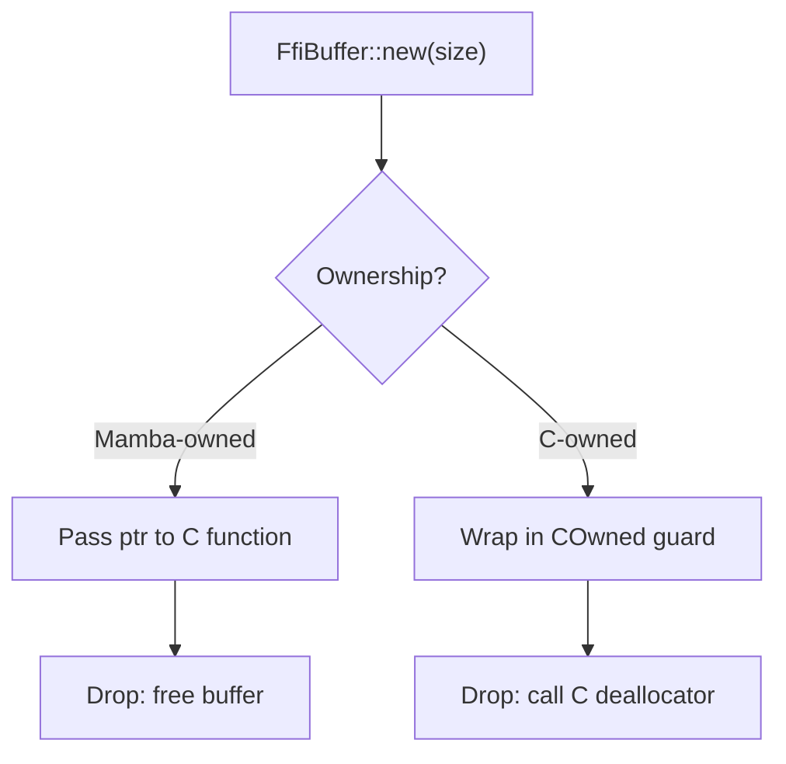
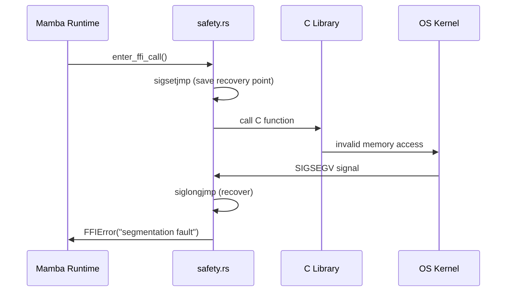

# FFI: Memory Management and Safety

## Overview
<!-- type: overview lang: markdown -->

This specification defines the memory management and safety layers for the Mamba
FFI subsystem.

- `ffi/memory.rs` (141 LOC): Buffer allocation for C interop, lifetime tracking,
  automatic cleanup of C-allocated memory, and pointer validity checks.
- `ffi/safety.rs` (~333 LOC): Null pointer checks, buffer overflow prevention,
  type safety enforcement, and signal handling for SIGSEGV/SIGBUS during FFI calls.

## Requirements
<!-- type: overview lang: markdown -->

### R1 - Buffer Allocation and Lifecycle Management

```yaml
id: R1
priority: high
```

Provide a `FfiBuffer` type that:
- Allocates C-compatible memory buffers with specified size and alignment.
- Tracks buffer ownership (Mamba-owned vs C-owned).
- Supports `as_ptr()` and `as_mut_ptr()` for passing to C functions.
- Implements `Drop` to free Mamba-owned buffers automatically.

### R2 - Automatic Cleanup of C-Allocated Memory

```yaml
id: R2
priority: high
```

When a C function returns a pointer to memory it allocated (e.g., `malloc`-ed
string), the FFI layer must:
1. Wrap the pointer in a `COwned<T>` guard.
2. Call the appropriate C deallocator (`free`, custom destructor) when the
   guard is dropped.
3. Never double-free: track whether cleanup has already occurred.

### R3 - Null Pointer Validation

```yaml
id: R3
priority: high
```

Before dereferencing any pointer received from C:
- Check for null and raise `FFIError("null pointer")` instead of segfaulting.
- Validate pointer alignment for the target type.
- Log the function name and parameter position in the error message.

### R4 - Buffer Bounds Checking

```yaml
id: R4
priority: high
```

For array and buffer operations:
- Track allocated size alongside the pointer.
- Bounds-check all indexed accesses before performing them.
- Raise `FFIError("buffer overflow")` on out-of-bounds access.
- Prevent writing beyond allocated capacity during marshaling.

### R5 - Signal Handling for FFI Crashes

```yaml
id: R5
priority: high
```

Install signal handlers for `SIGSEGV` and `SIGBUS` scoped to FFI call regions:
1. Before entering an FFI call, register a `sigsetjmp` recovery point.
2. If a signal fires during the call, `siglongjmp` back to the recovery point.
3. Convert the caught signal into a Mamba `FFIError` exception with the signal
   name and faulting address (from `siginfo_t`).
4. Restore the previous signal handler after the FFI call completes.

### R6 - Thread Safety for Concurrent FFI Calls

```yaml
id: R6
priority: medium
```

Ensure thread safety when multiple Mamba threads invoke FFI concurrently:
- Per-thread signal handler state (no global mutable state).
- `FfiBuffer` allocations are thread-local or protected by a lock.
- The safety layer is re-entrant: nested FFI calls are supported.

## Acceptance Criteria
<!-- type: test_plan lang: markdown -->

### Scenario: Automatic buffer cleanup

- **GIVEN** A `FfiBuffer` allocated with 1024 bytes.
- **WHEN** The buffer goes out of scope.
- **THEN** The memory is freed and no leak is reported by valgrind/ASAN.

### Scenario: Null pointer from C function

- **GIVEN** A C function that returns NULL.
- **WHEN** The FFI wrapper processes the return value.
- **THEN** An `FFIError("null pointer")` is raised; no segfault occurs.

### Scenario: SIGSEGV recovery

- **GIVEN** A C function that dereferences an invalid pointer.
- **WHEN** The function is called through the FFI safety layer.
- **THEN** The SIGSEGV is caught and converted to `FFIError("segmentation fault at 0x...")`.

### Scenario: Concurrent FFI calls

- **GIVEN** Two Mamba threads calling different C functions simultaneously.
- **WHEN** Both calls execute.
- **THEN** Each thread has independent safety state; no data races occur.

## Diagrams
<!-- type: overview lang: markdown -->

### Memory Lifecycle



### Signal Recovery Flow


