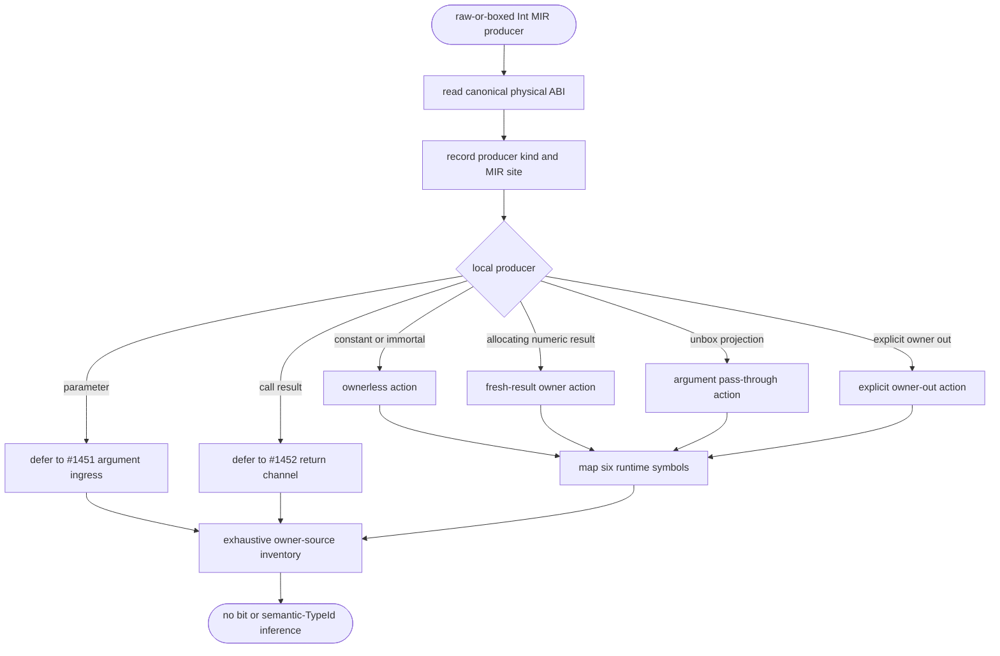

## Logic
<!-- type: logic lang: mermaid -->


## Unit Test

```mermaid
---
id: mamba-strict-type-per-producer-owner-source-verification
requirements:
  deferred_boundaries:
    id: R4
    text: "Parameters and call results are recorded as the named #1451 and #1452 boundaries instead of receiving local ownership transfer behavior."
    kind: functional
    risk: medium
    verify: mir::return_abi::tests::producer_owner_metadata_is_actionable_at_stable_sites
  producer_inventory:
    id: R1
    text: "Every value-producing MIR instruction has one explicit owner-source action, so a newly added producer cannot bypass the inventory gate."
    kind: regression
    risk: high
    verify: mir::producer_owner::tests::every_value_producing_mir_inst_has_an_owner_action
  producer_location:
    id: R5
    text: "Producer metadata records the originating MIR instruction location and source category for downstream transaction and codegen consumers."
    kind: functional
    risk: medium
    verify: mir::return_abi::tests::producer_owner_metadata_is_actionable_at_stable_sites
  runtime_extern_contracts:
    id: R3
    text: "The six raw-or-boxed runtime symbols expose exact fresh-result or argument-pass-through companion contracts without payload or semantic-TypeId inference."
    kind: regression
    risk: high
    verify: mir::producer_owner::tests::mixed_int_extern_contracts_preserve_exact_owner_source
  invalid_extern_contract:
    id: R6
    text: "A declared argument pass-through contract fails closed when its required source argument is absent."
    kind: regression
    risk: high
    verify: mir::producer_owner::tests::declared_argument_contract_fails_closed_when_argument_is_missing
---
flowchart TD
    r1[R1 producer inventory] --> mir_producer_owner_tests_every_value_producing_mir_inst_has_an_owner_action[mir::producer_owner::tests::every_value_producing_mir_inst_has_an_owner_action]
    r3[R3 runtime extern contracts] --> mir_producer_owner_tests_mixed_int_extern_contracts_preserve_exact_owner_source[mir::producer_owner::tests::mixed_int_extern_contracts_preserve_exact_owner_source]
    r4[R4 deferred boundaries] --> mir_return_abi_tests_producer_owner_metadata_is_actionable_at_stable_sites[mir::return_abi::tests::producer_owner_metadata_is_actionable_at_stable_sites]
    r5[R5 producer location] --> mir_return_abi_tests_producer_owner_metadata_is_actionable_at_stable_sites
    r6[R6 invalid extern contract] --> mir_producer_owner_tests_declared_argument_contract_fails_closed_when_argument_is_missing[mir::producer_owner::tests::declared_argument_contract_fails_closed_when_argument_is_missing]
```

<!-- type: unit-test lang: mermaid -->



## Changes
<!-- type: changes lang: yaml -->

```yaml
changes:
  - path: projects/mamba/src/mir/mod.rs
    action: modify
    section: logic
    impl_mode: hand-written
    gap: missing-generator:mamba-mir-producer-owner
    tracker: "#1459"
    reason: "The MIR facade declares and re-exports the owner-source metadata module."
  - path: projects/mamba/src/mir/return_abi.rs
    action: modify
    section: logic
    impl_mode: hand-written
    gap: missing-generator:mamba-mir-producer-owner
    tracker: "#1459"
    reason: "Physical ABI analysis stores and exposes producer-site ownership metadata."
  - path: projects/mamba/src/mir/producer_owner.rs
    action: modify
    section: logic
    impl_mode: hand-written
    gap: missing-generator:mamba-mir-producer-owner
    tracker: "#1459"
    reason: "The exhaustive MIR producer inventory and typed extern companion contract remain hand-written pending a MIR metadata generator."
```
