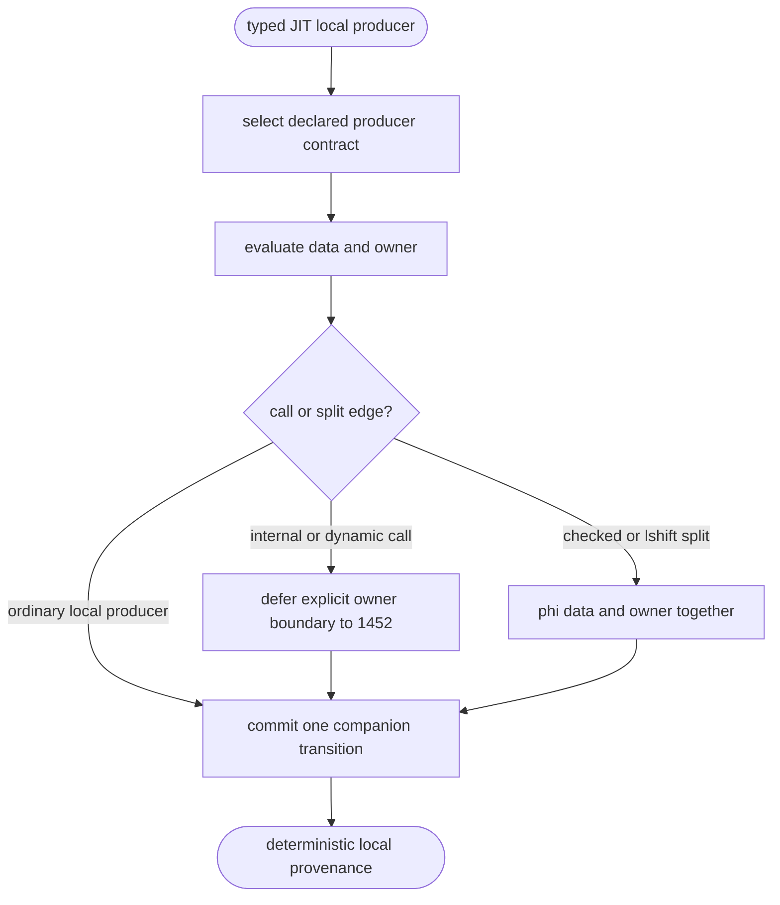

## Logic
<!-- type: logic lang: mermaid -->

Every typed JIT producer must derive its owner from the producer contract or the storage/runtime sidecar after evaluating data, then make one destination transition. The old generic pre-evaluation write is removed. Raw and immortal values publish `None`; fresh results transfer their declared owner; borrowed/pass-through results retain only their declared source. Checked arithmetic and left shift propagate `[data, owner]` through both predecessors in the same order. Internal and dynamic calls record an explicit deferred boundary for #1452 and must not infer payload provenance.
