## Logic
<!-- type: logic lang: mermaid -->

`jit.rs` commits a companion only after the producer has established its data and declared owner source. Constants, raw values, and immortals commit `None`; fresh runtime results transfer the emitted owner; borrowed and pass-through results retain their named owner source. Checked arithmetic and left shift pass `[data, owner]` together through each predecessor, including slow and missing-helper paths. Internal and dynamic calls remain a named #1452 boundary action rather than a local inference path.
## Unit Test

```mermaid
---
id: mamba-strict-type-jit-local-producer-provenance-verification
requirements:
  deferred_calls:
    id: R4
    text: "Internal and dynamic call results remain explicit #1452 ownership boundaries and never receive payload-derived local provenance."
    kind: functional
    risk: high
    verify: codegen::cranelift::jit::tests::companion_owner_call_boundaries_are_explicitly_deferred
  exhaustive_actions:
    id: R1
    text: "Every JIT-local raw-or-boxed Int producer takes exactly one declared companion action after its data and owner have been evaluated."
    kind: regression
    risk: high
    verify: codegen::cranelift::jit::tests::companion_owner_exhaustive_local_producer_actions
  paired_merges:
    id: R3
    text: "Checked arithmetic and left shift merge data and owner as paired phi values on every fast and slow predecessor."
    kind: regression
    risk: high
    verify: codegen::cranelift::jit::tests::companion_owner_checked_and_lshift_merges_pair_data_then_owner
  raw_collision:
    id: R2
    text: "A pointer-shaped raw integer remains ownerless while a live BigInt with the same payload transfers or borrows only its explicit owner."
    kind: regression
    risk: high
    verify: codegen::cranelift::jit::tests::companion_owner_raw_collision_and_bigint_refcounts
  rebind_and_forward:
    id: R5
    text: "Copy, self-copy, rebinding, and loop/branch forwarding retain and release only the declared owner source once."
    kind: regression
    risk: high
    verify: codegen::cranelift::jit::tests::companion_owner_branch_loop_and_parameter_rebind_keep_ssa_aligned
---
flowchart TD
    r1[R1 exhaustive actions] --> codegen_cranelift_jit_tests_companion_owner_exhaustive_local_producer_actions[codegen::cranelift::jit::tests::companion_owner_exhaustive_local_producer_actions]
    r2[R2 raw collision] --> codegen_cranelift_jit_tests_companion_owner_raw_collision_and_bigint_refcounts[codegen::cranelift::jit::tests::companion_owner_raw_collision_and_bigint_refcounts]
    r3[R3 paired merges] --> codegen_cranelift_jit_tests_companion_owner_checked_and_lshift_merges_pair_data_then_owner[codegen::cranelift::jit::tests::companion_owner_checked_and_lshift_merges_pair_data_then_owner]
    r4[R4 deferred calls] --> codegen_cranelift_jit_tests_companion_owner_call_boundaries_are_explicitly_deferred[codegen::cranelift::jit::tests::companion_owner_call_boundaries_are_explicitly_deferred]
    r5[R5 rebind and forward] --> codegen_cranelift_jit_tests_companion_owner_branch_loop_and_parameter_rebind_keep_ssa_aligned[codegen::cranelift::jit::tests::companion_owner_branch_loop_and_parameter_rebind_keep_ssa_aligned]
```

<!-- type: unit-test lang: mermaid -->

