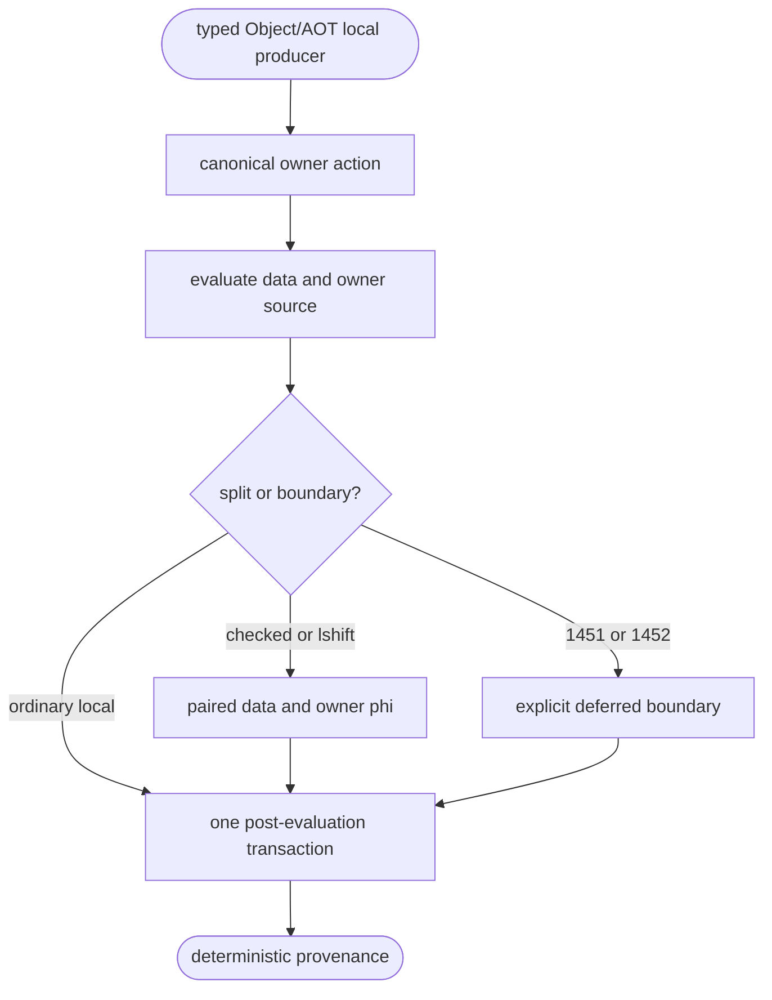

## Logic
<!-- type: logic lang: mermaid -->

`mod.rs` consumes the same MIR producer metadata as JIT lowering. It never derives ownership from the physical data register: raw values and compile-time immortals publish `None`; fresh runtime results transfer the owner returned by the runtime sidecar; Copy and pass-through operations retain their named source companion; and unknown call ingress/egress remains an explicit #1451/#1452 boundary. Checked arithmetic and left shift form paired `[data, owner]` merge values on every predecessor before the shared post-evaluation transaction releases the replaced companion.

## Unit Test

```mermaid
---
id: mamba-strict-type-object-local-producer-provenance-verification
requirements:
  deferred_boundaries:
    id: R4
    text: "Internal and dynamic Object call results remain explicit #1452 provenance boundaries and never receive payload-derived ownership."
    kind: functional
    risk: high
    verify: codegen::cranelift::tests::object_companion_owner_call_boundaries_are_explicitly_deferred
  exhaustive_actions:
    id: R1
    text: "Every Object/AOT raw-or-boxed Int local producer uses exactly one explicit canonical companion action after its data and owner source are evaluated."
    kind: regression
    risk: high
    verify: codegen::cranelift::tests::object_companion_owner_exhaustive_local_producer_actions
  inventory:
    id: R5
    text: "The cross-backend producer inventory rejects an Object/AOT raw-or-boxed Int producer without a local action or named #1451/#1452 boundary."
    kind: regression
    risk: high
    verify: mir::return_abi::tests::producer_owner_metadata_is_actionable_at_stable_sites
  paired_merges:
    id: R3
    text: "Object checked arithmetic and left shift carry paired data and owner values through every fast, slow, and missing-helper predecessor."
    kind: regression
    risk: high
    verify: codegen::cranelift::tests::object_companion_owner_checked_and_lshift_merges_pair_data_then_owner
  raw_collision:
    id: R2
    text: "Pointer-shaped raw integers remain ownerless while live BigInt producers transfer one explicit fresh owner with balanced release behavior."
    kind: regression
    risk: high
    verify: codegen::cranelift::tests::object_companion_owner_raw_collision_and_bigint_refcounts
---
flowchart TD
    r1[R1 exhaustive actions] --> codegen_cranelift_tests_object_companion_owner_exhaustive_local_producer_actions[codegen::cranelift::tests::object_companion_owner_exhaustive_local_producer_actions]
    r2[R2 raw collision] --> codegen_cranelift_tests_object_companion_owner_raw_collision_and_bigint_refcounts[codegen::cranelift::tests::object_companion_owner_raw_collision_and_bigint_refcounts]
    r3[R3 paired merges] --> codegen_cranelift_tests_object_companion_owner_checked_and_lshift_merges_pair_data_then_owner[codegen::cranelift::tests::object_companion_owner_checked_and_lshift_merges_pair_data_then_owner]
    r4[R4 deferred boundaries] --> codegen_cranelift_tests_object_companion_owner_call_boundaries_are_explicitly_deferred[codegen::cranelift::tests::object_companion_owner_call_boundaries_are_explicitly_deferred]
    r5[R5 inventory] --> mir_return_abi_tests_producer_owner_metadata_is_actionable_at_stable_sites[mir::return_abi::tests::producer_owner_metadata_is_actionable_at_stable_sites]
```

<!-- type: unit-test lang: mermaid -->

