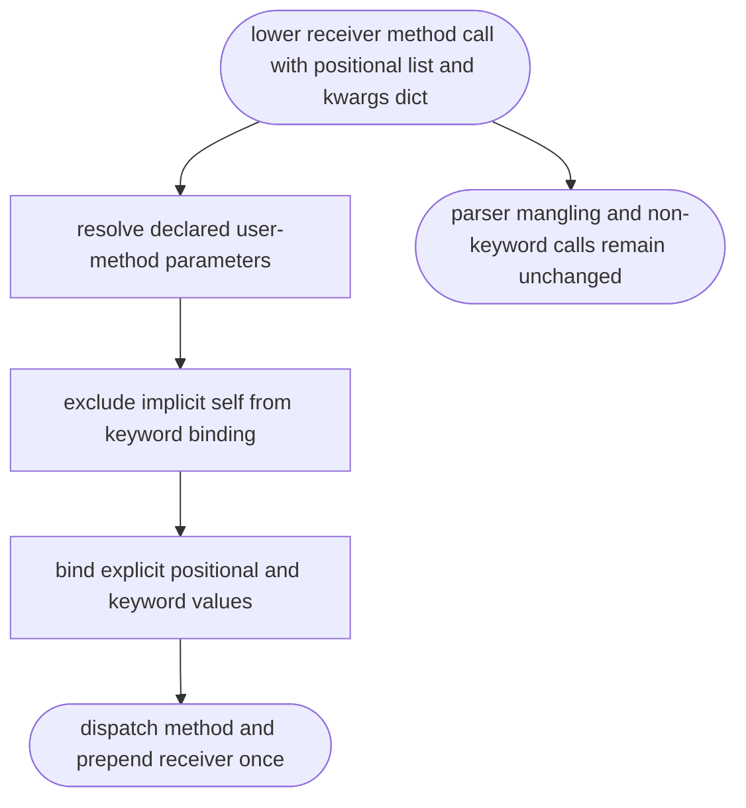

## Logic
<!-- type: logic lang: mermaid -->

`mb_call_method_kwargs` receives only explicit call arguments, while `mb_call_method` prepends the receiver during dispatch. Its binder must therefore skip the leading instance `self` parameter when resolving positional and keyword slots for a user instance method. Private-name mangling remains upstream: the AST and HIR already agree on `_Top__arg`; the binder must match that explicit keyword to the first bindable parameter without treating `self` as missing. Module functions, class dispatch, native/variadic fallback, and positional-only method calls retain their existing paths.
