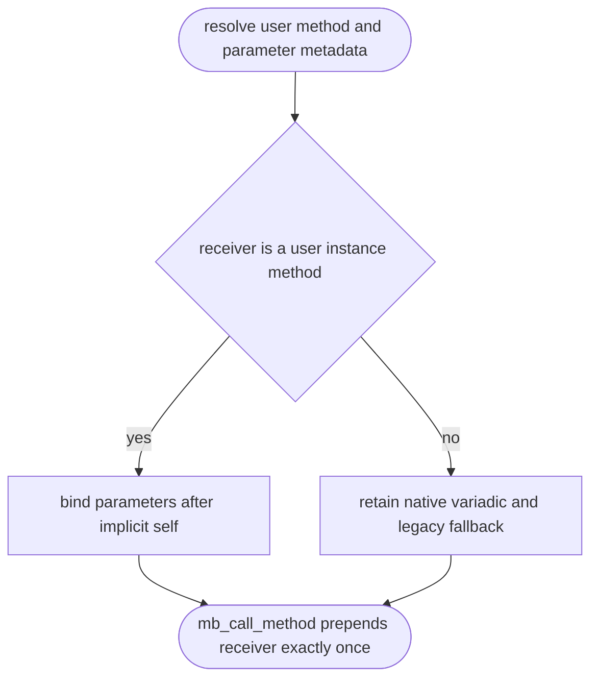

## Logic
<!-- type: logic lang: mermaid -->



For a user method resolved from an `ObjData::Instance`, the keyword binder receives only explicit arguments. It must build its bindable parameter sequence after the leading instance receiver parameter, then pass those explicit bound values to `mb_call_method`, which owns adding the receiver once. Keyword lookup uses the already mangled parameter metadata unchanged, so `_Top__arg` binds successfully while `_O2__arg` is rejected as unexpected. Other receiver kinds retain the existing full-parameter and legacy fallback behavior.

## Changes
<!-- type: changes lang: yaml -->

```yaml
changes:
  - path: projects/mamba/src/runtime/class/mod.rs
    action: modify
    section: logic
    impl_mode: hand-written
    gap: missing-generator:mamba-instance-method-keyword-binding
    tracker: "#1491"
    reason: The generic keyword binder must exclude implicit self for user instance methods before mb_call_method re-adds the receiver.
  - path: projects/mamba/tests/cpython/_regression/core/scope_resolution/name_mangling.py
    action: modify
    section: logic
    impl_mode: hand-written
    gap: missing-generator:mamba-instance-method-keyword-binding-oracle
    tracker: "#1491"
    reason: The CPython oracle must isolate valid and invalid mangled keyword binding on user instance methods.
```
