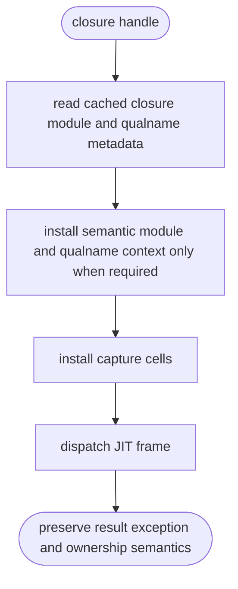
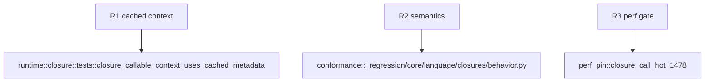

## Logic
<!-- type: logic lang: mermaid -->



For a closure handle, `with_callable_module` must read `MbClosure.module`, `MbClosure.qualname`, and `MbClosure.name` directly through the closure registry rather than allocating temporary MbValue strings through `mb_func_get_module`, `mb_func_get_qualname`, and `mb_func_get_name`. It must retain the existing push/pop behavior whenever module or qualname context is needed, preserving nested definition qualification, traceback state, and module isolation. Non-closure callables retain the current path. This is the first measured dispatch optimization; the release perf pin remains the terminal contract and requires further specialization if the measured ratio is still below its floor.

## Changes
<!-- type: changes lang: yaml -->

```yaml
changes:
  - path: projects/mamba/src/runtime/closure.rs
    action: modify
    section: logic
    impl_mode: hand-written
    gap: missing-generator:mamba-closure-call-context-fastpath
    tracker: "#1478"
    reason: Closure metadata and invocation context require runtime ownership and reentrancy judgement not derivable by the current generator.
  - path: projects/mamba/src/runtime/class/mod.rs
    action: modify
    section: logic
    impl_mode: hand-written
    gap: missing-generator:mamba-closure-call-context-fastpath
    tracker: "#1478"
    reason: Dynamic closure dispatch must route through the cached context path without changing non-closure semantics.
  - path: projects/mamba/tests/cpython/_regression/core/language/closures/bench/closure_call_hot.py
    action: modify
    section: logic
    impl_mode: hand-written
    gap: missing-generator:mamba-closure-perf-pin
    tracker: "#1478"
    reason: Perf pin measurement requires the canonical internal-time marker.
  - path: projects/mamba/tests/harness/cpython/config/perf/pins/closure_call_hot_1478.toml
    action: create
    section: logic
    impl_mode: hand-written
    gap: missing-generator:mamba-closure-perf-pin
    tracker: "#1478"
    reason: The closure hot path needs an executable CPU and RSS perf gate.
```
## Unit Test
<!-- type: unit-test lang: mermaid -->


