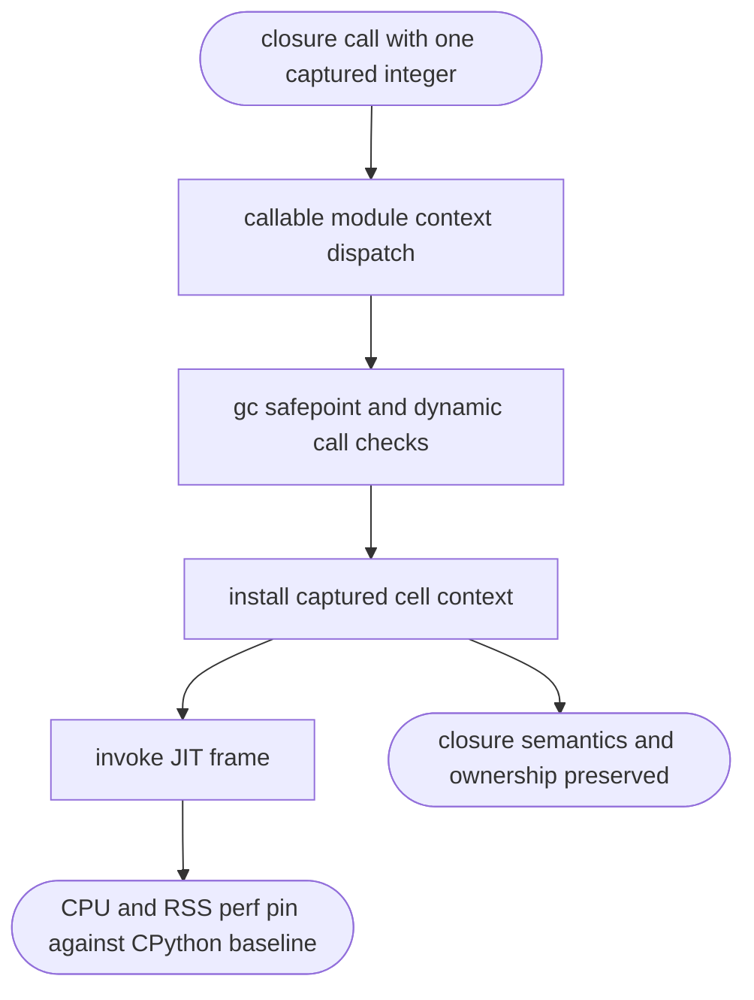

## Logic
<!-- type: logic lang: mermaid -->

Applicability is confined to release-mode repeated calls of a stable closure. The observed release workload is 3.96 user seconds for Mamba versus 0.10 for CPython. The candidate hot path is `mb_call1_val` plus `with_closure_cells`: it traverses module context, safepoint, closure lookup, and active-cell map setup for every call. The contract must measure and remove only redundant work while retaining per-call capture identity, exception behavior, and ownership.

## Unit Test

```mermaid
---
id: mamba-closure-call-hot-applicability-verification
requirements:
  cell_semantics:
    id: R2
    text: "Closure capture identity and nested sibling recursion remain at CPython parity after hot-path changes."
    kind: regression
    risk: high
    verify: conformance::_regression/core/closure_capture/closure_late_binding.py
  release_measurement:
    id: R1
    text: "The release closure hot workload emits an internal CPU marker and is measured against the recorded CPython baseline."
    kind: performance
    risk: high
    verify: perf_pin::closure_call_hot_1478
  surface_behavior:
    id: R3
    text: "Closure surface and behavior contracts remain green."
    kind: regression
    risk: medium
    verify: conformance::_regression/core/language/closures/behavior.py
---
flowchart TD
    r1[R1 release measurement] --> perf_pin_closure_call_hot_1478[perf_pin::closure_call_hot_1478]
    r2[R2 cell semantics] --> conformance_regression_core_closure_capture_closure_late_binding_py[conformance::_regression/core/closure_capture/closure_late_binding.py]
    r3[R3 surface behavior] --> conformance_regression_core_language_closures_behavior_py[conformance::_regression/core/language/closures/behavior.py]
```

<!-- type: unit-test lang: mermaid -->

