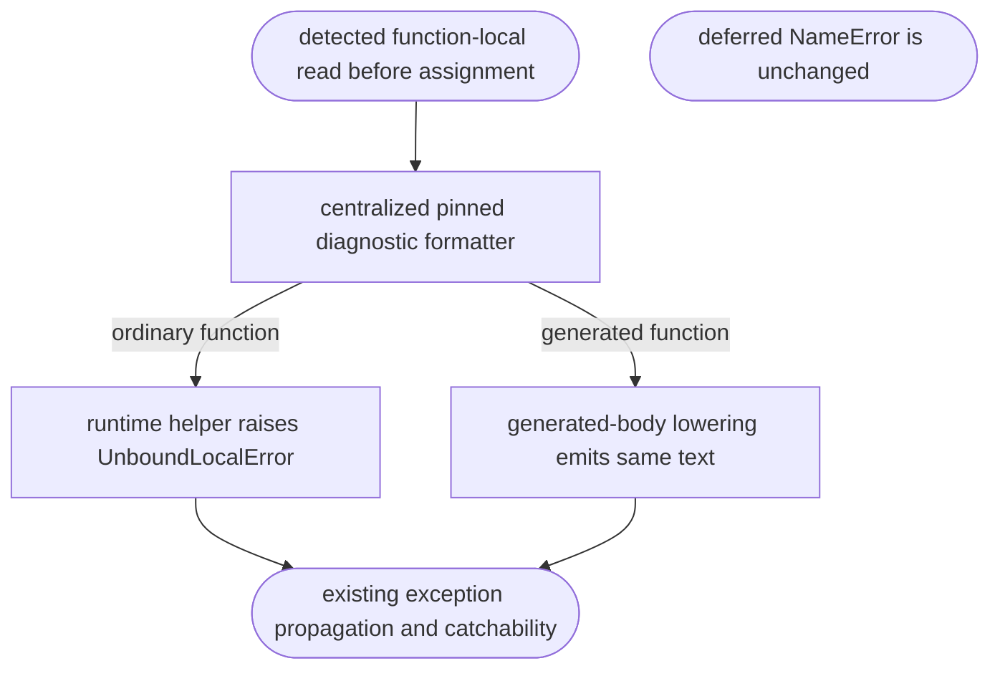

## Logic
<!-- type: logic lang: mermaid -->



Add a pure `unbound_local_error_message(name)` formatter in `runtime::exception` that returns `local variable '<name>' referenced before assignment`. `mb_unbound_local_error_value` uses this formatter when constructing the existing `UnboundLocalError`. Generated-function lowering calls the same formatter while materializing its pre-bind exception message, so the two exception routes cannot drift. No type, handler, or deferred-name lookup control flow changes.

## Changes
<!-- type: changes lang: yaml -->

```yaml
changes:
  - path: projects/mamba/src/runtime/exception.rs
    action: modify
    section: logic
    impl_mode: hand-written
    gap: missing-generator:mamba-pinned-unbound-local-diagnostic
    tracker: "#1476"
    reason: "A pure pinned-oracle diagnostic formatter and exact exception unit test are runtime behavior that the current generator cannot derive."
  - path: projects/mamba/src/lower/hir_to_mir.rs
    action: modify
    section: logic
    impl_mode: hand-written
    gap: missing-generator:mamba-pinned-unbound-local-diagnostic
    tracker: "#1476"
    reason: "Generated-body pre-bind lowering must reuse the runtime diagnostic contract instead of embedding a divergent literal."
  - path: projects/mamba/tests/cpython/_regression/core/scope_resolution/errors.py
    action: modify
    section: logic
    impl_mode: hand-written
    gap: missing-generator:mamba-pinned-unbound-local-diagnostic-tests
    tracker: "#1476"
    reason: "The regression fixture needs an explicit stable assertion for the oracle-pinned unbound-local diagnostic while preserving its NameError check."
```
## Unit Test

```mermaid
---
id: mamba-unbound-local-diagnostic-contract-verification
requirements:
  deferred_name_boundary:
    id: R4
    text: "A genuinely unresolved name remains a catchable NameError in the same regression fixture."
    kind: regression
    risk: medium
    verify: conformance::_regression/core/scope_resolution/errors.py
  generated_path:
    id: R2
    text: "The generator pre-bind lowering emits the same centralized message rather than a local divergent literal."
    kind: regression
    risk: medium
    verify: lower::hir_to_mir::tests::generated_unbound_local_message_matches_runtime_helper
  ordinary_helper:
    id: R1
    text: "mb_unbound_local_error_value raises the pinned CPython 3.12 UnboundLocalError message and retains NameError inheritance."
    kind: functional
    risk: high
    verify: runtime::exception::tests::unbound_local_error_matches_pinned_cpython_message
  scope_oracle:
    id: R3
    text: "The scope-resolution regression fixture matches the pinned live oracle when the cache is disabled."
    kind: integration
    risk: high
    verify: conformance::_regression/core/scope_resolution/errors.py
---
flowchart TD
    r1[R1 ordinary helper] --> runtime_exception_tests_unbound_local_error_matches_pinned_cpython_message[runtime::exception::tests::unbound_local_error_matches_pinned_cpython_message]
    r2[R2 generated path] --> lower_hir_to_mir_tests_generated_unbound_local_message_matches_runtime_helper[lower::hir_to_mir::tests::generated_unbound_local_message_matches_runtime_helper]
    r3[R3 scope oracle] --> conformance_regression_core_scope_resolution_errors_py[conformance::_regression/core/scope_resolution/errors.py]
    r4[R4 deferred name boundary] --> conformance_regression_core_scope_resolution_errors_py
```

<!-- type: unit-test lang: mermaid -->


