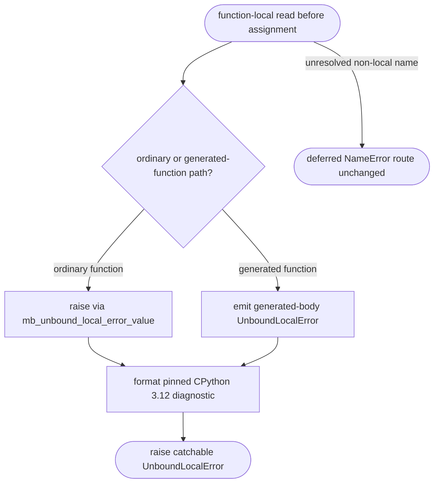

## Logic
<!-- type: logic lang: mermaid -->

The existing scope analysis continues to identify local reads before assignment and retains the `UnboundLocalError` subtype. This slice changes only the diagnostic string emitted by the normal runtime helper and the generated-function pre-bind path, making both emit `local variable '<name>' referenced before assignment`, the wording required by the pinned CPython 3.12 oracle. Deferred unresolved global names continue through `mb_deferred_name_read` and preserve their `NameError` behavior.
