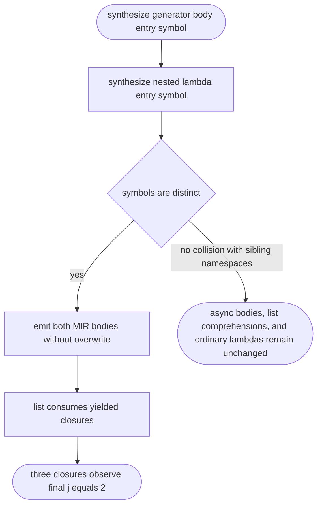

## Logic
<!-- type: logic lang: mermaid -->



`lower_generator_function` currently derives a generator-body `SymbolId` in the same 4,000,000 range used by lambda lowering. A generator expression that yields a lambda can therefore emit two MIR bodies with the same name; the later body overwrites the lambda entry in codegen, so invoking the yielded closure re-enters a generator body without a caller context. Allocate generator body symbols from a disjoint namespace. The yielded lambdas then retain their own entry body and their shared generator loop cell, so consuming the expression through `list()` produces three closures whose later calls return `2`. This is limited to MIR synthetic-symbol allocation; generator runtime switching, list-comprehension late binding, default arguments, class cells, imports, and built-in libraries remain unchanged.

## Changes
<!-- type: changes lang: yaml -->

```yaml
changes:
  - path: projects/mamba/src/lower/hir_to_mir.rs
    action: modify
    section: logic
    impl_mode: hand-written
    gap: missing-generator:mamba-generator-expression-symbol-isolation
    tracker: "#1490"
    reason: Generator-body and lambda MIR entries currently share a synthetic SymbolId namespace and can overwrite one another during code generation.
  - path: projects/mamba/src/driver/tests/generator_conformance.rs
    action: modify
    section: logic
    impl_mode: hand-written
    gap: missing-generator:mamba-generator-expression-symbol-isolation-tests
    tracker: "#1490"
    reason: The JIT generator conformance suite needs a focused regression for a generator expression consumed after a list-comprehension closure.
  - path: projects/mamba/tests/cpython/_regression/core/comprehension_scope/generator_expression_closure_context.py
    action: create
    section: logic
    impl_mode: hand-written
    gap: missing-generator:mamba-generator-expression-closure-oracle
    tracker: "#1490"
    reason: A one-case CPython oracle fixture must pin closure late binding through generator expression iteration after a prior list-comprehension closure.
```
