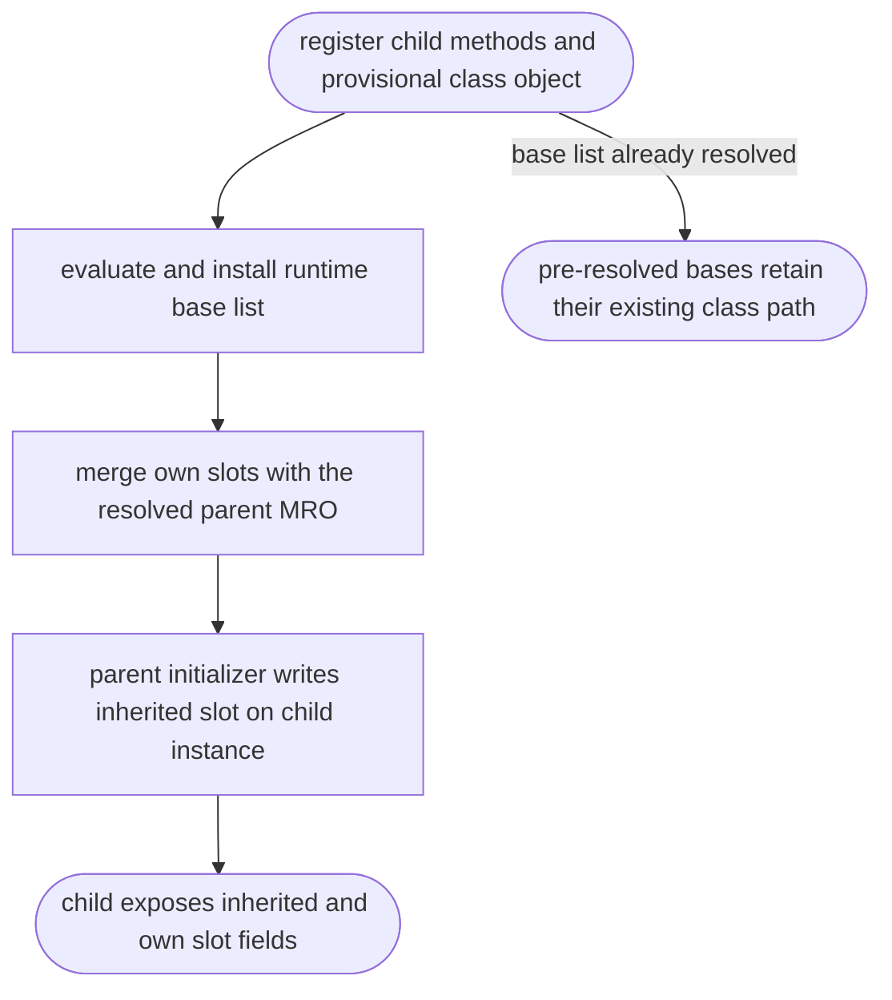

## Logic
<!-- type: logic lang: mermaid -->



`mb_register_slots` derives a class effective slot set from its registered MRO. `emit_pending_class_registrations` currently emits it before `emit_runtime_class_bases_for`, so a child with a deferred base receives only its own names. Add a pending slot-registration queue keyed by the class symbol. Populate it during class registration and drain it immediately after deferred bases are emitted, before class body attributes and definition finalization. For classes with no deferred base, the same drain point runs after normal registration and keeps their prior semantics.

## Changes
<!-- type: changes lang: yaml -->

```yaml
changes:
  - path: projects/mamba/src/lower/hir_to_mir.rs
    action: modify
    section: logic
    impl_mode: hand-written
    gap: missing-generator:mamba-slot-registration-after-runtime-bases
    tracker: "#1492"
    reason: Queue declared slot names until runtime bases are installed, then assert MIR orders mb_class_update_bases before mb_register_slots for a slotted child using zero-argument super.
  - path: projects/mamba/src/driver/mod.rs
    action: modify
    section: logic
    impl_mode: hand-written
    gap: missing-generator:mamba-slot-registration-after-runtime-bases-e2e
    tracker: "#1492"
    reason: Execute a runtime-base slotted-child source probe that verifies inherited and own slots after the deferred MRO update.
```
