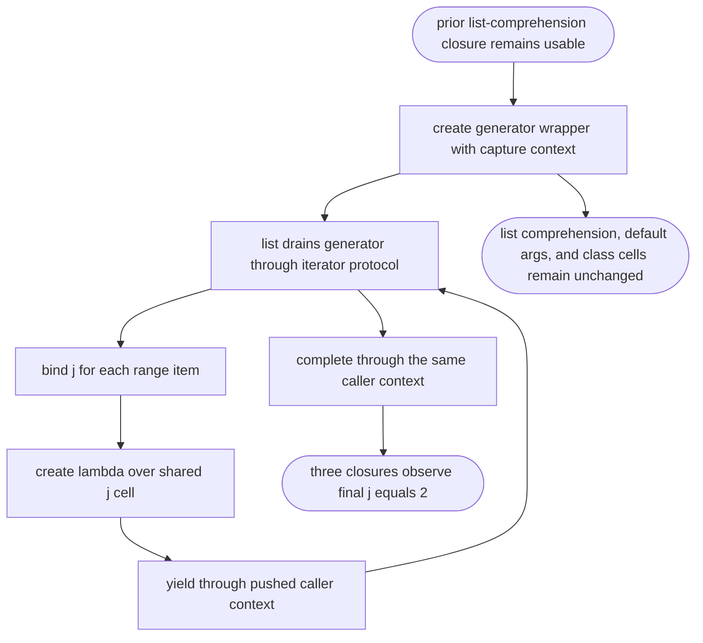

## Logic
<!-- type: logic lang: mermaid -->

The generator runtime must preserve one pushed caller context from the wrapper's first resume until each yield or terminal completion switches back. It must not reset or pop that context while a previously materialized list-comprehension closure exists. The generator-expression wrapper owns the loop-variable capture cell; every yielded lambda references that same cell, so consuming the expression through `list()` produces three closures whose later calls return the final value `2`. This change is limited to generator-expression lowering and generator resume/yield context management; it must preserve existing list-comprehension late binding, default-argument early binding, class `__class__` cells, imports, and built-in-library behavior.
