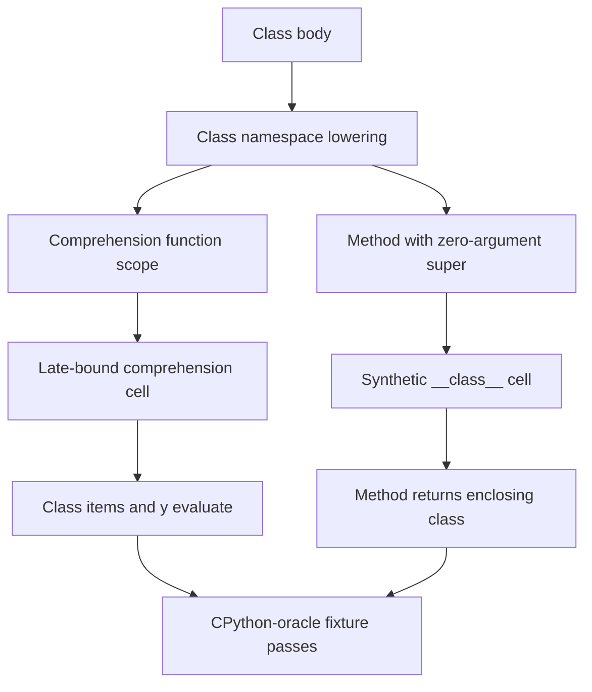

## Logic
<!-- type: logic lang: mermaid -->

The fix is a language-core lowering/runtime change: a class-body comprehension owns its loop-variable closure scope, while a method that uses zero-argument `super()` must retain the enclosing class's synthetic `__class__` cell. The two cell paths must coexist without aliasing or consuming one another.
