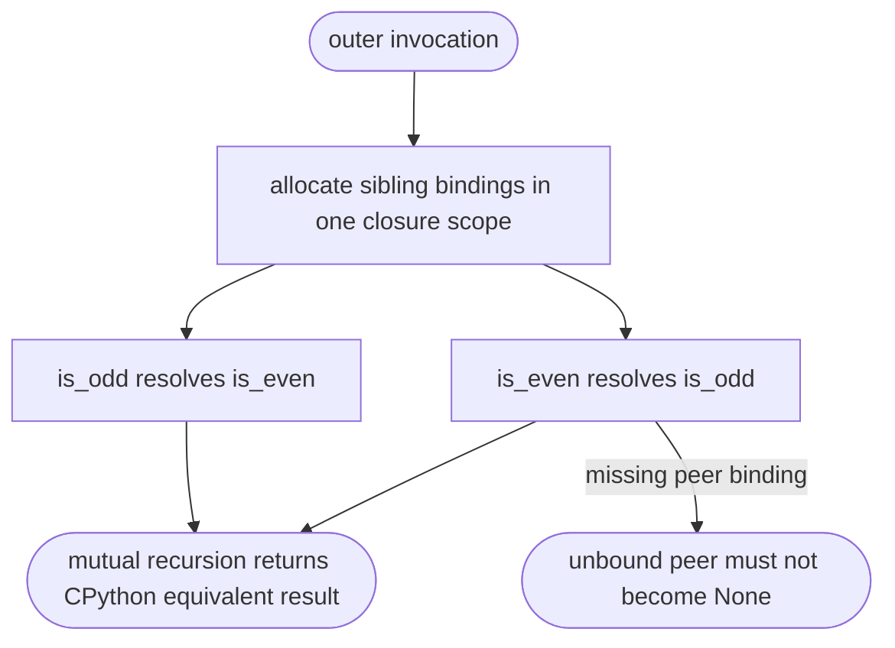

## Logic
<!-- type: logic lang: mermaid -->

Applicability is confined to nested function definitions that share an enclosing invocation. The existing closure runtime already supports per-call cells; this slice must prove the lowering creates and wires both sibling placeholders into that same invocation scope before either closure body can resolve its peer. Module-level recursion, class bodies, and general dynamic dispatch are not touched.

## Unit Test

```mermaid
---
id: mamba-nested-sibling-recursion-verification
requirements:
  closure_boundaries:
    id: R3
    text: "Forward capture and per-call closure identity remain correct while sibling bindings are fixed."
    kind: regression
    risk: medium
    verify: conformance::_regression/core/closure_capture/closure_late_binding.py
  first_call_order:
    id: R2
    text: "Either sibling may execute first and recursively call its peer."
    kind: regression
    risk: high
    verify: conformance::_regression/core/closure_capture/nested_sibling_mutual_recursion.py
  sibling_binding:
    id: R1
    text: "Nested sibling functions resolve each other through the enclosing invocation scope instead of a None placeholder."
    kind: functional
    risk: high
    verify: conformance::_regression/core/closure_capture/nested_sibling_mutual_recursion.py
---
flowchart TD
    r1[R1 sibling binding] --> conformance_regression_core_closure_capture_nested_sibling_mutual_recursion_py[conformance::_regression/core/closure_capture/nested_sibling_mutual_recursion.py]
    r2[R2 first call order] --> conformance_regression_core_closure_capture_nested_sibling_mutual_recursion_py
    r3[R3 closure boundaries] --> conformance_regression_core_closure_capture_closure_late_binding_py[conformance::_regression/core/closure_capture/closure_late_binding.py]
```

<!-- type: unit-test lang: mermaid -->

