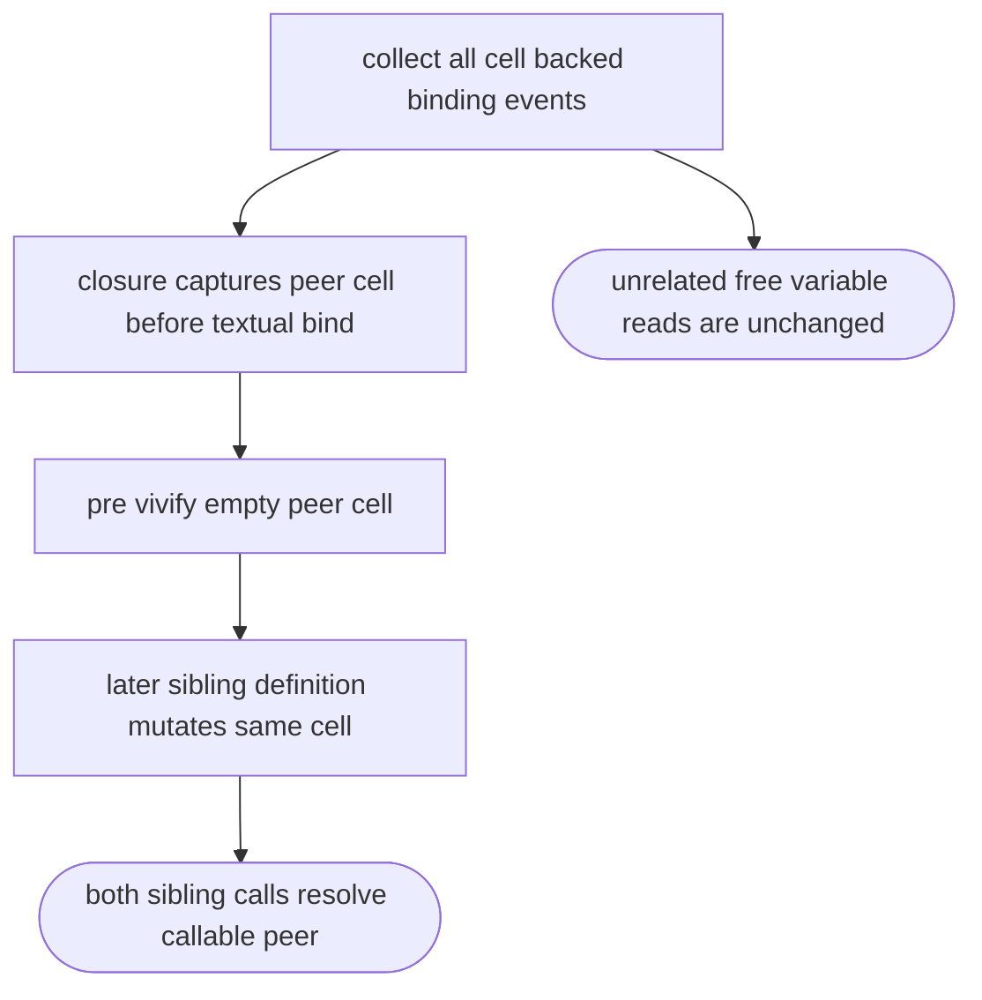

## Logic
<!-- type: logic lang: mermaid -->



Replace the Let-only pre-vivification inventory in `lower::hir_to_mir` with an inventory of cell-backed binding events. It includes a `FuncDefPlaceholder` bind symbol when that symbol is in `cell_override`, but continues to exclude a nested function body. Before the earlier sibling closure is created, the existing pre-vivification loop creates an empty cell for its later sibling. `bind_runtime_value` then observes an initialized cell and calls `mb_capture_cell_set_id`, preserving the captured handle rather than replacing it. Existing Let, parameter, and nonlocal behavior remains unchanged.

## Changes
<!-- type: changes lang: yaml -->

```yaml
changes:
  - path: projects/mamba/src/lower/hir_to_mir.rs
    action: modify
    section: logic
    impl_mode: hand-written
    gap: missing-generator:mamba-nested-sibling-recursion
    tracker: "#1477"
    reason: Existing lowering only pre-vivifies captured Let targets and therefore disconnects a closure from a later sibling function binding.
  - path: projects/mamba/tests/cpython/_regression/core/closure_capture/nested_sibling_mutual_recursion.py
    action: create
    section: logic
    impl_mode: hand-written
    gap: missing-generator:mamba-nested-sibling-recursion-tests
    tracker: "#1477"
    reason: A one-case CPython oracle fixture must prove both nested siblings resolve the same callable cell after all definitions execute.
```
## Unit Test

```mermaid
---
id: mamba-nested-sibling-recursion-contract-verification
requirements:
  binding_inventory:
    id: R1
    text: "A cell-backed nested FuncDefPlaceholder bind target is included in the pre-vivification inventory."
    kind: unit
    risk: high
    verify: lower::hir_to_mir::tests::captured_funcdef_binding_is_previvified
  closure_nonregression:
    id: R3
    text: "Existing late-binding closure behavior remains at oracle parity."
    kind: regression
    risk: medium
    verify: conformance::_regression/core/closure_capture/closure_late_binding.py
  mutual_recursion_oracle:
    id: R2
    text: "Nested is_even and is_odd functions both resolve their peer and match CPython output."
    kind: integration
    risk: high
    verify: conformance::_regression/core/closure_capture/nested_sibling_mutual_recursion.py
---
flowchart TD
    r1[R1 binding inventory] --> lower_hir_to_mir_tests_captured_funcdef_binding_is_previvified[lower::hir_to_mir::tests::captured_funcdef_binding_is_previvified]
    r2[R2 mutual recursion oracle] --> conformance_regression_core_closure_capture_nested_sibling_mutual_recursion_py[conformance::_regression/core/closure_capture/nested_sibling_mutual_recursion.py]
    r3[R3 closure nonregression] --> conformance_regression_core_closure_capture_closure_late_binding_py[conformance::_regression/core/closure_capture/closure_late_binding.py]
```

<!-- type: unit-test lang: mermaid -->


