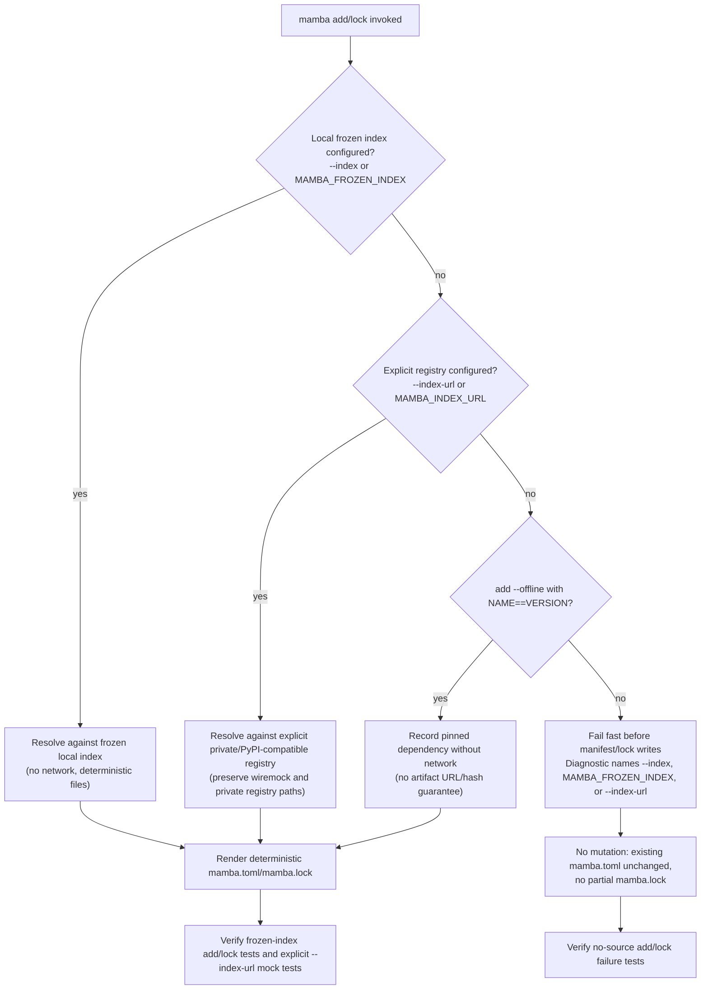

## Logic
<!-- type: logic lang: mermaid -->

## Unit Test

```mermaid
---
id: mamba-pkgmanage-no-implicit-pypi-unit-tests
requirements:
  R1:
    text: "add without local index or explicit registry fails before any manifest or lockfile mutation."
    risk: high
    verify: integration-test
  R2:
    text: "lock without local index or explicit registry fails before writing a partial lockfile."
    risk: high
    verify: integration-test
  R3:
    text: "frozen local index and explicit --index-url registry paths continue to pass."
    risk: high
    verify: regression-test
---
requirementDiagram
    requirement add_no_source {
      id: R1
      text: "mamba add bare_dep with no source fails fast and leaves mamba.toml/mamba.lock unchanged."
      risk: high
      verifymethod: test
    }
    requirement lock_no_source {
      id: R2
      text: "mamba lock with deps and no source fails fast and does not write a partial lockfile."
      risk: high
      verifymethod: test
    }
    requirement source_paths_preserved {
      id: R3
      text: "Existing frozen-index and explicit --index-url pkgmgr tests still pass."
      risk: high
      verifymethod: test
    }
```

<!-- type: unit-test lang: mermaid -->

# Reviews

### Review 1
**Verdict:** approved

- [logic] Source-policy decision tree is bounded to add/lock and distinguishes frozen local index, explicit registry URL, offline pinned add, and fail-fast no-source behavior.
- [unit-test] Test requirements cover both new negative cases and regression protection for frozen-index plus explicit `--index-url` paths.
