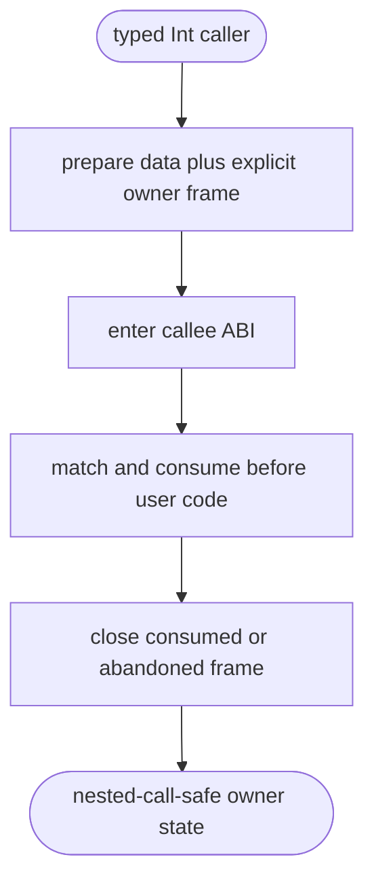

## Logic
<!-- type: logic lang: mermaid -->



A thread-local LIFO frame stack carries only explicit companion provenance for raw-or-boxed Int arguments. Every static or dynamic caller evaluates data and its companion owner before pushing one uniquely identified frame. Callee entry consumes the matching top frame by argument index and exact data value before trace, profiling, argument adaptation, or user code can re-enter. It installs a retained borrowed companion for a matching BigInt and `None` for raw/collision/missing values. Return, error, arity mismatch, unsupported target, and worker teardown discard only their own remaining frame, preserving any outer recursive frame. Dynamic and `asyncio.to_thread` paths serialize the same explicit slots through their call specs and install them only around the target invocation.

## Changes
<!-- type: changes lang: yaml -->

```yaml
changes:
  - path: projects/mamba/src/runtime/argument_owner.rs
    action: create
    section: logic
    impl_mode: hand-written
    gap: missing-generator:mamba-argument-owner-frame
    tracker: "#1451"
    reason: "Thread-local frame identity, matching, and nested cleanup require a runtime transaction primitive."
  - path: projects/mamba/src/codegen/cranelift/jit.rs
    action: modify
    section: logic
    impl_mode: hand-written
    gap: missing-generator:mamba-call-entry-provenance
    tracker: "#1451"
    reason: "JIT internal callers and callee entry must prepare and consume frame slots around the existing ABI."
  - path: projects/mamba/src/codegen/cranelift/mod.rs
    action: modify
    section: logic
    impl_mode: hand-written
    gap: missing-generator:mamba-call-entry-provenance
    tracker: "#1451"
    reason: "Object/AOT internal calls use the same explicit caller and callee owner-frame contract."
  - path: projects/mamba/src/runtime/builtins/mod.rs
    action: modify
    section: logic
    impl_mode: hand-written
    gap: missing-generator:mamba-dynamic-call-provenance
    tracker: "#1451"
    reason: "Dynamic positional, keyword, spread, closure, class, and callable-wrapper routes need explicit slots before ABI adaptation."
  - path: projects/mamba/src/runtime/stdlib/asyncio_mod.rs
    action: modify
    section: logic
    impl_mode: hand-written
    gap: missing-generator:mamba-worker-call-provenance
    tracker: "#1451"
    reason: "to_thread call specs must carry and install explicit argument provenance on the worker thread."
```

## Unit Test

```mermaid
---
id: mamba-strict-type-argument-owner-frame-verification
requirements:
  callee_entry:
    id: R2
    text: "Typed internal call entry consumes provenance before user-visible callee work and balances retained BigInt ownership."
    kind: functional
    risk: high
    verify: codegen::cranelift::jit::tests::argument_owner_frame_is_prepared_and_consumed_at_entry
  dynamic_routes:
    id: R3
    text: "Dynamic positional, keyword, spread, closure, class, and callable-wrapper routes preserve only explicit owner slots."
    kind: regression
    risk: high
    verify: runtime::builtins::tests::typed_argument_owner_slots_survive_dynamic_adaptation
  frame_lifo_collision:
    id: R1
    text: "Nested frames match only their own explicit argument data and collision-shaped raw values consume as ownerless."
    kind: regression
    risk: high
    verify: runtime::argument_owner::tests::nested_frames_are_lifo_and_collision_safe
  thread_handoff:
    id: R4
    text: "asyncio.to_thread installs the owned argument frame only on the worker invocation and tears it down afterward."
    kind: functional
    risk: high
    verify: runtime::stdlib::asyncio_mod::tests::to_thread_argument_owner_frame_is_worker_scoped
---
flowchart TD
    r1[R1 frame lifo collision] --> runtime_argument_owner_tests_nested_frames_are_lifo_and_collision_safe[runtime::argument_owner::tests::nested_frames_are_lifo_and_collision_safe]
    r2[R2 callee entry] --> codegen_cranelift_jit_tests_argument_owner_frame_is_prepared_and_consumed_at_entry[codegen::cranelift::jit::tests::argument_owner_frame_is_prepared_and_consumed_at_entry]
    r3[R3 dynamic routes] --> runtime_builtins_tests_typed_argument_owner_slots_survive_dynamic_adaptation[runtime::builtins::tests::typed_argument_owner_slots_survive_dynamic_adaptation]
    r4[R4 thread handoff] --> runtime_stdlib_asyncio_mod_tests_to_thread_argument_owner_frame_is_worker_scoped[runtime::stdlib::asyncio_mod::tests::to_thread_argument_owner_frame_is_worker_scoped]
```

<!-- type: unit-test lang: mermaid -->


