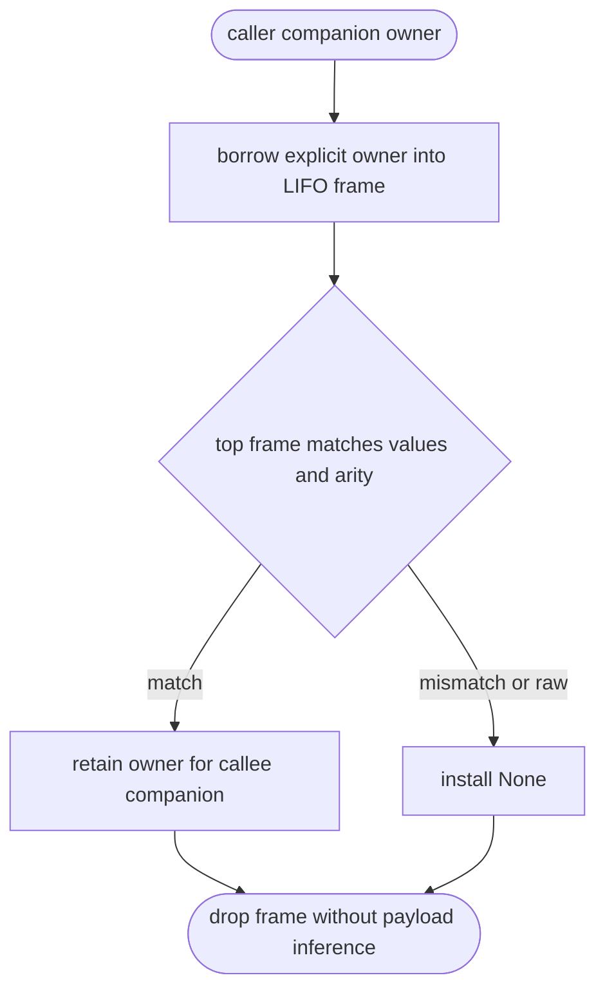

## Logic
<!-- type: logic lang: mermaid -->



The frame slot is `{ value_bits, owner_or_none }`, where `owner_or_none` is copied only from an existing companion slot; the frame never classifies payload bits. Pushing a frame borrows the caller companion and does not change its retain count. A matching callee entry retains that explicit owner once while installing its own companion; caller and callee cleanup then each release only their own companion. Any mismatch, absent frame, raw collision, or malformed slot installs `None` and closes the top frame without fallback inference. Each push receives a monotonically unique identity and an RAII cleanup guard so nested, recursive, exceptional, and reentrant calls cannot consume or discard an outer frame.

The ABI remains data-only. The call trampoline must prepare the frame before invoking the callee and callee entry must consume it before profiling, tracing, argument adaptation, or user code. Dynamic and worker-thread routes carry the same explicit slot values; worker installation is scoped to the one target invocation and removes the frame even when it fails.
## Changes
<!-- type: changes lang: yaml -->

```yaml
changes:
  - path: projects/mamba/src/runtime/argument_owner.rs
    action: create
    section: logic
    impl_mode: hand-written
    gap: missing-generator:mamba-argument-owner-frame
    tracker: "#1451"
    reason: "Thread-local frame identity, matching, and nested cleanup require a runtime transaction primitive."
  - path: projects/mamba/src/codegen/cranelift/jit.rs
    action: modify
    section: logic
    impl_mode: hand-written
    gap: missing-generator:mamba-call-entry-provenance
    tracker: "#1451"
    reason: "JIT internal callers and callee entry must prepare and consume frame slots around the existing ABI."
  - path: projects/mamba/src/codegen/cranelift/mod.rs
    action: modify
    section: logic
    impl_mode: hand-written
    gap: missing-generator:mamba-call-entry-provenance
    tracker: "#1451"
    reason: "Object/AOT internal calls use the same explicit caller and callee owner-frame contract."
  - path: projects/mamba/src/runtime/builtins/mod.rs
    action: modify
    section: logic
    impl_mode: hand-written
    gap: missing-generator:mamba-dynamic-call-provenance
    tracker: "#1451"
    reason: "Dynamic positional, keyword, spread, closure, class, and callable-wrapper routes need explicit slots before ABI adaptation."
  - path: projects/mamba/src/runtime/class/mod.rs
    action: modify
    section: logic
    impl_mode: hand-written
    gap: missing-generator:mamba-dynamic-call-provenance
    tracker: "#1451"
    reason: "Callable-value, closure-default, descriptor, and class fast paths must prepare the final physical owner frame after receiver and default adaptation."
  - path: projects/mamba/src/runtime/stdlib/asyncio_mod.rs
    action: modify
    section: logic
    impl_mode: hand-written
    gap: missing-generator:mamba-worker-call-provenance
    tracker: "#1451"
    reason: "to_thread call specs must carry and install explicit argument provenance on the worker thread."
```

## Unit Test

```mermaid
---
id: mamba-strict-type-argument-owner-frame-contract-verification
requirements:
  callee_entry:
    id: R2
    text: "Typed internal call entry consumes provenance before user-visible callee work and balances retained BigInt ownership."
    kind: functional
    risk: high
    verify: codegen::cranelift::jit::tests::argument_owner_frame_is_prepared_and_consumed_at_entry
  dynamic_routes:
    id: R3
    text: "Dynamic positional and spread routes preserve only explicit owner slots."
    kind: regression
    risk: high
    verify: runtime::builtins::tests::typed_argument_owner_slots_survive_dynamic_adaptation
  keyword_final_order:
    id: R5
    text: "Keyword binding emits slots in the final physical parameter order, not the pre-binding source order."
    kind: regression
    risk: high
    verify: runtime::builtins::tests::keyword_binding_frames_owners_in_final_parameter_order
  callable_and_closure_fast_paths:
    id: R6
    text: "Descriptor, callable-value, and closure-default fast paths prepare their final physical owner slots before direct dispatch."
    kind: regression
    risk: high
    verify: runtime::class::tests::closure_default_fast_path_frames_final_owner_slots
  frame_lifo_collision:
    id: R1
    text: "Nested frames match only their own explicit argument data and collision-shaped raw values consume as ownerless."
    kind: regression
    risk: high
    verify: runtime::argument_owner::tests::nested_frames_are_lifo_and_collision_safe
  thread_handoff:
    id: R4
    text: "asyncio.to_thread installs the owned argument frame only on the worker invocation and tears it down afterward."
    kind: functional
    risk: high
    verify: runtime::stdlib::asyncio_mod::tests::to_thread_argument_owner_frame_is_worker_scoped
  thread_worker_entry:
    id: R7
    text: "asyncio.to_thread carries a BigInt owner into the target worker entry frame."
    kind: functional
    risk: high
    verify: runtime::stdlib::asyncio_mod::tests::to_thread_forwards_bigint_owner_to_the_worker_entry_frame
---
flowchart TD
    r1[R1 frame lifo collision] --> runtime_argument_owner_tests_nested_frames_are_lifo_and_collision_safe[runtime::argument_owner::tests::nested_frames_are_lifo_and_collision_safe]
    r2[R2 callee entry] --> codegen_cranelift_jit_tests_argument_owner_frame_is_prepared_and_consumed_at_entry[codegen::cranelift::jit::tests::argument_owner_frame_is_prepared_and_consumed_at_entry]
    r3[R3 dynamic routes] --> runtime_builtins_tests_typed_argument_owner_slots_survive_dynamic_adaptation[runtime::builtins::tests::typed_argument_owner_slots_survive_dynamic_adaptation]
    r4[R4 thread handoff] --> runtime_stdlib_asyncio_mod_tests_to_thread_argument_owner_frame_is_worker_scoped[runtime::stdlib::asyncio_mod::tests::to_thread_argument_owner_frame_is_worker_scoped]
    r5[R5 final keyword order] --> runtime_builtins_tests_keyword_binding_frames_owners_in_final_parameter_order[runtime::builtins::tests::keyword_binding_frames_owners_in_final_parameter_order]
    r6[R6 callable and closure fast paths] --> runtime_class_tests_closure_default_fast_path_frames_final_owner_slots[runtime::class::tests::closure_default_fast_path_frames_final_owner_slots]
    r7[R7 worker entry] --> runtime_stdlib_asyncio_mod_tests_to_thread_forwards_bigint_owner_to_the_worker_entry_frame[runtime::stdlib::asyncio_mod::tests::to_thread_forwards_bigint_owner_to_the_worker_entry_frame]
```

<!-- type: unit-test lang: mermaid -->


