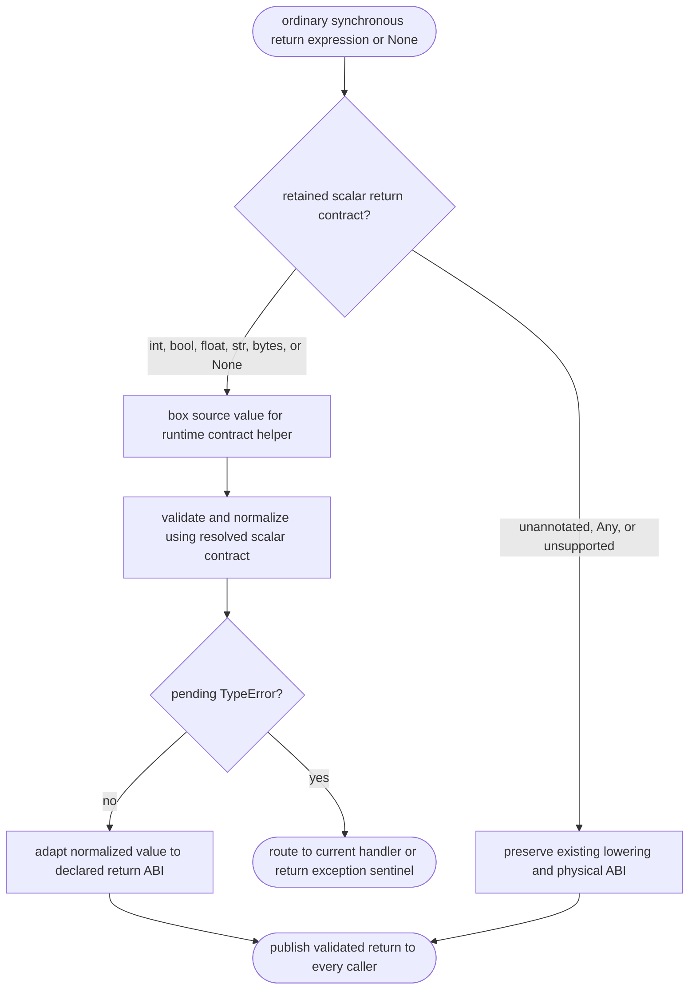

## Logic
<!-- type: logic lang: mermaid -->



`HirFuncSig.return_annotation` remains the diagnostic source spelling and the enclosing `HirFunction.return_ty` is the already-resolved semantic type. `hir_to_mir` derives a contract only for ordinary, synchronous user functions that have both a source annotation and one of the definite scalar semantic types: `int`, `bool`, `float`, `str`, `bytes`, or `None`. Thus a PEP 695 scalar alias uses its resolved scalar contract while its error retains the user spelling. Methods, async/generator bodies, unannotated functions, explicit `Any`, and unsupported container/generic/union/forward-reference annotations do not construct a contract.

At every ordinary-function return boundary, including explicit `return expr`, bare `return`, and the implicit fallthrough terminator, lowering boxes the candidate exactly once and calls `mb_validate_and_adapt_declared_return(value, contract, annotation, function_name)`. The runtime helper reuses the ingress `strict_scalar_value` compatibility rule: bool is normalized for an `int` contract; int/bool are normalized for `float`; strings, bytes, and None retain identity; and a mismatch raises `TypeError` with function name, source annotation, and actual runtime type. It returns the normalized boxed value only when no exception is pending.

Immediately after the helper, lowering calls the existing exception-propagation path. A rejected return therefore routes to the innermost handler or yields the existing exception sentinel before trace return publication, finally/with unwinding, ABI transfer, or caller code can observe a result. An accepted normalized value is unboxed only through the declared function return type, preserving raw Int/Bool, F64, and boxed physical ABIs. The #1447 provenance contract owns the raw Int unbox/return transfer; this slice does not infer representation from payload bits.

The runtime helper is registered in the normal symbol table so generic `CallExtern` lowering handles JIT and Object paths identically. Runtime unit tests cover diagnostics and normalization; two atomic PEP 723 fixtures prove direct and `Any`-erased dynamic calls, while the accounting gate asserts the exact executable-wall increment.

## Changes
<!-- type: changes lang: yaml -->

```yaml
changes:
  - path: projects/mamba/src/lower/hir_to_mir.rs
    action: modify
    section: logic
    impl_mode: hand-written
    gap: missing-generator:mamba-strict-scalar-return-contract
    tracker: "#1446"
    reason: "Return contracts require function-local resolved type, source spelling, exception routing, and physical ABI adaptation that the current generator cannot derive."
  - path: projects/mamba/src/runtime/builtins/mod.rs
    action: modify
    section: logic
    impl_mode: hand-written
    gap: missing-generator:mamba-strict-scalar-return-contract
    tracker: "#1446"
    reason: "The runtime owns scalar compatibility, exact TypeError diagnostics, and value normalization for an already-boxed return candidate."
  - path: projects/mamba/src/runtime/symbols.rs
    action: modify
    section: logic
    impl_mode: hand-written
    gap: missing-generator:mamba-strict-scalar-return-contract
    tracker: "#1446"
    reason: "The new callee-egress runtime helper must be visible to both JIT and Object CallExtern lowering."
  - path: projects/mamba/tests/cpython/type/core/return_annotation/func_int_return_any_str_direct.py
    action: add
    section: logic
    impl_mode: hand-written
    gap: missing-generator:mamba-strict-scalar-return-fixtures
    tracker: "#1446"
    reason: "One atomic fixture proves a direct caller cannot consume an Any-origin scalar-return mismatch."
  - path: projects/mamba/tests/cpython/type/core/return_annotation/func_int_return_any_str_dynamic.py
    action: add
    section: logic
    impl_mode: hand-written
    gap: missing-generator:mamba-strict-scalar-return-fixtures
    tracker: "#1446"
    reason: "One atomic fixture proves the callee contract applies through an Any-erased dynamic call."
  - path: projects/mamba/tests/governance/schema_gates/strict_type_accounting_gate_704.rs
    action: modify
    section: logic
    impl_mode: hand-written
    gap: missing-generator:mamba-strict-scalar-return-fixtures
    tracker: "#1446"
    reason: "The executable strict-type wall must advance deterministically from 7418 to 7420 when the two fixtures are added."
```
## Unit Test

```mermaid
---
id: mamba-strict-type-scalar-return-egress-verification
requirements:
  direct_any_rejection:
    id: R1
    text: "A synchronous function declared as returning int rejects an Any-origin str at callee egress after executing its body, with a catchable TypeError before a direct caller can consume the result."
    kind: regression
    risk: high
    verify: return_annotation/func_int_return_any_str_direct.py
  dynamic_any_rejection:
    id: R2
    text: "The same retained callee contract rejects an Any-origin str when the function value is invoked through an Any-erased dynamic call, proving validation is not dispatcher-only."
    kind: regression
    risk: high
    verify: return_annotation/func_int_return_any_str_dynamic.py
  fail_open_boundaries:
    id: R5
    text: "Unannotated, explicit Any, and unsupported container, generic, union, or forward-reference return annotations retain the existing fail-open behavior."
    kind: regression
    risk: medium
    verify: codegen::cranelift::tests::strict_scalar_return_contract_keeps_unsupported_annotations_open
  fixture_accounting:
    id: R6
    text: "The two executable return_annotation fixtures are discovered and strict-type accounting advances from 7418 to 7420 without changing unconstrained or unresolved denominators."
    kind: integration
    risk: medium
    verify: strict_type_accounting_gate_704::strict_type_fixture_accounting_matches_manifest
  return_form_contracts:
    id: R4
    text: "Explicit, bare, and implicit returns enforce non-None scalar contracts while bare and implicit returns satisfy a None contract without caller continuation after rejection."
    kind: functional
    risk: high
    verify: codegen::cranelift::tests::strict_scalar_return_contract_covers_return_forms
  scalar_abi_compatibility:
    id: R3
    text: "Accepted int, bool, float, str, bytes, None, and resolved PEP 695 scalar aliases preserve the existing raw, boxed, or F64 return ABI; bool-to-int and int-or-bool-to-float follow the ingress numeric compatibility rule."
    kind: functional
    risk: high
    verify: codegen::cranelift::tests::strict_scalar_return_contract_preserves_compatible_abi
---
flowchart TD
    r1[R1 direct any rejection] --> return_annotation_func_int_return_any_str_direct_py[return_annotation/func_int_return_any_str_direct.py]
    r2[R2 dynamic any rejection] --> return_annotation_func_int_return_any_str_dynamic_py[return_annotation/func_int_return_any_str_dynamic.py]
    r3[R3 scalar abi compatibility] --> codegen_cranelift_tests_strict_scalar_return_contract_preserves_compatible_abi[codegen::cranelift::tests::strict_scalar_return_contract_preserves_compatible_abi]
    r4[R4 return form contracts] --> codegen_cranelift_tests_strict_scalar_return_contract_covers_return_forms[codegen::cranelift::tests::strict_scalar_return_contract_covers_return_forms]
    r5[R5 fail open boundaries] --> codegen_cranelift_tests_strict_scalar_return_contract_keeps_unsupported_annotations_open[codegen::cranelift::tests::strict_scalar_return_contract_keeps_unsupported_annotations_open]
    r6[R6 fixture accounting] --> strict_type_accounting_gate_704_strict_type_fixture_accounting_matches_manifest[strict_type_accounting_gate_704::strict_type_fixture_accounting_matches_manifest]
```

<!-- type: unit-test lang: mermaid -->


