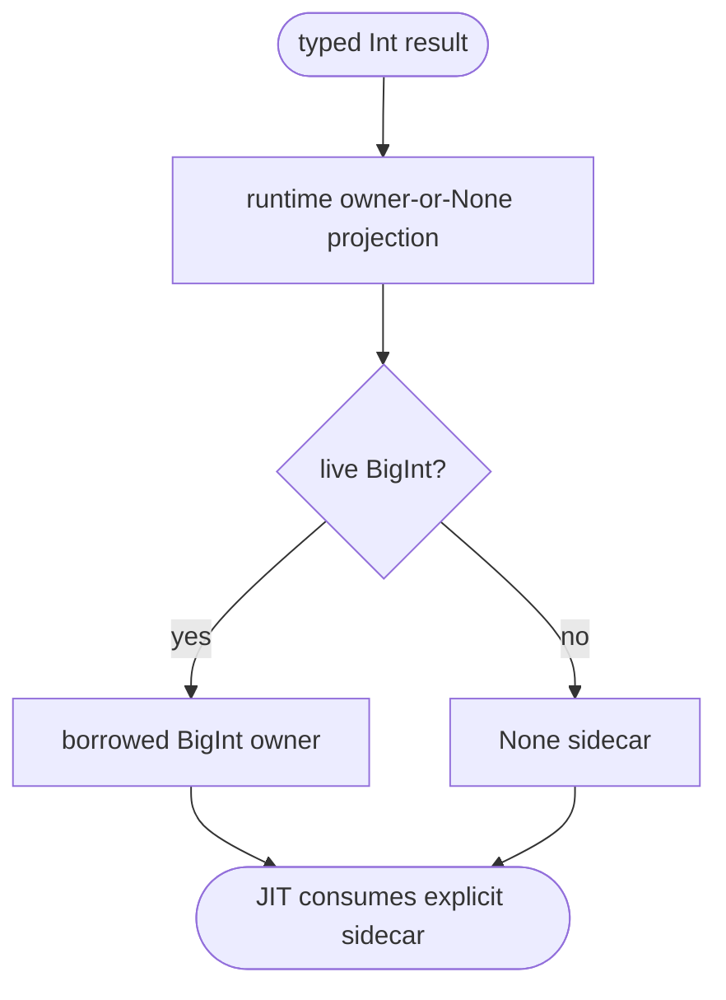
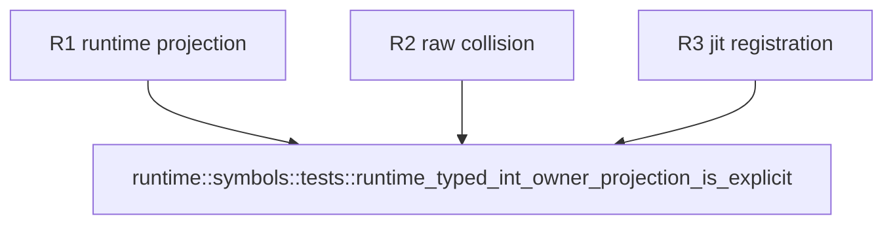

## Logic
<!-- type: logic lang: mermaid -->

The runtime, not JIT lowering, classifies the produced value. It returns the original `MbValue` only for a live BigInt and `MbValue::none()` for raw integers, inline boxed integers, and any pointer-shaped raw payload. The helper grants no new reference; a JIT producer chooses its declared fresh or borrowed transaction action after receiving this sidecar.

## Unit Test
<!-- type: unit-test lang: mermaid -->

