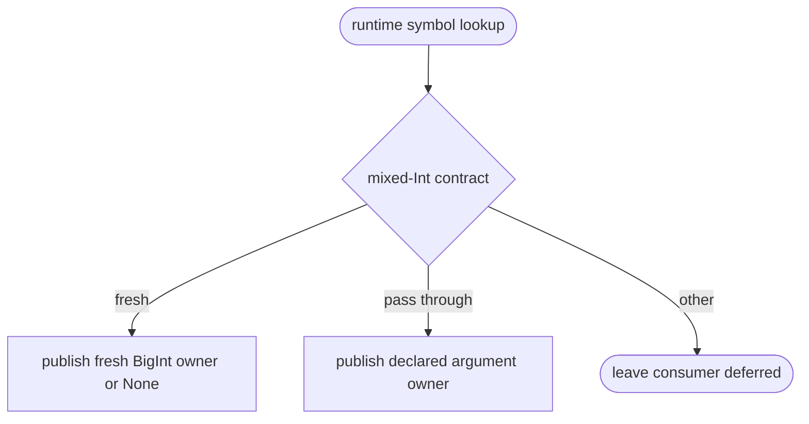

## Logic
<!-- type: logic lang: mermaid -->



`RuntimeSymbol` owns an optional `IntCompanionContract` sidecar in addition to `ReturnAbi`. `mb_pow_int` and `mb_bigint_{add,sub,mul}` declare `FreshResultOrNone`; `mb_unbox_{int,inline_int}_if_boxed` declares `ArgumentPassThroughOrNone { argument_index: 0 }`. Non-Int and dynamic `Unknown` symbols have no sidecar, so #1452 remains the only owner of dynamic return transport.

The owner-out adapter keeps result bits distinct from ownership: helper-created BigInts transfer exactly one fresh owner, while raw, inline, float, and handle results transfer none. Smart-unbox selects only its declared argument companion as `Borrowed`, never by inspecting result bits. The C/JIT ABI remains `i64`; #1462 consumes the sidecar after evaluation.
## Unit Test

```mermaid
---
id: mamba-strict-type-runtime-mixed-int-owner-sidecar-verification
requirements:
  fresh_transfer:
    id: R2
    text: "Overflowing power and BigInt arithmetic publish exactly their one fresh BigInt owner; raw results publish none."
    kind: functional
    risk: high
    verify: runtime::bigint_ops::tests::mixed_int_owner_out_transfers_fresh_bigint_once
  pass_through:
    id: R3
    text: "Smart unbox selects its declared argument companion even when the result bits are raw, without type or tag inference."
    kind: regression
    risk: high
    verify: runtime::builtins::boxing::tests::mixed_int_unbox_owner_out_uses_declared_argument
  registry_contract:
    id: R1
    text: "Every registered RawOrBoxedInt helper has its declared companion source, while non-Int and dynamic helpers have no mixed-Int sidecar."
    kind: regression
    risk: high
    verify: runtime::symbols::tests::runtime_mixed_int_companion_contracts_are_explicit
---
flowchart TD
    r1[R1 registry contract] --> runtime_symbols_tests_runtime_mixed_int_companion_contracts_are_explicit[runtime::symbols::tests::runtime_mixed_int_companion_contracts_are_explicit]
    r2[R2 fresh transfer] --> runtime_bigint_ops_tests_mixed_int_owner_out_transfers_fresh_bigint_once[runtime::bigint_ops::tests::mixed_int_owner_out_transfers_fresh_bigint_once]
    r3[R3 pass through] --> runtime_builtins_boxing_tests_mixed_int_unbox_owner_out_uses_declared_argument[runtime::builtins::boxing::tests::mixed_int_unbox_owner_out_uses_declared_argument]
```

<!-- type: unit-test lang: mermaid -->


## Changes
<!-- type: changes lang: yaml -->

```yaml
changes:
  - path: projects/mamba/src/runtime/symbols.rs
    action: modify
    section: logic
    impl_mode: hand-written
    gap: missing-generator:mamba-runtime-mixed-int-owner-sidecars
    tracker: "#1461"
    reason: "The runtime symbol registry is the authoritative declaration point for mixed-Int result ownership."
  - path: projects/mamba/src/runtime/bigint_ops.rs
    action: modify
    section: logic
    impl_mode: hand-written
    gap: missing-generator:mamba-runtime-mixed-int-owner-sidecars
    tracker: "#1461"
    reason: "Overflow arithmetic must expose fresh BigInt ownership separately from raw result bits."
  - path: projects/mamba/src/runtime/builtins/boxing.rs
    action: modify
    section: logic
    impl_mode: hand-written
    gap: missing-generator:mamba-runtime-mixed-int-owner-sidecars
    tracker: "#1461"
    reason: "Smart-unbox ownership must select an explicit argument sidecar rather than infer from result bits."
```
