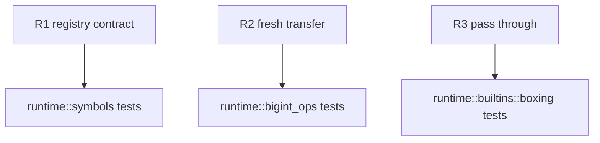

## Logic
<!-- type: logic lang: mermaid -->

```mermaid
(fill)
```
## Unit Test
<!-- type: unit-test lang: mermaid -->



## Changes
<!-- type: changes lang: yaml -->

```yaml
changes:
  - path: projects/mamba/src/runtime/symbols.rs
    action: modify
    section: logic
    impl_mode: hand-written
    gap: missing-generator:mamba-runtime-mixed-int-owner-sidecars
    tracker: "#1461"
    reason: "The runtime symbol registry is the authoritative declaration point for mixed-Int result ownership."
  - path: projects/mamba/src/runtime/bigint_ops.rs
    action: modify
    section: logic
    impl_mode: hand-written
    gap: missing-generator:mamba-runtime-mixed-int-owner-sidecars
    tracker: "#1461"
    reason: "Overflow arithmetic must expose fresh BigInt ownership separately from raw result bits."
  - path: projects/mamba/src/runtime/builtins/boxing.rs
    action: modify
    section: logic
    impl_mode: hand-written
    gap: missing-generator:mamba-runtime-mixed-int-owner-sidecars
    tracker: "#1461"
    reason: "Smart-unbox ownership must select an explicit argument sidecar rather than infer from result bits."
```
