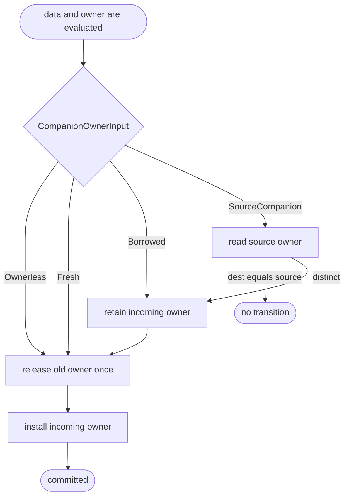

## Logic
<!-- type: logic lang: mermaid -->

`VarAlloc` exposes a shared commit API with an explicit `CompanionOwnerInput`:
`Ownerless`, `Fresh(Value)`, `Borrowed(Value)`, or `SourceCompanion(VReg)`.
Callers evaluate the producer's data and construct this input before invoking the
commit API. The API reads a source companion, when present, before it reads or
releases the destination; returns without transition for `dest == source`;
retains only borrowed/source inputs; releases the old destination exactly once;
and defines the destination to the incoming owner exactly once.

Fresh runtime results are transferred without a duplicate retain. Ownerless
results install the canonical `MbValue::none()` companion. A pure boxed source
bridges to a mixed destination through `Borrowed(Value)`, never through a data
bit/tag inference. `MoveOut` and cleanup retain their current ownership-transfer
semantics and are outside the producer transaction.

The generic pre-evaluation `ProducerWrite` preamble is removed from the shared
Object backend path. This TD does not migrate JIT/Object producer-specific arms,
runtime sidecars, parameter frames, or return transport; those are the declared
responsibility of #1461, #1462, #1463, #1451, and #1452.
## Unit Test

```mermaid
---
id: mamba-strict-type-post-evaluation-companion-transaction-verification
requirements:
  borrowed_order:
    id: R2
    text: "A borrowed incoming companion is retained before the old destination companion is released, including aliasing values."
    kind: regression
    risk: high
    verify: codegen::cranelift::tests::companion_transaction_borrowed_retains_before_release
  boxed_bridge:
    id: R5
    text: "An explicit boxed source can bridge into a canonical mixed VReg as a borrowed-retained companion rather than becoming None."
    kind: functional
    risk: high
    verify: codegen::cranelift::tests::companion_transaction_borrowed_boxed_bridge_retains
  fresh_transfer:
    id: R1
    text: "A fresh transferred companion installs after producer evaluation without an extra retain, then releases the previous destination owner exactly once."
    kind: regression
    risk: high
    verify: codegen::cranelift::tests::companion_transaction_fresh_owner_does_not_retain
  ownerless_overwrite:
    id: R4
    text: "An ownerless replacement releases the old companion once and installs the canonical None companion without passing raw data bits to retain or release."
    kind: regression
    risk: high
    verify: codegen::cranelift::tests::companion_transaction_ownerless_overwrite_is_precise
  source_alias:
    id: R3
    text: "A source-companion input reads and retains the source before release, and a self source/destination alias emits no retain or release transition."
    kind: functional
    risk: high
    verify: codegen::cranelift::tests::companion_transaction_source_alias_is_safe
---
flowchart TD
    r1[R1 fresh transfer] --> codegen_cranelift_tests_companion_transaction_fresh_owner_does_not_retain[codegen::cranelift::tests::companion_transaction_fresh_owner_does_not_retain]
    r2[R2 borrowed order] --> codegen_cranelift_tests_companion_transaction_borrowed_retains_before_release[codegen::cranelift::tests::companion_transaction_borrowed_retains_before_release]
    r3[R3 source alias] --> codegen_cranelift_tests_companion_transaction_source_alias_is_safe[codegen::cranelift::tests::companion_transaction_source_alias_is_safe]
    r4[R4 ownerless overwrite] --> codegen_cranelift_tests_companion_transaction_ownerless_overwrite_is_precise[codegen::cranelift::tests::companion_transaction_ownerless_overwrite_is_precise]
    r5[R5 boxed bridge] --> codegen_cranelift_tests_companion_transaction_borrowed_boxed_bridge_retains[codegen::cranelift::tests::companion_transaction_borrowed_boxed_bridge_retains]
```

<!-- type: unit-test lang: mermaid -->

