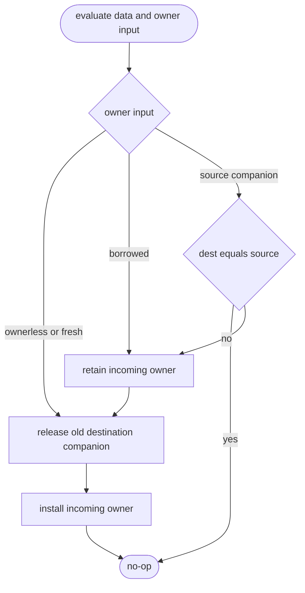

## Logic
<!-- type: logic lang: mermaid -->

The shared Cranelift companion API is a two-step contract: the producer evaluates
data and obtains its owner input before it calls the transaction, then the
transaction performs retain-if-borrowed, release-old, and install-new in that
order. `Fresh(Value)` transfers ownership without a retain; `Borrowed(Value)`
and `SourceCompanion(VReg)` retain before the old destination is released; and
`Ownerless` installs the canonical `None` companion. A self source/destination
alias is a no-op. The transaction never derives ownership from data bits, tags,
or semantic type.

`ProducerWrite` is replaced by an explicit incoming-owner form so no caller can
release a destination before it has evaluated the replacement data and owner.
`MoveOut` and cleanup remain transfer/teardown operations, not producer writes.
This slice changes only the shared `VarAlloc` transaction region and its
colocated structural tests. JIT/Object producer match arms, runtime sidecars,
argument ingress, and return transport remain deferred to #1461, #1462, #1463,
#1451, and #1452 respectively.

## Unit Test

```mermaid
---
id: mamba-strict-type-post-evaluation-companion-transaction-verification
requirements:
  borrowed_order:
    id: R2
    text: "A borrowed incoming companion is retained before the old destination companion is released, including aliasing values."
    kind: regression
    risk: high
    verify: codegen::cranelift::tests::companion_transaction_borrowed_retains_before_release
  boxed_bridge:
    id: R5
    text: "An explicit boxed source can bridge into a canonical mixed VReg as a borrowed-retained companion rather than becoming None."
    kind: functional
    risk: high
    verify: codegen::cranelift::tests::companion_transaction_borrowed_boxed_bridge_retains
  fresh_transfer:
    id: R1
    text: "A fresh transferred companion installs after producer evaluation without an extra retain, then releases the previous destination owner exactly once."
    kind: regression
    risk: high
    verify: codegen::cranelift::tests::companion_transaction_fresh_owner_does_not_retain
  ownerless_overwrite:
    id: R4
    text: "An ownerless replacement releases the old companion once and installs the canonical None companion without passing raw data bits to retain or release."
    kind: regression
    risk: high
    verify: codegen::cranelift::tests::companion_transaction_ownerless_overwrite_is_precise
  source_alias:
    id: R3
    text: "A source-companion input reads and retains the source before release, and a self source/destination alias emits no retain or release transition."
    kind: functional
    risk: high
    verify: codegen::cranelift::tests::companion_transaction_source_alias_is_safe
---
flowchart TD
    r1[R1 fresh transfer] --> codegen_cranelift_tests_companion_transaction_fresh_owner_does_not_retain[codegen::cranelift::tests::companion_transaction_fresh_owner_does_not_retain]
    r2[R2 borrowed order] --> codegen_cranelift_tests_companion_transaction_borrowed_retains_before_release[codegen::cranelift::tests::companion_transaction_borrowed_retains_before_release]
    r3[R3 source alias] --> codegen_cranelift_tests_companion_transaction_source_alias_is_safe[codegen::cranelift::tests::companion_transaction_source_alias_is_safe]
    r4[R4 ownerless overwrite] --> codegen_cranelift_tests_companion_transaction_ownerless_overwrite_is_precise[codegen::cranelift::tests::companion_transaction_ownerless_overwrite_is_precise]
    r5[R5 boxed bridge] --> codegen_cranelift_tests_companion_transaction_borrowed_boxed_bridge_retains[codegen::cranelift::tests::companion_transaction_borrowed_boxed_bridge_retains]
```

<!-- type: unit-test lang: mermaid -->

