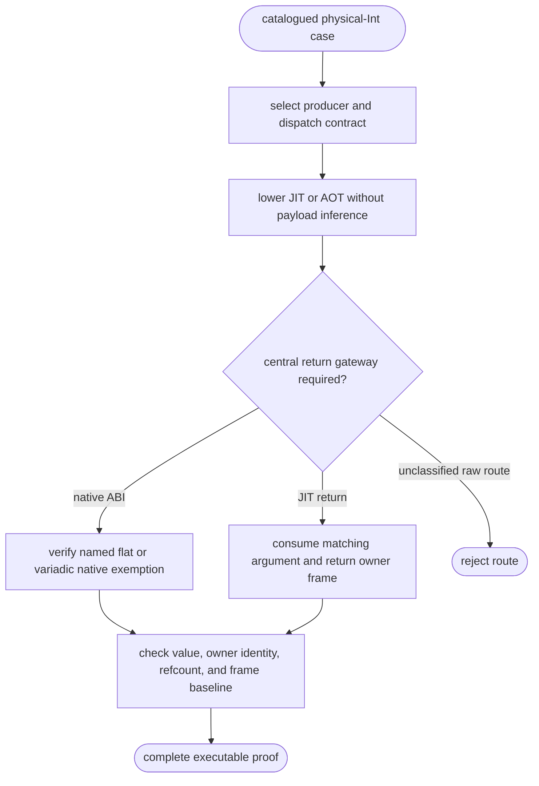

## Logic
<!-- type: logic lang: mermaid -->



`ProducerCase` is the single test-only catalogue. Each row names the MIR construction, expected raw-or-boxed value, expected companion owner (`None`, transferred, or borrowed/retained), and concrete JIT assertion. It includes literal, global/cell/capture, attribute/item, arithmetic, bitwise/shift/unary/pow, copy/rebind/self-copy, branch/loop/parameter forwarding, internal/extern call, and unbox classes. A missing class fails before behavior can be inferred from numeric payload bits.

`DispatchCase` binds public dynamic routes to existing central gateways: closure and callable wrappers use `builtins::dispatch_jit_frame`; class/method/descriptor use `class::dispatch_jit_method_return`; value-discarding routes use the paired discard path; spread/kwargs keeps the input frame prepared from original dynamic values; and `asyncio.to_thread` consumes its worker return token on that worker. A raw JIT `transmute(addr)` return call is forbidden; native flat or variadic ABIs require a classifier record proving that they do not transport JIT return owners.

Every execution starts from a fresh ownership baseline and checks semantic value, exact owner identity, refcount, and frame depth after repeated cleanup. A raw integer with the numeric bits of a live BigInt must be ownerless according to `mb_typed_int_owner_or_none`; the real BigInt carries its named owner once. Nested profile and weakref probes must finish inner before outer frame. AOT uses the same MIR catalogue to write an object, link it through the repository host-linker fixture, and execute it; compile-only output cannot satisfy this contract.

`provenance_inventory` is fail-closed: it classifies all codegen raw-or-boxed producer locations and runtime raw-callable invocations as a central gateway or named native exemption. The governance gate checks repository sources and a synthetic bypass fixture, so an unclassified future route is rejected.
## Changes
<!-- type: changes lang: yaml -->

```yaml
changes:
  - path: projects/mamba/src/codegen/cranelift/provenance_matrix.rs
    action: add
    section: logic
    impl_mode: hand-written
    gap: missing-generator:mamba-strict-type-provenance-proof-matrix
    tracker: "#1453"
    reason: "The finite provenance catalog and executable JIT/AOT matrix require a deterministic generator primitive before they can be generated."
  - path: projects/mamba/src/codegen/cranelift/mod.rs
    action: modify
    section: logic
    impl_mode: hand-written
    gap: missing-generator:mamba-strict-type-provenance-proof-matrix
    tracker: "#1453"
    reason: "The Cranelift test module must expose the isolated proof matrix without changing production code paths."
  - path: projects/mamba/src/runtime/provenance_inventory.rs
    action: add
    section: logic
    impl_mode: hand-written
    gap: missing-generator:mamba-strict-type-provenance-static-inventory
    tracker: "#1453"
    reason: "Raw callable-route classification and synthetic fail-closed fixtures need one semantic owner."
  - path: projects/mamba/src/runtime/mod.rs
    action: modify
    section: logic
    impl_mode: hand-written
    gap: missing-generator:mamba-strict-type-provenance-static-inventory
    tracker: "#1453"
    reason: "The runtime module must expose the inventory only to the strict proof tests."
  - path: projects/mamba/tests/governance/schema_gates/strict_type_provenance_gate_1453.rs
    action: add
    section: logic
    impl_mode: hand-written
    gap: missing-generator:mamba-strict-type-provenance-governance-gate
    tracker: "#1453"
    reason: "The strict proof inventory is a repository-level gate and needs an isolated, runnable schema-gate module."
  - path: projects/mamba/tests/governance/schema_gates.rs
    action: modify
    section: logic
    impl_mode: hand-written
    gap: missing-generator:mamba-strict-type-provenance-governance-gate
    tracker: "#1453"
    reason: "Cargo must register the provenance gate in the consolidated schema-gate binary."
```

## Unit Test

```mermaid
---
id: mamba-strict-type-provenance-proof-matrix-verification
requirements:
  aot_execution:
    id: R5
    text: "A provenance-catalogue AOT object is linked and executed through the host-linker fixture; generating a non-empty object alone does not meet the proof contract."
    kind: integration
    risk: high
    verify: codegen::cranelift::provenance_matrix::tests::aot_provenance_object_executes_with_host_linker
  closed_static_inventory:
    id: R6
    text: "The repository inventory classifies every raw JIT address call and raw-or-boxed producer; an unclassified synthetic JIT bypass fails closed unless it uses a named native ABI exemption."
    kind: regression
    risk: high
    verify: strict_type_provenance_gate_1453::raw_or_boxed_provenance_inventory_is_complete
  dynamic_dispatch:
    id: R3
    text: "Each dynamic public route—closure, callable wrapper, class/method/descriptor, spread/kwargs, and to_thread—uses a matching central argument and return owner frame exactly once."
    kind: functional
    risk: high
    verify: runtime::provenance_inventory::tests::dynamic_return_routes_finalize_one_matching_owner
  pointer_collision:
    id: R2
    text: "Equal numeric payload bits cannot create provenance: a pointer-shaped raw integer has no owner, while the corresponding live BigInt owner is transferred exactly once and repeated calls restore the baseline refcount."
    kind: regression
    risk: high
    verify: codegen::cranelift::provenance_matrix::tests::pointer_shaped_raw_values_never_adopt_bigint_owner
  producer_matrix:
    id: R1
    text: "The JIT producer catalogue executes every declared raw-or-boxed producer class with the expected value and only the declared companion owner transition."
    kind: regression
    risk: high
    verify: codegen::cranelift::provenance_matrix::tests::jit_producer_matrix_preserves_explicit_owners
  reentrant_teardown:
    id: R4
    text: "Nested profile and weakref callbacks complete return owner frames in LIFO order and leave both argument and return frame depth at baseline after repeated calls."
    kind: regression
    risk: high
    verify: runtime::provenance_inventory::tests::nested_profile_weakref_callbacks_restore_owner_frames
---
flowchart TD
    r1[R1 producer matrix] --> codegen_cranelift_provenance_matrix_tests_jit_producer_matrix_preserves_explicit_owners[codegen::cranelift::provenance_matrix::tests::jit_producer_matrix_preserves_explicit_owners]
    r2[R2 pointer collision] --> codegen_cranelift_provenance_matrix_tests_pointer_shaped_raw_values_never_adopt_bigint_owner[codegen::cranelift::provenance_matrix::tests::pointer_shaped_raw_values_never_adopt_bigint_owner]
    r3[R3 dynamic dispatch] --> runtime_provenance_inventory_tests_dynamic_return_routes_finalize_one_matching_owner[runtime::provenance_inventory::tests::dynamic_return_routes_finalize_one_matching_owner]
    r4[R4 reentrant teardown] --> runtime_provenance_inventory_tests_nested_profile_weakref_callbacks_restore_owner_frames[runtime::provenance_inventory::tests::nested_profile_weakref_callbacks_restore_owner_frames]
    r5[R5 aot execution] --> codegen_cranelift_provenance_matrix_tests_aot_provenance_object_executes_with_host_linker[codegen::cranelift::provenance_matrix::tests::aot_provenance_object_executes_with_host_linker]
    r6[R6 closed static inventory] --> strict_type_provenance_gate_1453_raw_or_boxed_provenance_inventory_is_complete[strict_type_provenance_gate_1453::raw_or_boxed_provenance_inventory_is_complete]
```

<!-- type: unit-test lang: mermaid -->


