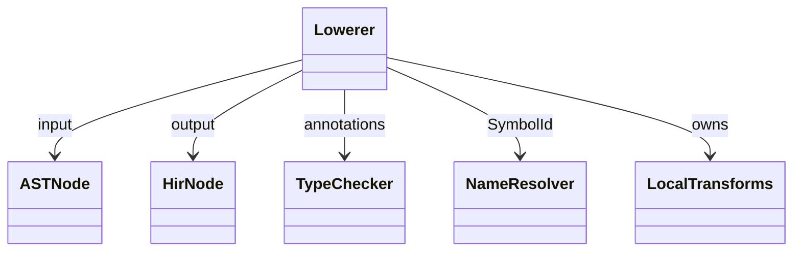
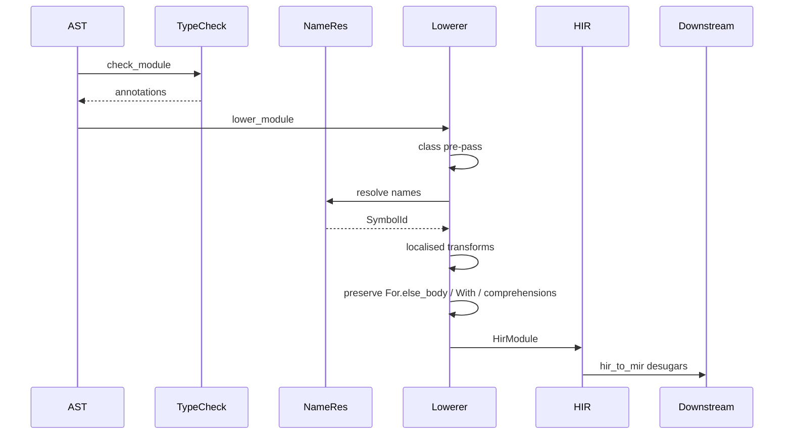

# Lower — AST to HIR

> **Audit note (2026-05-08, #1269):** prior revisions of this spec described
> the AST→HIR pass as a "desugaring" stage that flattened comprehensions,
> `with`-statements, and `for-else` into smaller HIR primitives. The code
> does not do this. HIR retains those syntactic variants
> (`HirExpr::ListComp` / `SetComp` / `DictComp`, `HirStmt::With`,
> `For.else_body` / `While.else_body`); the actual desugaring lives at
> `lower/hir_to_mir.rs` (e.g. `For.else_body` at hir_to_mir.rs:1595,
> `HirStmt::With` at hir_to_mir.rs:2139). This spec has been rewritten to
> say "variant preserved at HIR" wherever the prior phrasing claimed
> desugaring. AugAssign R5 has also been weakened — it desugars to
> `Assign + BinOp` but evaluates the target expression twice for
> subscript/attribute targets (real semantic gap, see R5 below).

`lower/ast_to_hir.rs` (~4636 LOC) is the single biggest file in the
compiler pipeline. It walks `parser::ast::Module`, runs name
resolution against the type-checker's symbol table, performs a small
set of localised transforms, and produces `hir::HirModule`. HIR is
best understood as the **typed + resolved + scope-annotated AST**, not
as a post-desugar IR.

What this pass actually transforms (small, localised — most syntactic
variants are preserved verbatim):

- `(n := e)` → `HirAssign(n, e); HirLocalRef(n)` plus scope hoist
  to the enclosing function (commit `92458f9d1`).
- `[*head, *tail] = xs` → starred-unpack lowered to `HirLValue::Unpack`
  with `star_index`.
- `x op= e` (AugAssign) → `Assign { lvalue, BinOp(<lower_expr(target)>, op, value) }`.
  **Caveat (R5):** target is evaluated twice for subscript/attribute
  forms (`a[i] += 1` calls `a` and `__getitem__` twice).
- `f'{e:fmt}'` → `HirExpr::FString { parts: Vec<HirFStringPart> }`.
- decorator chain → `HirFunction.decorators: Vec<HirExpr>` (right-to-left
  applied at runtime per `closure.md`).
- `for a, b in iter` (multi-target) → introduces `__for_tmp_<n>` plus
  an unpack-assign in the loop body; single-target `for x in iter`
  passes through.
- `if / elif* / else` → nested `If { else_body: [If { ... }] }`.
- `@dataclass` and `@enum` recognised at this layer for special HIR
  shape.

What this pass **preserves** at HIR (no desugaring here — handled at
`lower/hir_to_mir.rs` or codegen):

- `HirStmt::For { ..., else_body }` — `for-else` kept as a single node;
  the broken-flag rewrite lives at hir_to_mir.rs:1595.
- `HirStmt::While { ..., else_body }` — `while-else` analogous.
- `HirStmt::With { items, body, is_async, span }` — `__enter__` /
  `__exit__` / `try / finally` shape produced at hir_to_mir.rs:2139,
  not here.
- `HirExpr::ListComp` / `SetComp` / `DictComp` — comprehensions kept
  intact; loop+append form is built downstream.

Three load-bearing invariants:

1. **Class symbol pre-pass before any method body lowers** — commit
   `486b3ea7` fix; collects every class name into `user_class_syms`
   before walking method bodies, so `class A: def f(self): return B()`
   followed by `class B: ...` resolves both ways. Skipping the pre-pass
   makes B unresolvable when A's method lowers.
2. **Walrus expressions hoist their binding to the enclosing function
   scope, not the comprehension scope** — `[(n := f()) for x in xs]`
   binds `n` outside the comp; same for lambda body (commit
   `92458f9d1`). The lowerer must walk up to the enclosing function
   scope when adding the symbol.
3. **AugAssign desugars to `Assign + BinOp` (single statement)** —
   `x += e` lowers to `Assign(x, BinOp(x, op, e))`. For Name targets
   this is correct (the symbol is read from the local-types map, no
   side effects). For subscript / attribute targets the target
   expression is evaluated **twice** today (once for the `lvalue`,
   once for `lower_expr(target)` in the BinOp left-hand side). This
   diverges from CPython, which evaluates the target expression once
   and uses dedicated `LOAD_SUBSCR` / `STORE_SUBSCR` opcodes against
   shared temps. Tracked in #1269 R5; the deliberate choice in this
   audit is to weaken the spec rather than ship the fix in-line.

## Type model
<!-- type: dependency lang: mermaid -->



## AST → HIR transform shape
<!-- type: schema lang: yaml -->

```yaml
$schema: "https://json-schema.org/draft/2020-12/schema"
$id: "ast-to-hir-types"
$defs:
  TransformTable:
    type: array
    items:
      type: object
      properties:
        ast_form:        { type: string }
        hir_target:      { type: string }
        kind:            { type: string, enum: [transform, preserve] }
        notes:           { type: string }
      required: [ast_form, hir_target, kind]
    examples:
      - - { ast_form: "(n := e)", hir_target: "HirAssign(n, e); HirLocalRef(n)", kind: transform, notes: "scope hoists to enclosing fn (commit 92458f9d1)" }
        - { ast_form: "x op= e (AugAssign, Name target)", hir_target: "Assign(x, BinOp(x, op, e))", kind: transform, notes: "single-evaluation OK for Name targets" }
        - { ast_form: "lst[i] op= e (AugAssign, subscript target)", hir_target: "Assign(lst[i], BinOp(lst[i], op, e))", kind: transform, notes: "R5 caveat: target evaluated twice today" }
        - { ast_form: "f'{e:fmt}'", hir_target: "FString parts: Literal + Expr(e, format_spec)", kind: transform }
        - { ast_form: "@d def f", hir_target: "HirFunction.decorators carries d (right-to-left apply at runtime)", kind: transform }
        - { ast_form: "[*head, *tail] = xs", hir_target: "HirLValue::Unpack with star_index", kind: transform }
        - { ast_form: "for a, b in iter: body", hir_target: "for __for_tmp in iter: a,b = __for_tmp; body", kind: transform, notes: "only multi-target forms introduce a temp" }
        - { ast_form: "if c: ... elif d: ... else: ...", hir_target: "nested HirStmt::If with else_body=[If]", kind: transform }
        - { ast_form: "for x in iter: body else: e", hir_target: "HirStmt::For { ..., else_body: e } (preserved)", kind: preserve, notes: "broken-flag rewrite at hir_to_mir.rs:1595, NOT here" }
        - { ast_form: "while c: body else: e", hir_target: "HirStmt::While { ..., else_body: e } (preserved)", kind: preserve, notes: "broken-flag rewrite at hir_to_mir.rs" }
        - { ast_form: "with X as y: body", hir_target: "HirStmt::With { items, body, is_async } (preserved)", kind: preserve, notes: "__enter__ / __exit__ / try-finally produced at hir_to_mir.rs:2139" }
        - { ast_form: "with A() as a, B() as b: body", hir_target: "HirStmt::With with multi-item items list (preserved)", kind: preserve, notes: "single With node carries all items; nesting/desugar deferred" }
        - { ast_form: "[e for x in xs if c]", hir_target: "HirExpr::ListComp { element, generators }", kind: preserve, notes: "loop+append form built at hir_to_mir / codegen" }
        - { ast_form: "{k: v for x in xs}", hir_target: "HirExpr::DictComp { key, value, generators }", kind: preserve }
        - { ast_form: "{e for x in xs}", hir_target: "HirExpr::SetComp { element, generators }", kind: preserve }
```

## Lowering walk logic
<!-- type: logic lang: mermaid -->

```mermaid
---
id: ast-to-hir-walk
entry: enter
nodes:
  enter:        { kind: start,    label: "lower_module(Module, TypeChecker)" }
  prepass:      { kind: process,  label: "Pre-pass: collect class names from Module.stmts → user_class_syms / class_syms" }
  walk_top:     { kind: process,  label: "for each top-level Stmt: dispatch by AST variant" }
  is_def:       { kind: decision, label: "FnDef / AsyncFnDef / ClassDef / EnumDef?" }
  lower_def:    { kind: process,  label: "build HirFunction / HirClass / EnumDef; recurse body with new scope" }
  is_aug:       { kind: decision, label: "AugAssign?" }
  desugar_aug:  { kind: process,  label: "Assign(lvalue, BinOp(target, op, value)); R5 caveat: target evaluated twice for subscript/attribute" }
  is_for:       { kind: decision, label: "For (single or multi-target)?" }
  pass_for:     { kind: process,  label: "HirStmt::For { ..., else_body } preserved; multi-target → __for_tmp + unpack" }
  is_while:     { kind: decision, label: "While?" }
  pass_while:   { kind: process,  label: "HirStmt::While { ..., else_body } preserved" }
  is_with:      { kind: decision, label: "With?" }
  pass_with:    { kind: process,  label: "HirStmt::With { items, body, is_async } preserved" }
  is_walrus:    { kind: decision, label: "expression contains :=?" }
  desugar_walrus:{ kind: process, label: "HirAssign + LocalRef; hoist symbol to enclosing fn scope" }
  is_comp:      { kind: decision, label: "ListComp / SetComp / DictComp / GeneratorExp?" }
  pass_comp:    { kind: process,  label: "HirExpr::ListComp / SetComp / DictComp preserved" }
  is_match:     { kind: decision, label: "Match?" }
  lower_match:  { kind: process,  label: "build HirMatchCase per arm" }
  resolve_names:{ kind: process,  label: "walk HirExpr; LocalRef / GlobalRef carry SymbolId" }
  done:         { kind: terminal, label: "HirModule (typed+resolved AST)" }
edges:
  - { from: enter,         to: prepass }
  - { from: prepass,       to: walk_top }
  - { from: walk_top,      to: is_def }
  - { from: is_def,        to: lower_def,        label: "yes" }
  - { from: is_def,        to: is_aug,           label: "no" }
  - { from: is_aug,        to: desugar_aug,      label: "yes" }
  - { from: is_aug,        to: is_for,           label: "no" }
  - { from: is_for,        to: pass_for,         label: "yes" }
  - { from: is_for,        to: is_while,         label: "no" }
  - { from: is_while,      to: pass_while,       label: "yes" }
  - { from: is_while,      to: is_with,          label: "no" }
  - { from: is_with,       to: pass_with,        label: "yes" }
  - { from: is_with,       to: is_walrus,        label: "no" }
  - { from: is_walrus,     to: desugar_walrus,   label: "yes" }
  - { from: is_walrus,     to: is_comp,          label: "no" }
  - { from: is_comp,       to: pass_comp,        label: "yes (preserve)" }
  - { from: is_comp,       to: is_match,         label: "no" }
  - { from: is_match,      to: lower_match,      label: "yes" }
  - { from: is_match,      to: resolve_names,    label: "no — generic Stmt" }
  - { from: lower_def,     to: resolve_names }
  - { from: desugar_aug,   to: resolve_names }
  - { from: pass_for,      to: resolve_names }
  - { from: pass_while,    to: resolve_names }
  - { from: pass_with,     to: resolve_names }
  - { from: desugar_walrus, to: resolve_names }
  - { from: pass_comp,     to: resolve_names }
  - { from: lower_match,   to: resolve_names }
  - { from: resolve_names, to: walk_top, label: "next" }
  - { from: resolve_names, to: done,     label: "EOF" }
---
flowchart TD
    enter([lower_module]) --> prepass[class pre-pass]
    prepass --> walk_top[walk top-level Stmts]
    walk_top --> is_def{def/class/enum?}
    is_def -->|yes| lower_def[HirFunction / HirClass]
    is_def -->|no| is_aug{AugAssign?}
    is_aug -->|yes| desugar_aug[Assign + BinOp; R5 2-eval caveat]
    is_aug -->|no| is_for{For?}
    is_for -->|yes| pass_for[HirStmt::For else_body preserved]
    is_for -->|no| is_while{While?}
    is_while -->|yes| pass_while[HirStmt::While else_body preserved]
    is_while -->|no| is_with{with?}
    is_with -->|yes| pass_with[HirStmt::With preserved]
    is_with -->|no| is_walrus{walrus?}
    is_walrus -->|yes| desugar_walrus[HirAssign + LocalRef hoist]
    is_walrus -->|no| is_comp{comprehension?}
    is_comp -->|yes| pass_comp[ListComp/SetComp/DictComp preserved]
    is_comp -->|no| is_match{match?}
    is_match -->|yes| lower_match[HirMatchCase]
    is_match -->|no| resolve_names[SymbolId resolve]
    lower_def --> resolve_names
    desugar_aug --> resolve_names
    pass_for --> resolve_names
    pass_while --> resolve_names
    pass_with --> resolve_names
    desugar_walrus --> resolve_names
    pass_comp --> resolve_names
    lower_match --> resolve_names
    resolve_names --> walk_top
    resolve_names --> done([HirModule])
```

## Lowerer interaction
<!-- type: interaction lang: mermaid -->



## Acceptance scenarios
<!-- type: overview lang: markdown -->

```mermaid
---
id: ast-to-hir-acceptance
actors:
  - { id: User,    kind: actor }
  - { id: Mamba,   kind: system }
  - { id: Fixture, kind: system }
messages:
  - { from: User,    to: Mamba,   name: "run iterators/custom_iter_non_self.py" }
  - { from: Mamba,   to: Fixture, name: "forward-class-ref in method body" }
  - { from: Fixture, to: Mamba,   name: "class pre-pass; both classes resolve (commit 486b3ea7)" }
  - { from: User,    to: Mamba,   name: "run augmented_assign/sequences.py" }
  - { from: Mamba,   to: Fixture, name: "lst[0] += 1" }
  - { from: Fixture, to: Mamba,   name: "Assign + BinOp; R5 caveat: target evaluated twice (subscript/attribute)" }
  - { from: User,    to: Mamba,   name: "run language/walrus_in_lambda.py" }
  - { from: Mamba,   to: Fixture, name: "lambda y: (n := f()) + y" }
  - { from: Fixture, to: Mamba,   name: "walrus hoists n into lambda body scope (commit 92458f9d1)" }
  - { from: User,    to: Mamba,   name: "run language/with_lifecycle.py" }
  - { from: Mamba,   to: Fixture, name: "with cm() as x: body" }
  - { from: Fixture, to: Mamba,   name: "HirStmt::With preserved at HIR; __enter__/__exit__ produced at hir_to_mir" }
  - { from: User,    to: Mamba,   name: "run control_flow/for_else_basic.py" }
  - { from: Mamba,   to: Fixture, name: "for x in xs: ... else: e" }
  - { from: Fixture, to: Mamba,   name: "HirStmt::For.else_body preserved; broken-flag rewrite at hir_to_mir:1595" }
---
sequenceDiagram
    actor User
    participant Mamba
    participant Fixture
    User->>Mamba: iterators/custom_iter_non_self.py
    Mamba->>Fixture: forward class ref
    Fixture-->>Mamba: pre-pass resolves
    User->>Mamba: augmented_assign/sequences.py
    Mamba->>Fixture: lst[0] += 1
    Fixture-->>Mamba: Assign+BinOp; R5 2-eval caveat
    User->>Mamba: language/walrus_in_lambda.py
    Mamba->>Fixture: lambda walrus
    Fixture-->>Mamba: hoist scope
    User->>Mamba: language/with_lifecycle.py
    Mamba->>Fixture: with statement
    Fixture-->>Mamba: With preserved at HIR
    User->>Mamba: control_flow/for_else_basic.py
    Mamba->>Fixture: for-else
    Fixture-->>Mamba: For.else_body preserved
```

## Tests
<!-- type: tests lang: yaml -->

```yaml
runner: "cargo test -p mamba --test conformance_tests --release -- {name} --test-threads=1"
fixtures:
  - id: forward_class
    name: "iterators/custom_iter_non_self.py"
    paired: "iterators/custom_iter_non_self.expected"
    verifies: ["class symbol pre-pass (commit 486b3ea7)"]
  - id: aug_assign_lvalue
    name: "augmented_assign/sequences.py"
    paired: "augmented_assign/sequences.expected"
    verifies: ["AugAssign desugars to Assign + BinOp; R5 2-eval caveat tracked in #1269"]
  - id: walrus_lambda
    name: "language/walrus_in_lambda.py"
    paired: "language/walrus_in_lambda.expected"
    verifies: ["walrus hoists scope (commit 92458f9d1)"]
  - id: with_preserve
    name: "language/with_lifecycle.py"
    paired: "language/with_lifecycle.expected"
    verifies: ["with-statement preserved at HIR; __enter__/__exit__ produced at hir_to_mir.rs:2139"]
  - id: for_else
    name: "control_flow/for_else_basic.py"
    paired: "control_flow/for_else_basic.expected"
    verifies: ["For.else_body preserved at HIR; broken-flag rewrite at hir_to_mir.rs:1595"]
```

## Changes
<!-- type: changes lang: yaml -->

```yaml
changes:
  - file: projects/mamba/src/lower/ast_to_hir.rs
    action: modify
    impl_mode: hand-written
    description: "lower_module + class pre-pass + recursive walker. Performs localised transforms (walrus / aug-assign / f-string / decorator / multi-target for / elif chain / starred-unpack) and preserves syntactic variants for For.else_body, While.else_body, HirStmt::With, and HirExpr::{ListComp,SetComp,DictComp}. Hand-written; the pre-pass + per-variant contract is load-bearing."
  - file: projects/mamba/src/lower/mod.rs
    action: modify
    impl_mode: hand-written
    description: "lower module entry point re-export."
```
