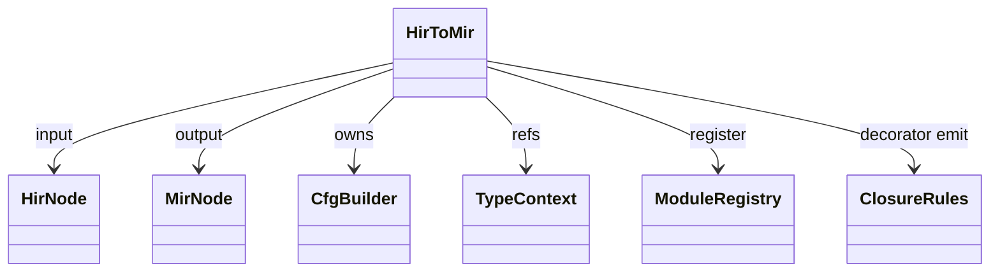
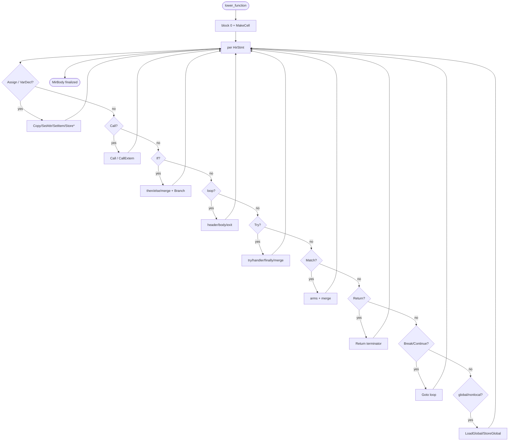
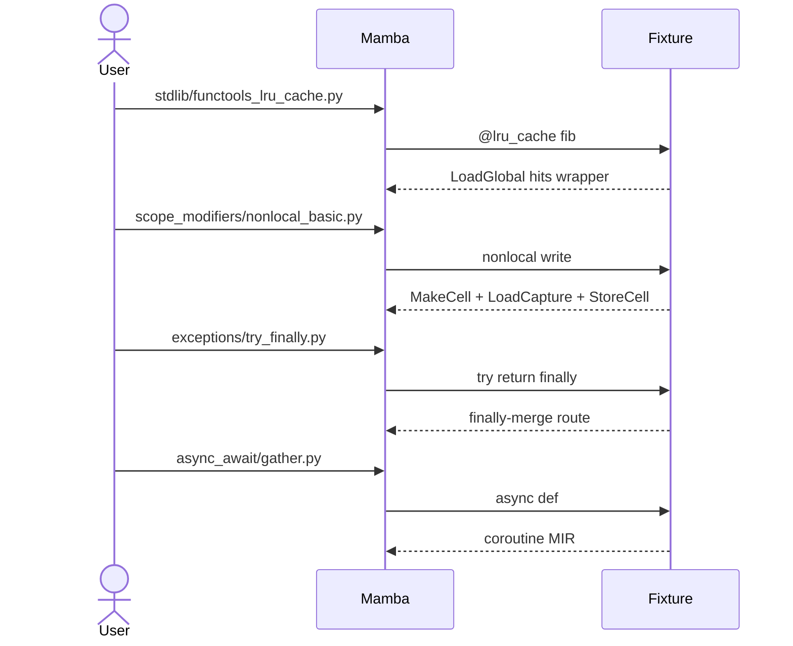

# Lower — HIR to MIR

`lower/hir_to_mir.rs` (6298 LOC) takes the HIR module produced by
`ast_to_hir` and emits a CFG-based `MirModule`. Per HIR function it
allocates a `MirBody`, walks statements emitting `MirInst` into the
current block, and opens new blocks at every control-flow boundary
(if / while / for / try / match / break / continue / return).

This is where most JIT-visible decisions are made: which globals are
hot enough to inline-load via `LoadGlobal`, which captures need cells,
how try-blocks fan out to handlers and finally-merge, and how
checked arithmetic ops are emitted vs. plain BinOp.

Three load-bearing invariants:

1. **`Var(sym)` for decorated user funcs emits `LoadGlobal`, not
   `FuncRef`** (commit `7b4b6af4` fix from `closure.md`). Decorators
   replace the bound symbol's value in `GLOBAL_BY_ID` with the wrapper
   instance; `FuncRef` would short-circuit to the raw JIT entry,
   bypassing the wrapper. This affects `@lru_cache`, `@property`,
   `@classmethod`, etc.
2. **Cell allocation lives at function-entry, not at first capture
   site** — every function with captured-and-mutated variables emits
   `MakeCell` instructions in its prologue block, so the cell exists
   before any nested closure tries to capture it. Lazy allocation
   would race with closure construction.
3. **Try-finally emits a "finally-merge" block all paths converge
   on** — return, break, continue, fall-through, and exception all
   route through finally-merge before exiting the try. Skipping any
   path produces a try where finally never runs.

## Type model
<!-- type: dependency lang: mermaid -->



## CFG-construction shape
<!-- type: schema lang: yaml -->

```yaml
$schema: "https://json-schema.org/draft/2020-12/schema"
$id: "hir-to-mir-types"
$defs:
  CfgPattern:
    description: "How HIR control-flow lowers to MIR blocks"
    type: array
    items:
      type: object
      properties:
        hir_form: { type: string }
        cfg_blocks: { type: array, items: { type: string } }
        terminators: { type: array, items: { type: string } }
      required: [hir_form, cfg_blocks]
    examples:
      - - { hir_form: "if c: T else: E", cfg_blocks: [cond, then, else, merge], terminators: [Branch, Goto, Goto] }
        - { hir_form: "while c: body", cfg_blocks: [header, body, exit], terminators: [Branch, Goto-back-edge] }
        - { hir_form: "for x in iter: body", cfg_blocks: [iter-init, header, body, exit], terminators: [Goto, Branch, Goto-back-edge] }
        - { hir_form: "try: T except: H finally: F", cfg_blocks: [try, handler, finally, merge], terminators: [Goto, Goto, Goto] }
        - { hir_form: "return e", cfg_blocks: [], terminators: [Return(e)], description: "no new block; current block sealed" }
        - { hir_form: "break", cfg_blocks: [], terminators: [Goto(loop-exit)] }
        - { hir_form: "continue", cfg_blocks: [], terminators: [Goto(loop-header)] }
        - { hir_form: "raise e", cfg_blocks: [], terminators: [Raise(e); Unreachable] }
  EmissionFlag:
    description: "Per-function flags affecting emit"
    type: object
    properties:
      has_star_args:    { type: boolean, description: "registers symbol id in module::VARIADIC_SYMBOL_IDS" }
      has_kwargs:       { type: boolean, description: "registers in module::KWARGS_SYMBOL_IDS" }
      requires_cells:   { type: boolean, description: "any captured-and-mutated free vars" }
      has_decorators:   { type: boolean, description: "Var(sym)→LoadGlobal lowering enabled" }
```

## Per-statement lowering logic
<!-- type: logic lang: mermaid -->



## Function lowering interaction
<!-- type: interaction lang: mermaid -->

```mermaid
---
id: hir-to-mir-flow
actors:
  - { id: HIR,         kind: system, label: "hir::HirModule" }
  - { id: HirToMir,    kind: system, label: "lower::hir_to_mir" }
  - { id: ModuleReg,   kind: system, label: "runtime::module variadic / kwargs registries" }
  - { id: MIR,         kind: system, label: "mir::MirModule" }
messages:
  - { from: HIR,         to: HirToMir, name: "lower_hir_to_mir(HirModule, TypeContext)" }
  - { from: HirToMir,    to: HirToMir, name: "for each HirFunction: alloc MirBody; open block 0" }
  - { from: HirToMir,    to: ModuleReg, name: "if has_star_args: register_variadic_symbol(sym)" }
  - { from: HirToMir,    to: ModuleReg, name: "if has_kwargs: register_kwargs_symbol(sym)" }
  - { from: HirToMir,    to: HirToMir, name: "emit prologue MakeCell instructions" }
  - { from: HirToMir,    to: HirToMir, name: "walk HirStmts; emit MirInst per stmt; open new blocks at control flow" }
  - { from: HirToMir,    to: HirToMir, name: "for decorated user fn refs in non-call position: emit LoadGlobal not FuncRef (commit 7b4b6af4)" }
  - { from: HirToMir,    to: MIR,      name: "MirBody finalized" }
  - { from: HirToMir,    to: HirToMir, name: "for each HirClass: lower methods recursively" }
  - { from: HirToMir,    to: MIR,      name: "MirModule.bodies + MirModule.externs" }
---
sequenceDiagram
    participant HIR
    participant HirToMir
    participant ModuleReg
    participant MIR
    HIR->>HirToMir: lower_hir_to_mir
    HirToMir->>HirToMir: alloc MirBody
    HirToMir->>ModuleReg: register variadic / kwargs
    HirToMir->>HirToMir: prologue MakeCell
    HirToMir->>HirToMir: walk HirStmts; emit MirInst
    HirToMir->>HirToMir: decorated → LoadGlobal
    HirToMir->>MIR: MirBody finalized
    HirToMir->>HirToMir: lower class methods
    HirToMir->>MIR: MirModule
```

## Acceptance scenarios
<!-- type: overview lang: markdown -->



## Tests
<!-- type: tests lang: yaml -->

```yaml
runner: "cargo test -p mamba --test conformance_tests --release -- {name} --test-threads=1"
fixtures:
  - id: lru_cache_var_load
    name: "stdlib/functools_lru_cache.py"
    paired: "stdlib/functools_lru_cache.expected"
    verifies: ["Var(sym) for decorated fn emits LoadGlobal (commit 7b4b6af4)"]
  - id: nonlocal_cells
    name: "scope_modifiers/nonlocal_basic.py"
    paired: "scope_modifiers/nonlocal_basic.expected"
    verifies: ["MakeCell prologue + LoadCapture / StoreCell in nested fn"]
  - id: try_finally_path
    name: "exceptions/try_finally.py"
    paired: "exceptions/try_finally.expected"
    verifies: ["all exit paths route through finally-merge"]
  - id: async_def
    name: "async_await/gather.py"
    paired: "async_await/gather.expected"
    verifies: ["AsyncFnDef emits coroutine body shape"]
  - id: while_loop
    name: "control_flow/while_basic.py"
    paired: "control_flow/while_basic.expected"
    verifies: ["while emits header/body/exit with back-edge"]
```

## Changes
<!-- type: changes lang: yaml -->

```yaml
changes:
  - file: crates/mamba/src/lower/hir_to_mir.rs
    action: modify
    impl_mode: hand-written
    description: "lower_hir_to_mir + lower_function + lower_stmt + lower_expr + CFG construction (if / while / for / try / match); decorated-fn LoadGlobal rule (commit 7b4b6af4); cell prologue allocation; finally-merge path. Hand-written; the lowering contract is the load-bearing surface for codegen."
```
