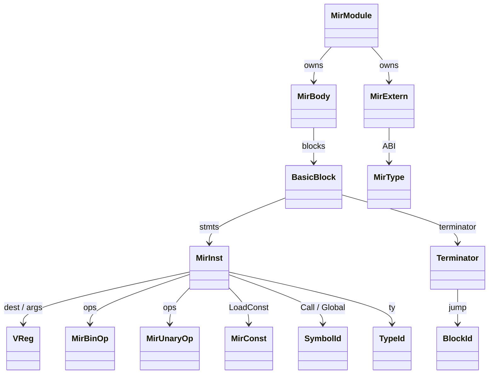
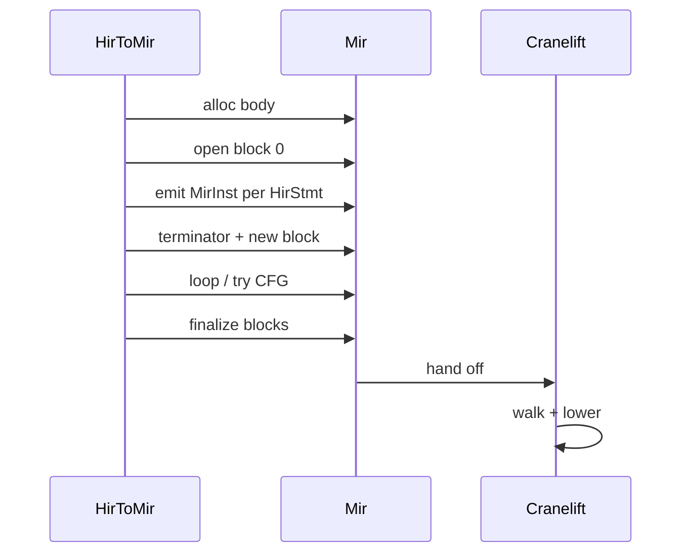
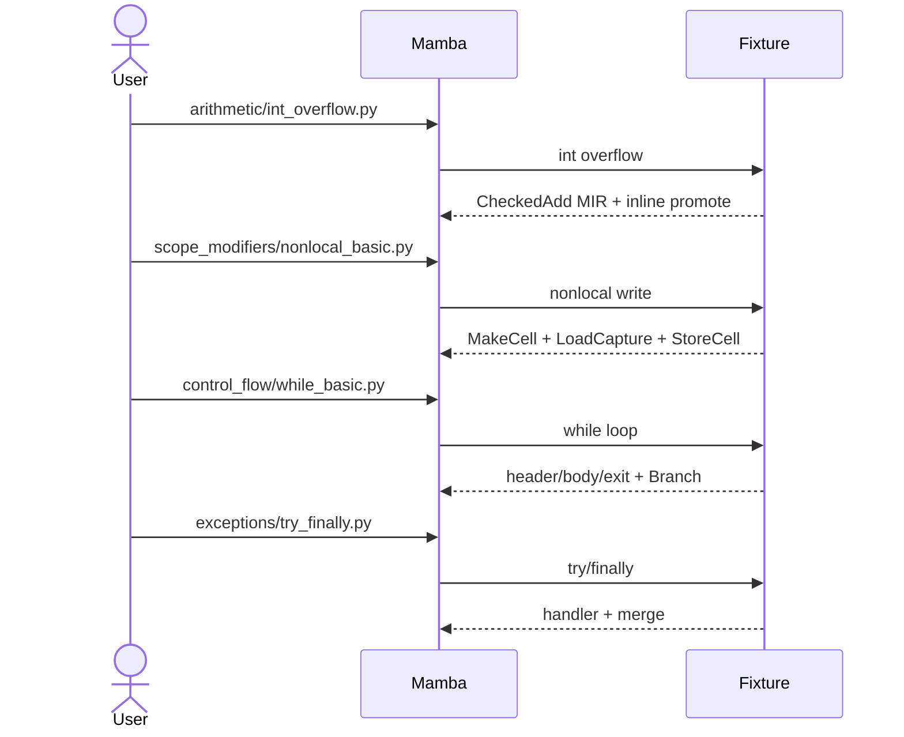

# MIR — Mid-level CFG IR

MIR is a control-flow graph in single-assignment form. Each function is
a `MirBody` containing `Vec<BasicBlock>`; each block has a `Vec<MirInst>`
followed by a `Terminator`. Virtual registers (`VReg(u32)`) are
SSA-style — each instruction `dest` is unique within the body.

MIR is what the JIT consumes. Cranelift codegen (per `codegen/cranelift.md`)
walks blocks in CFG order, lowering `MirInst` to `cranelift_codegen` IR.
The mapping is mostly 1:1; the interesting cases are the checked
arithmetic ops (`CheckedAdd` / `CheckedSub` / `CheckedMul`) which emit
overflow-check + BigInt promotion sequences.

Three load-bearing invariants:

1. **`CheckedAdd` / `CheckedSub` / `CheckedMul` are MIR-level, not
   runtime calls** — the BigInt promotion path is inlined into the JIT
   output for performance. A naive lowering through `mb_add` would
   double-dispatch every int-add through the runtime; the checked
   variants only call out when overflow occurs.
2. **`LoadGlobal` / `StoreGlobal` use `SymbolId`, not strings** —
   downstream the JIT looks up the sym in `runtime/closure::GLOBAL_BY_ID`
   (per `closure.md`) for O(1) hot-path dispatch.
3. **Cells (`LoadCell` / `StoreCell` / `MakeCell` / `LoadCapture`) are
   the closure protocol** — nonlocal mutations route through cells;
   cell capture into a closure goes through `LoadCapture` with the
   `capture_idx` slot in the active closure's environment array.

## Type model
<!-- type: dependency lang: mermaid -->



## MIR shape
<!-- type: schema lang: yaml -->

```yaml
$schema: "https://json-schema.org/draft/2020-12/schema"
$id: "mir-types"
$defs:
  MirBody:
    type: object
    x-rust-type: MirBody
    properties:
      name:      { x-rust-type: SymbolId }
      params:    { type: array, items: { type: array, items: { x-rust-type: VReg }, description: "(VReg, TypeId) pairs" } }
      return_ty: { x-rust-type: TypeId }
      blocks:    { type: array, items: { x-rust-type: BasicBlock } }
    required: [name, params, return_ty, blocks]
  BasicBlock:
    type: object
    x-rust-type: BasicBlock
    properties:
      id:         { x-rust-type: BlockId }
      stmts:      { type: array, items: { x-rust-type: MirInst } }
      terminator: { x-rust-type: Terminator }
    required: [id, stmts, terminator]
  MirInstFamily:
    description: "Categorisation of the ~24 MirInst variants"
    type: string
    enum:
      - arith                  # BinOp / UnaryOp
      - checked_arith          # CheckedAdd / Sub / Mul (BigInt promote)
      - load_const             # LoadConst
      - call                   # Call / CallExtern
      - copy                   # Copy
      - attribute              # GetAttr / SetAttr
      - subscript              # GetItem / SetItem
      - constructor            # MakeList / MakeDict / MakeTuple
      - control                # Raise
      - global                 # LoadGlobal / StoreGlobal
      - cell                   # LoadCell / StoreCell / MakeCell / LoadCapture
  TerminatorVariant:
    type: string
    enum: [Return, Goto, Branch, Unreachable]
```

## Instruction emission logic
<!-- type: logic lang: mermaid -->

```mermaid
---
id: mir-emission
entry: enter
nodes:
  enter:        { kind: start,    label: "lowering emits MirInst into current BasicBlock.stmts" }
  classify:     { kind: decision, label: "what kind of HIR expr / stmt?" }
  arith_emit:   { kind: process,  label: "BinOp / CheckedArith — alloc dest VReg; reference operands" }
  unary_emit:   { kind: process,  label: "UnaryOp" }
  load_const:   { kind: process,  label: "LoadConst MirConst::*" }
  call_emit:    { kind: process,  label: "Call / CallExtern with arg VReg list" }
  attr_emit:    { kind: process,  label: "GetAttr / SetAttr" }
  subs_emit:    { kind: process,  label: "GetItem / SetItem" }
  ctor_emit:    { kind: process,  label: "MakeList / MakeDict / MakeTuple" }
  global_emit:  { kind: process,  label: "LoadGlobal / StoreGlobal — SymbolId carried" }
  cell_emit:    { kind: process,  label: "LoadCell / StoreCell / MakeCell / LoadCapture" }
  raise_emit:   { kind: process,  label: "Raise (no dest)" }
  is_terminator:{ kind: decision, label: "is this a Return / Goto / Branch?" }
  set_term:     { kind: process,  label: "BasicBlock.terminator = ..." }
  next_block:   { kind: process,  label: "open new BasicBlock for downstream stmts" }
  done:         { kind: terminal, label: "block sealed" }
edges:
  - { from: enter,        to: classify }
  - { from: classify,     to: arith_emit,    label: "binop / checked" }
  - { from: classify,     to: unary_emit,    label: "unary" }
  - { from: classify,     to: load_const,    label: "literal" }
  - { from: classify,     to: call_emit,     label: "call" }
  - { from: classify,     to: attr_emit,     label: "attr" }
  - { from: classify,     to: subs_emit,     label: "subscript" }
  - { from: classify,     to: ctor_emit,     label: "list/dict/tuple" }
  - { from: classify,     to: global_emit,   label: "global" }
  - { from: classify,     to: cell_emit,     label: "cell / capture" }
  - { from: classify,     to: raise_emit,    label: "raise" }
  - { from: classify,     to: is_terminator, label: "control flow" }
  - { from: is_terminator, to: set_term,     label: "yes" }
  - { from: set_term,      to: next_block }
  - { from: next_block,    to: done }
  - { from: arith_emit,    to: classify, label: "more stmts" }
  - { from: unary_emit,    to: classify }
  - { from: load_const,    to: classify }
  - { from: call_emit,     to: classify }
  - { from: attr_emit,     to: classify }
  - { from: subs_emit,     to: classify }
  - { from: ctor_emit,     to: classify }
  - { from: global_emit,   to: classify }
  - { from: cell_emit,     to: classify }
  - { from: raise_emit,    to: classify }
---
flowchart TD
    enter([emit MirInst]) --> classify{kind?}
    classify -->|binop / checked| arith_emit[BinOp / CheckedArith]
    classify -->|unary| unary_emit[UnaryOp]
    classify -->|literal| load_const[LoadConst]
    classify -->|call| call_emit[Call / CallExtern]
    classify -->|attr| attr_emit[GetAttr / SetAttr]
    classify -->|subscript| subs_emit[GetItem / SetItem]
    classify -->|ctor| ctor_emit[MakeList / Dict / Tuple]
    classify -->|global| global_emit[LoadGlobal / StoreGlobal]
    classify -->|cell| cell_emit[LoadCell / StoreCell / MakeCell / LoadCapture]
    classify -->|raise| raise_emit[Raise]
    classify -->|control| is_terminator{terminator?}
    is_terminator -->|yes| set_term[BasicBlock terminator]
    set_term --> next_block[open new block]
    next_block --> done([block sealed])
    arith_emit --> classify
    unary_emit --> classify
    load_const --> classify
    call_emit --> classify
    attr_emit --> classify
    subs_emit --> classify
    ctor_emit --> classify
    global_emit --> classify
    cell_emit --> classify
    raise_emit --> classify
```

## CFG construction interaction
<!-- type: interaction lang: mermaid -->



## Acceptance scenarios
<!-- type: overview lang: markdown -->



## Tests
<!-- type: tests lang: yaml -->

```yaml
runner: "cargo test -p mamba --test conformance_tests --release -- {name} --test-threads=1"
fixtures:
  - id: int_overflow_checked
    name: "arithmetic/int_overflow.py"
    paired: "arithmetic/int_overflow.expected"
    verifies: ["CheckedAdd MIR with inline BigInt promote"]
  - id: nonlocal_cell
    name: "scope_modifiers/nonlocal_basic.py"
    paired: "scope_modifiers/nonlocal_basic.expected"
    verifies: ["MakeCell / LoadCell / StoreCell / LoadCapture roundtrip"]
  - id: while_branch
    name: "control_flow/while_basic.py"
    paired: "control_flow/while_basic.expected"
    verifies: ["MIR while emits header / body / exit blocks with Branch"]
  - id: try_finally_cfg
    name: "exceptions/try_finally.py"
    paired: "exceptions/try_finally.expected"
    verifies: ["try / except / finally CFG blocks + Raise terminator"]
```

## Changes
<!-- type: changes lang: yaml -->

```yaml
changes:
  - file: crates/mamba/src/mir/mod.rs
    action: modify
    impl_mode: hand-written
    description: "MirBody + BasicBlock + MirInst (~24 variants) + Terminator + MirBinOp + MirUnaryOp + MirConst + MirType + MirExtern. Hand-written; CFG + SSA register shape is the contract for codegen."
```
