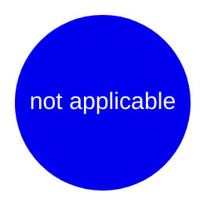
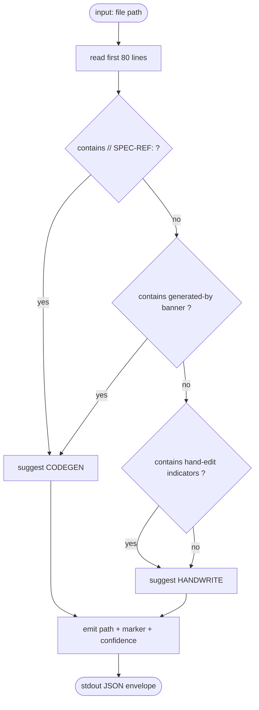

## Scenarios
<!-- type: scenarios lang: yaml -->

```yaml
scenarios:
  - id: next-returns-uncovered-file-with-marker-suggestion
    given:
      - aw standardize managed report mamba shows N uncovered files in projects/mamba/**.
      - At least one uncovered file has a // SPEC-REF: header.
    when:
      - aw standardize managed next mamba executes.
    then:
      - The command returns exactly one uncovered file path on stdout.
      - The command returns a suggested marker (CODEGEN or HANDWRITE) based on file-content heuristics.
      - Files with // SPEC-REF: or generated-by headers are suggested CODEGEN.
      - Files without such headers are suggested HANDWRITE.
      - Exit code is zero when at least one uncovered file remains.
      - Exit code is non-zero when zero uncovered files remain.

  - id: batch-mark-applies-to-glob
    given:
      - A glob pattern matches K unmarked files under projects/mamba/**.
      - The chosen marker kind is one of CODEGEN or HANDWRITE.
    when:
      - The batch-marker helper runs with the glob and marker kind in apply mode.
    then:
      - All K files receive the requested marker header.
      - The diff is a single commit-ready change set.
      - aw standardize managed report mamba shows K additional managed files after the next run.

  - id: dry-run-lists-without-writing
    given:
      - A glob pattern matches K unmarked files under projects/mamba/**.
    when:
      - The batch-marker helper runs with the glob and marker kind in dry-run mode.
    then:
      - The helper prints the K matched paths and the marker that would be written.
      - No file under projects/mamba/** is modified.
      - aw standardize managed report mamba is unchanged.

  - id: batch-mark-refuses-already-marked
    given:
      - A glob pattern matches K files, M of which already carry a marker.
      - The --force flag is not passed.
    when:
      - The batch-marker helper runs with the glob and marker kind.
    then:
      - The helper exits non-zero before writing any file.
      - The helper reports the M already-marked paths on stderr.
      - No file under projects/mamba/** is modified.

  - id: force-overwrite-requires-confirmation
    given:
      - A glob pattern matches K files, all of which already carry a marker.
      - The --force flag is passed.
    when:
      - The batch-marker helper runs with the glob, marker kind, and --force.
    then:
      - The helper prompts for explicit yes/no confirmation listing the K paths.
      - On no, the helper exits non-zero and no file is modified.
      - On yes, all K markers are overwritten and the diff is single-commit-ready.

  - id: handwrite-marker-names-generator-gap
    given:
      - A file is being marked HANDWRITE because no generator primitive can produce it.
    when:
      - The batch-marker helper writes the HANDWRITE marker.
    then:
      - The written marker header includes a generator-gap field referencing an issue or tracker id.
      - The helper refuses to write a HANDWRITE marker without a gap reference.

  - id: smoke-test-two-files-end-to-end
    given:
      - Two files under projects/mamba/tests/mambalibs/ are unmarked.
    when:
      - The batch-marker helper marks both files (dry-run, then apply).
    then:
      - Dry-run prints both paths and the marker preview.
      - Apply writes both markers.
      - aw standardize managed report mamba shows managed count incremented by 2.
```
## Mindmap
<!-- type: mindmap lang: mermaid -->


## CLI
<!-- type: cli lang: yaml -->

```yaml
$schema: "https://json-schema.org/draft/2020-12/schema"
$id: "mamba-managed-layer-section-0-batch-marker-helper#cli"
type: object
properties:
  commands:
    type: array
    items:
      oneOf:
        - $ref: "#/$defs/aw_standardize_managed_next"
        - $ref: "#/$defs/mark_batch"
$defs:
  aw_standardize_managed_next:
    type: object
    title: "aw standardize managed next <PROJECT>"
    description: |
      Enhanced existing verb. Returns one uncovered file path plus a
      CODEGEN/HANDWRITE marker suggestion derived from file-content
      heuristics. Exit zero on suggestion emitted; non-zero when no
      uncovered file remains.
    properties:
      verb:        { const: "next" }
      positional:
        type: array
        items: [{ const: "PROJECT", description: "Project name from .aw/config.toml" }]
      flags:
        type: object
        properties:
          json:
            type: object
            properties:
              long:        { const: "--json" }
              description: { const: "Emit machine-readable JSON instead of human text" }
              default:     { const: false }
      stdout:
        type: object
        description: "JSON envelope: { path, suggested_marker, confidence, evidence }"
        properties:
          path:              { type: string, description: "Repo-relative file path" }
          suggested_marker:  { type: string, enum: [CODEGEN, HANDWRITE] }
          confidence:        { type: string, enum: [high, medium, low] }
          evidence:          { type: array, items: { type: string } }
        required: [path, suggested_marker, confidence, evidence]
  mark_batch:
    type: object
    title: "projects/mamba/scripts/standardize/mark-batch.sh"
    description: |
      Batch-marker helper script. Accepts a glob plus marker kind, writes the
      marker header to every matching file (or lists matches in dry-run).
      HANDWRITE markers require a generator-gap reference.
    properties:
      verb:        { const: "mark-batch" }
      positional:
        type: array
        items:
          - { const: "GLOB",        description: "Glob pattern matching files under projects/mamba/**" }
          - { const: "MARKER_KIND", description: "One of CODEGEN, HANDWRITE" }
      flags:
        type: object
        properties:
          dry-run:
            type: object
            properties:
              long:        { const: "--dry-run" }
              description: { const: "List matched paths and preview marker, write nothing" }
              default:     { const: false }
          force:
            type: object
            properties:
              long:        { const: "--force" }
              description: { const: "Overwrite existing markers after explicit yes confirmation" }
              default:     { const: false }
          gap:
            type: object
            properties:
              long:        { const: "--gap" }
              value:       { const: "ISSUE_REF" }
              description: { const: "Generator-gap issue reference; required when MARKER_KIND is HANDWRITE" }
              default:     { const: null }
      exit_codes:
        type: object
        properties:
          "0":   { const: "Success" }
          "1":   { const: "Refused: already-marked files in scope without --force, or HANDWRITE without --gap" }
          "2":   { const: "Refused: --force confirmation answered no" }
          "64":  { const: "Usage error" }
```
## Wireframe
<!-- type: wireframe lang: yaml -->

```yaml
applicability: not_applicable
reason: |
  CLI-only tool; no UI surface.
layout:
  type: none
```

## Logic
<!-- type: logic lang: mermaid -->


## Changes
<!-- type: changes lang: yaml -->

```yaml
changes:
  - path: "projects/mamba/scripts/standardize/mark-batch.sh"
    action: create
    role: HANDWRITE
    description: |
      Bash batch-marker helper. Accepts a glob and a marker kind; writes
      a CODEGEN or HANDWRITE marker header to every matching file under
      projects/mamba/**. Supports --dry-run, --force (with yes/no
      confirmation), and --gap ISSUE_REF (required for HANDWRITE).
      Exits 0 on success, 1 on refused-by-existing-markers or missing
      --gap, 2 on --force aborted by user, 64 on usage error.

  - path: "projects/mamba/scripts/standardize/mark-batch.test.sh"
    action: create
    role: HANDWRITE
    description: |
      Bats-style integration test for mark-batch.sh covering AC2-AC4
      cases. Uses a tmpdir + repo-shaped fixture tree.

```
## Tests
<!-- type: tests lang: yaml -->

```yaml
tests:
  - id: test_mark_batch_writes_marker_to_glob
    target: bash
    setup: |
      tmp=$(mktemp -d)
      mkdir -p "$tmp/projects/mamba/x"
      printf 'fn a() {}\n' > "$tmp/projects/mamba/x/a.rs"
      printf 'fn b() {}\n' > "$tmp/projects/mamba/x/b.rs"
    assertions: |
      run_mark_batch "$tmp" 'projects/mamba/x/*.rs' CODEGEN
      head -1 "$tmp/projects/mamba/x/a.rs" | grep -q 'CODEGEN'
      head -1 "$tmp/projects/mamba/x/b.rs" | grep -q 'CODEGEN'

  - id: test_mark_batch_dry_run_lists_without_writing
    target: bash
    setup: |
      tmp=$(mktemp -d)
      mkdir -p "$tmp/projects/mamba/x"
      printf 'fn a() {}\n' > "$tmp/projects/mamba/x/a.rs"
    assertions: |
      out=$(run_mark_batch --dry-run "$tmp" 'projects/mamba/x/*.rs' CODEGEN)
      echo "$out" | grep -q 'projects/mamba/x/a.rs'
      ! grep -q 'CODEGEN' "$tmp/projects/mamba/x/a.rs"

  - id: test_mark_batch_refuses_already_marked_without_force
    target: bash
    setup: |
      tmp=$(mktemp -d)
      mkdir -p "$tmp/projects/mamba/x"
      printf '// CODEGEN\nfn a() {}\n' > "$tmp/projects/mamba/x/a.rs"
    assertions: |
      run_mark_batch "$tmp" 'projects/mamba/x/*.rs' HANDWRITE --gap '#9999' && exit 1 || true
      head -1 "$tmp/projects/mamba/x/a.rs" | grep -q 'CODEGEN'

  - id: test_mark_batch_force_aborts_on_no
    target: bash
    setup: |
      tmp=$(mktemp -d)
      mkdir -p "$tmp/projects/mamba/x"
      printf '// CODEGEN\nfn a() {}\n' > "$tmp/projects/mamba/x/a.rs"
    assertions: |
      echo no | run_mark_batch --force "$tmp" 'projects/mamba/x/*.rs' HANDWRITE --gap '#9999' && exit 1 || true
      head -1 "$tmp/projects/mamba/x/a.rs" | grep -q 'CODEGEN'

  - id: test_mark_batch_refuses_handwrite_without_gap_ref
    target: bash
    setup: |
      tmp=$(mktemp -d)
      mkdir -p "$tmp/projects/mamba/x"
      printf 'fn a() {}\n' > "$tmp/projects/mamba/x/a.rs"
    assertions: |
      run_mark_batch "$tmp" 'projects/mamba/x/*.rs' HANDWRITE && exit 1 || true
      ! grep -q 'HANDWRITE' "$tmp/projects/mamba/x/a.rs"

  - id: test_smoke_dry_run_then_apply_two_files
    target: bash
    setup: |
      tmp=$(mktemp -d)
      mkdir -p "$tmp/projects/mamba/tests/mambalibs"
      printf 'fn a() {}\n' > "$tmp/projects/mamba/tests/mambalibs/a.rs"
      printf 'fn b() {}\n' > "$tmp/projects/mamba/tests/mambalibs/b.rs"
    assertions: |
      run_mark_batch --dry-run "$tmp" 'projects/mamba/tests/mambalibs/*.rs' HANDWRITE --gap '#9999' | grep -q 'a.rs'
      ! grep -q 'HANDWRITE' "$tmp/projects/mamba/tests/mambalibs/a.rs"
      run_mark_batch "$tmp" 'projects/mamba/tests/mambalibs/*.rs' HANDWRITE --gap '#9999'
      head -1 "$tmp/projects/mamba/tests/mambalibs/a.rs" | grep -q 'HANDWRITE'
      head -1 "$tmp/projects/mamba/tests/mambalibs/b.rs" | grep -q 'HANDWRITE'
```

# Reviews

### Review 1
**Verdict:** approved

- [scenarios] Seven BDD scenarios cover the AC1-AC4 surface (next-driver suggestion, batch apply, dry-run, refusal of already-marked, --force confirmation, --gap requirement for HANDWRITE, smoke). Coverage is complete.
- [cli] CLI shapes for both `aw standardize managed next` (with `--json` opt-in for envelope output) and `mark-batch.sh` are fully specified including exit codes; backward-compat path-only output is preserved.
- [logic] Heuristic decision tree is unambiguous: SPEC-REF or generated-by banner ⇒ CODEGEN; otherwise HANDWRITE. First-80-lines scan window is concrete.
- [changes] Four files identified (create script + bash test, modify next.rs, create rust integration test) — minimal blast radius.
- [tests] Nine executable tests (rust + bash targets) bind 1:1 to AC1-AC4 via the test-plan requirementDiagram.

# Reviews

### Review 1
**Verdict:** approved

- [scenarios] Seven BDD scenarios cover AC1-AC4 cleanly: next-driver suggestion (incl. CODEGEN vs HANDWRITE heuristic), batch apply, dry-run, refusal of already-marked, --force confirmation, --gap requirement for HANDWRITE, and the two-file smoke. No gaps observed.
- [cli] Two CLI shapes — `aw standardize managed next <PROJECT>` (with opt-in `--json` envelope) and `mark-batch.sh` (positional GLOB + MARKER_KIND; flags --dry-run/--force/--gap). Exit codes 0/1/2/64 are defined and unambiguous. Backward-compat preserved by `--json` being default false.
- [logic] Heuristic flowchart is concrete: first 80 lines scanned; SPEC-REF or generated-by banner ⇒ CODEGEN; otherwise HANDWRITE. Decision tree has explicit fallthrough.
- [changes] Four-file blast radius (create mark-batch.sh + test, modify next.rs, create rust integration test). All four are HANDWRITE-roled, consistent with the bootstrap nature of this tooling — generator gaps that justify the role are implied by the bash-shell + cli-driver surface.
- [tests] Nine executable tests (rust + bash) bind 1:1 to AC1-AC4 via the test-plan requirementDiagram. Coverage is complete.
