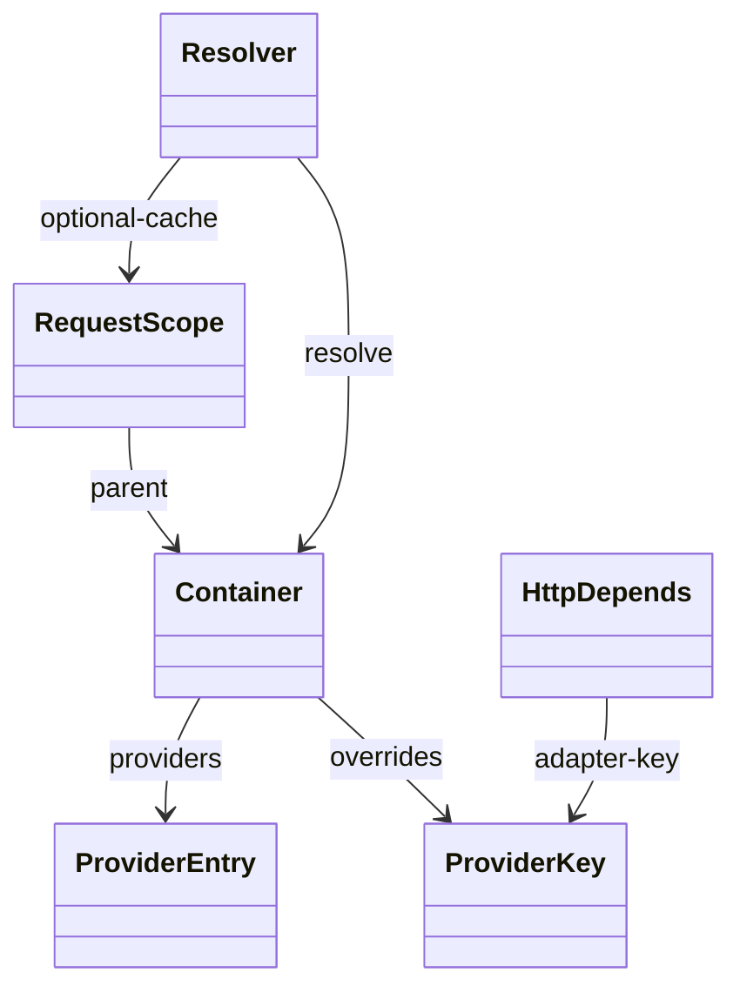

## Scenarios
<!-- type: scenarios lang: yaml -->

```yaml
scenarios:
  - id: singleton-provider-caches-on-container
    given:
      - A container registers key "config" with singleton scope.
    when:
      - Two container-level resolutions request "config".
    then:
      - The provider factory runs once.
      - Both resolutions return the same stored value.

  - id: request-provider-caches-inside-request-scope
    given:
      - A container registers key "db" with request scope.
      - Two request scopes are created from the same container.
    when:
      - Each scope resolves "db" twice.
    then:
      - Each individual scope reuses its local value.
      - Different scopes receive independent values.

  - id: transient-provider-does-not-cache
    given:
      - A container registers key "token" with transient scope.
    when:
      - The key is resolved twice.
    then:
      - The provider factory runs twice.
      - No singleton or request cache entry is used.

  - id: override-wins-before-provider
    given:
      - A container registers key "client".
      - A test override for "client" is installed.
    when:
      - A resolver requests "client".
    then:
      - The override value is returned.
      - The provider factory is not invoked.

  - id: http-depends-adapts-shared-di
    given:
      - httpkit exposes Depends as an HTTP parameter marker.
    when:
      - Depends is constructed with a dependency key.
    then:
      - The marker records a mambalibs.di provider key.
      - httpkit does not own provider registration or generic resolution.
```

## Dependency Graph
<!-- type: dependency lang: mermaid -->



## Schema
<!-- type: schema lang: yaml -->

```yaml
definitions:
  ScopeKind:
    type: string
    enum: [singleton, request, transient]
    description: "Provider lifecycle. Singleton caches on the container; request caches inside RequestScope; transient never caches."

  ProviderKey:
    type: object
    required: [name]
    properties:
      name:
        type: string
        minLength: 1
        description: "Logical dependency key, for example config, db, llm.provider, current_user."

  DependencyMarker:
    type: object
    required: [key]
    properties:
      key:
        type: [string, null]
        description: "Optional provider key. None means the framework may infer from a typed parameter later."
```

## Manifest
<!-- type: manifest lang: yaml -->

```yaml
packages:
  - name: mambalibs-di
    path: projects/mamba/mambalibs/dikit
    kind: rust-library
    dependencies:
      - { name: thiserror, spec: workspace }

  - name: mambalibs-di-binding
    path: projects/mamba/mambalibs/dikit/binding
    kind: rust-library
    dependencies:
      - { name: mambalibs-di, spec: path, path: ".." }
      - { name: cclab-mamba-registry, spec: path, path: "../../../../../crates/cclab-mamba-registry" }
      - { name: linkme, spec: workspace }

  - name: mambalibs-http-binding
    path: projects/mamba/mambalibs/httpkit/binding
    kind: rust-library
    dependencies:
      - { name: mambalibs-di, spec: path, path: "../../dikit" }
```

## Verification

```mermaid
---
id: mambalibs_di_verification
requirements:
  reusable_core:
    id: R1
    text: "DI core lives outside httpkit and has no HTTP type dependency"
    kind: design-constraint
    risk: high
    verify: test
  lifecycles:
    id: R2
    text: "Singleton request and transient provider scopes resolve with correct caching behavior"
    kind: functional
    risk: high
    verify: test
  overrides:
    id: R3
    text: "Test overrides take precedence over registered providers"
    kind: functional
    risk: medium
    verify: test
  mamba_surface:
    id: R4
    text: "mambalibs.di registers a Mamba-native module and basic symbols"
    kind: interface
    risk: medium
    verify: test
  http_adapter:
    id: R5
    text: "httpkit Depends records shared DI provider keys instead of owning DI core"
    kind: interface
    risk: medium
    verify: test
elements:
  dikit_unit_tests:
    kind: test
    type: "cargo test -p mambalibs-di"
  dikit_binding_tests:
    kind: test
    type: "cargo test -p mambalibs-di-binding"
  httpkit_binding_tests:
    kind: test
    type: "cargo test -p mambalibs-http-binding"
  mamba_force_link_test:
    kind: test
    type: "cargo test -p mamba --features native-modules native_modules_feature_links_mambalibs_di"
relations:
  - { from: dikit_unit_tests, verifies: reusable_core }
  - { from: dikit_unit_tests, verifies: lifecycles }
  - { from: dikit_unit_tests, verifies: overrides }
  - { from: dikit_binding_tests, verifies: mamba_surface }
  - { from: httpkit_binding_tests, verifies: http_adapter }
  - { from: mamba_force_link_test, verifies: mamba_surface }
---
requirementDiagram
  requirement R1 {
    id: R1
    text: "DI core lives outside httpkit and has no HTTP type dependency"
    risk: high
    verifymethod: test
  }
  requirement R2 {
    id: R2
    text: "Provider scopes cache correctly"
    risk: high
    verifymethod: test
  }
  requirement R3 {
    id: R3
    text: "Overrides win"
    risk: medium
    verifymethod: test
  }
  requirement R4 {
    id: R4
    text: "mambalibs.di registers"
    risk: medium
    verifymethod: test
  }
  requirement R5 {
    id: R5
    text: "http Depends adapts DI"
    risk: medium
    verifymethod: test
  }
  element dikit_unit_tests {
    type: "cargo test -p mambalibs-di"
  }
  element dikit_binding_tests {
    type: "cargo test -p mambalibs-di-binding"
  }
  element httpkit_binding_tests {
    type: "cargo test -p mambalibs-http-binding"
  }
  element mamba_force_link_test {
    type: "cargo test -p mamba --features native-modules native_modules_feature_links_mambalibs_di"
  }
  dikit_unit_tests - verifies -> R1
  dikit_unit_tests - verifies -> R2
  dikit_unit_tests - verifies -> R3
  dikit_binding_tests - verifies -> R4
  httpkit_binding_tests - verifies -> R5
  mamba_force_link_test - verifies -> R4
```

<!-- type: test-plan lang: mermaid -->



## Changes
<!-- type: changes lang: yaml -->

```yaml
files:
  - path: .aw/tech-design/projects/mamba/specs/3952.md
    action: create
    section: changes
    note: "Source of truth for #3952."
  - path: projects/mamba/mambalibs/dikit/Cargo.toml
    action: create
    section: manifest
    note: "Core mambalibs.di Rust package."
  - path: projects/mamba/mambalibs/dikit/src/lib.rs
    action: create
    section: schema
    note: "Container provider resolver scope and override implementation."
  - path: projects/mamba/mambalibs/dikit/README.md
    action: create
    section: dependency
    note: "Document ownership boundary for mambalibs.di."
  - path: projects/mamba/mambalibs/dikit/binding/Cargo.toml
    action: create
    section: manifest
    note: "Mamba binding package for mambalibs.di."
  - path: projects/mamba/mambalibs/dikit/binding/src/lib.rs
    action: create
    section: schema
    note: "Mamba module registration and basic container symbols."
  - path: projects/mamba/mambalibs/dikit/binding/tests/mamba_registry_test.rs
    action: create
    section: tests
    note: "Registry and symbol behavior tests."
  - path: projects/mamba/mambalibs/httpkit/binding/src/app.rs
    action: update
    section: schema
    note: "Make Depends record a shared DI provider key."
  - path: projects/mamba/mambalibs/httpkit/README.md
    action: update
    section: dependency
    note: "Document Depends as an adapter over mambalibs.di."
  - path: Cargo.toml
    action: update
    section: manifest
    note: "Add DI packages to workspace members."
  - path: projects/mamba/Cargo.toml
    action: update
    section: manifest
    note: "Force-link DI binding under native-modules."
  - path: projects/mamba/src/pkgmanage/builder/force_link.rs
    action: update
    section: changes
    note: "Add mambalibs.di to expected force-linked modules."
```

## Tests
<!-- type: tests lang: yaml -->

```yaml
imports:
  - "use mambalibs_di::{Container, ScopeKind};"

tests:
  - name: singleton_provider_is_cached
    assertions:
      - "container resolves singleton key twice and factory count is one"

  - name: request_scope_caches_per_scope
    assertions:
      - "one request scope returns the same value for repeated resolves"
      - "a second request scope gets a separate value"

  - name: transient_provider_is_not_cached
    assertions:
      - "two resolves run the provider twice"

  - name: override_wins
    assertions:
      - "override value is returned without invoking provider"

  - name: mambalibs_di_registers
    assertions:
      - "find_module(\"mambalibs.di\") succeeds"
      - "Container RequestScope Depends and resolve symbols are registered"

  - name: http_depends_records_provider_key
    assertions:
      - "Depends(\"current_user\") returns an HTTP param with dependency key current_user"
```
