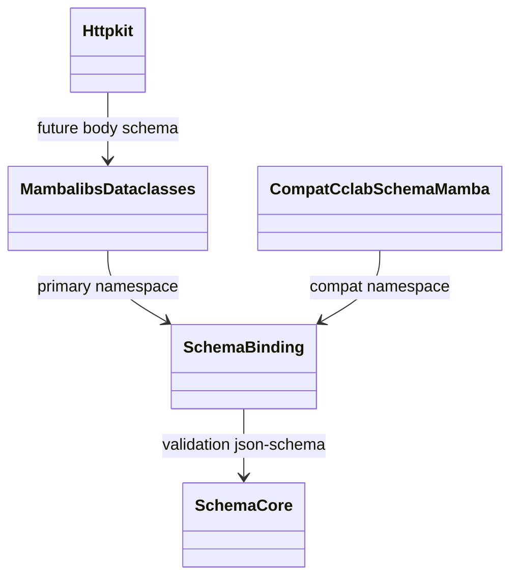
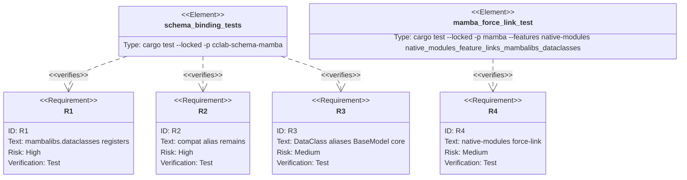

## Scenarios
<!-- type: scenarios lang: yaml -->

```yaml
scenarios:
  - id: primary-namespace-registers-schema-surface
    given:
      - cclab-schema-mamba is linked into a native-modules mamba build.
    when:
      - the runtime resolves module "mambalibs.dataclasses".
    then:
      - the module exists.
      - the module exposes BaseModel Field DataClass validate field_validator and to_json_schema.

  - id: compatibility-namespace-remains-available
    given:
      - existing users import cclab_schema_mamba.
    when:
      - the runtime resolves module "cclab_schema_mamba".
    then:
      - the module still exists.
      - it exposes the same schema surface as mambalibs.dataclasses.

  - id: dataclass-friendly-alias-uses-schema-model-core
    given:
      - a caller constructs DataClass("User").
    when:
      - the binding invokes the native constructor.
    then:
      - the returned model uses the same MbBaseModel core as BaseModel.
      - json schema export and validation use cclab-schema.

  - id: native-modules-force-link-catches-missing-dataclasses
    given:
      - mamba starts with feature native-modules.
    when:
      - startup checks expected kits.
    then:
      - mambalibs.dataclasses is required in the force-link table.
```

## Dependency Graph
<!-- type: dependency lang: mermaid -->



## Schema
<!-- type: schema lang: yaml -->

```yaml
definitions:
  DataclassModuleSurface:
    type: object
    required: [module, symbols]
    properties:
      module:
        type: string
        const: mambalibs.dataclasses
      compat_module:
        type: string
        const: cclab_schema_mamba
      symbols:
        type: array
        items:
          type: string
          enum: [BaseModel, DataClass, Field, validate, field_validator, to_json_schema]

  DataClassAlias:
    type: object
    required: [symbol, constructor]
    properties:
      symbol:
        type: string
        const: DataClass
      constructor:
        type: string
        const: mb_schema_base_model_new
      model_core:
        type: string
        const: MbBaseModel
```

## Manifest
<!-- type: manifest lang: yaml -->

```yaml
packages:
  - name: cclab-schema-mamba
    path: crates/cclab-schema-mamba
    kind: rust-library
    dependencies:
      - { name: cclab-mamba-registry, spec: path, path: "../cclab-mamba-registry" }
      - { name: cclab-schema, spec: path, path: "../cclab-schema" }
      - { name: linkme, spec: workspace }

  - name: mamba
    path: projects/mamba
    kind: rust-binary
    dependencies:
      - { name: cclab-schema-mamba, spec: path, path: "../../crates/cclab-schema-mamba", optional: true }
```

## Verification
<!-- type: test-plan lang: mermaid -->



## Changes
<!-- type: changes lang: yaml -->

```yaml
files:
  - path: .aw/tech-design/projects/mamba/specs/3961.md
    action: create
    section: changes
    note: "Source of truth for #3961."
  - path: crates/cclab-schema-mamba/src/lib.rs
    action: update
    section: schema
    note: "Register mambalibs.dataclasses primary module and cclab_schema_mamba compatibility alias."
  - path: crates/cclab-schema-mamba/src/methods.rs
    action: update
    section: schema
    note: "Return typed native BaseModel and Field handles."
  - path: crates/cclab-schema-mamba/tests/test_binding.rs
    action: update
    section: tests
    note: "Cover primary namespace compat alias symbol set and typed handles."
  - path: projects/mamba/Cargo.toml
    action: update
    section: manifest
    note: "Make cclab-schema-mamba optional native-modules dependency."
  - path: projects/mamba/src/pkgmanage/builder/force_link.rs
    action: update
    section: changes
    note: "Force-link mambalibs.dataclasses under native-modules."
  - path: projects/mamba/src/driver/mod.rs
    action: update
    section: tests
    note: "Add native module force-link test for mambalibs.dataclasses."
  - path: projects/mamba/mambalibs/README.md
    action: update
    section: dependency
    note: "Mark dataclasses/schema namespace active."
```

## Tests
<!-- type: tests lang: yaml -->

```yaml
imports:
  - "use cclab_schema_mamba::{SchemaMambaModule, CclabSchemaMambaCompatModule};"

tests:
  - name: primary_module_name_is_mambalibs_dataclasses
    assertions:
      - "SchemaMambaModule.name() == mambalibs.dataclasses"

  - name: compat_module_name_is_preserved
    assertions:
      - "CclabSchemaMambaCompatModule.name() == cclab_schema_mamba"

  - name: primary_and_compat_modules_register
    assertions:
      - "find_module(mambalibs.dataclasses).is_some()"
      - "find_module(cclab_schema_mamba).is_some()"

  - name: dataclass_alias_is_registered
    assertions:
      - "ModuleRegistrar symbols include DataClass"

  - name: native_modules_feature_links_dataclasses
    assertions:
      - "mamba native-modules test finds mambalibs.dataclasses"
```
