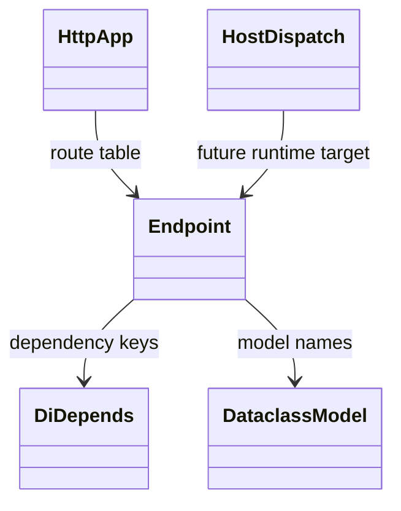
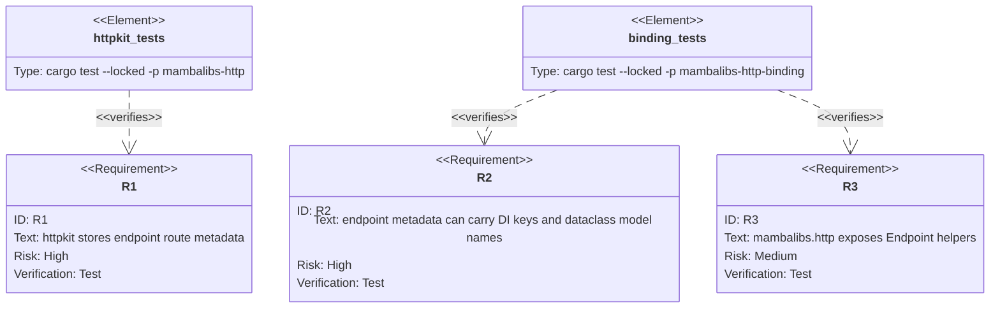

## Scenarios
<!-- type: scenarios lang: yaml -->

```yaml
scenarios:
  - id: extension-without-stdlib-behavior-change
    given:
      - mambalibs may add native methods functions classes and namespaces.
    when:
      - the endpoint contract is introduced.
    then:
      - the contract is exposed as a mambalibs extension.
      - CPython stdlib syntax and behavior are not changed.

  - id: endpoint-records-fastapi-shaped-route
    given:
      - a Mamba app uses normal Python decorator syntax for route registration later.
    when:
      - httpkit stores the native endpoint metadata.
    then:
      - method path handler name and status code are recorded without parser extensions.

  - id: endpoint-carries-di-keys
    given:
      - a handler parameter uses Depends("current_user").
    when:
      - the endpoint contract is built.
    then:
      - the DI provider key is recorded as endpoint metadata.

  - id: endpoint-carries-schema-model-names
    given:
      - request and response models come from mambalibs.dataclasses.
    when:
      - the endpoint contract is built.
    then:
      - request and response model names are preserved for later validation and OpenAPI generation.

  - id: existing-simple-route-api-remains
    given:
      - existing Rust callers call App::add_route or Router::add_route.
    when:
      - the endpoint contract lands.
    then:
      - simple route registration still works.
      - endpoint metadata is opt-in.
```

## Dependency Graph
<!-- type: dependency lang: mermaid -->



## Schema
<!-- type: schema lang: yaml -->

```yaml
definitions:
  ExtensionCompatibilityRule:
    type: object
    required: [extension_allowed, compatibility_gate]
    properties:
      extension_allowed:
        type: string
        const: "mambalibs may add methods functions classes and namespaces"
      compatibility_gate:
        type: string
        const: "do not change CPython stdlib syntax or behavior"

  Endpoint:
    type: object
    required: [method, path, dependency_keys, status_code]
    properties:
      method:
        type: string
        examples: [GET, POST]
      path:
        type: string
        examples: [/items]
      handler_name:
        type: [string, "null"]
      dependency_keys:
        type: array
        items: { type: string }
      request_model:
        type: [string, "null"]
      response_model:
        type: [string, "null"]
      status_code:
        type: integer
        minimum: 100
        maximum: 999
```

## Manifest
<!-- type: manifest lang: yaml -->

```yaml
packages:
  - name: mambalibs-http
    path: projects/mamba/mambalibs/httpkit
    kind: rust-library
  - name: mambalibs-http-binding
    path: projects/mamba/mambalibs/httpkit/binding
    kind: rust-library
    dependencies:
      - { name: mambalibs-http, spec: path, path: ".." }
      - { name: mambalibs-di, spec: path, path: "../../dikit" }
      - { name: cclab-schema-mamba, spec: path, path: "../../../../../crates/cclab-schema-mamba", scope: dev }
```

## Verification
<!-- type: test-plan lang: mermaid -->



## Changes
<!-- type: changes lang: yaml -->

```yaml
files:
  - path: .aw/tech-design/projects/mamba/specs/3966.md
    action: create
    section: changes
    note: "Source of truth for #3966."
  - path: projects/mamba/mambalibs/httpkit/src/app.rs
    action: update
    section: schema
    note: "Add Endpoint metadata and route registration APIs."
  - path: projects/mamba/mambalibs/httpkit/tests/app_host_protocol_test.rs
    action: update
    section: tests
    note: "Cover endpoint registration while preserving simple routes."
  - path: projects/mamba/mambalibs/httpkit/binding/src/app.rs
    action: update
    section: changes
    note: "Expose Endpoint and app/router endpoint registration helpers."
  - path: projects/mamba/mambalibs/httpkit/binding/tests/mamba_registry_test.rs
    action: update
    section: tests
    note: "Cover HTTP + DI + dataclasses endpoint metadata composition."
  - path: projects/mamba/mambalibs/httpkit/binding/Cargo.toml
    action: update
    section: manifest
    note: "Add cclab-schema-mamba dev-dependency for integration tests."
  - path: projects/mamba/mambalibs/README.md
    action: update
    section: dependency
    note: "Document endpoint contract as the next DX bridge."
```

## Tests
<!-- type: tests lang: yaml -->

```yaml
tests:
  - name: app_endpoint_registration_preserves_simple_routes
    assertions:
      - "App::add_route still increments route_count"
      - "App::add_endpoint stores Endpoint metadata"
  - name: endpoint_contract_combines_http_di_and_dataclasses
    assertions:
      - "Endpoint has POST /items"
      - "Endpoint dependency_keys contains current_user"
      - "Endpoint request_model is ItemCreate"
      - "Endpoint response_model is ItemRead"
  - name: mambalibs_http_exposes_endpoint_surface
    assertions:
      - "ModuleRegistrar symbols include Endpoint"
      - "ModuleRegistrar symbols include _httpkit_app_add_endpoint"
```
