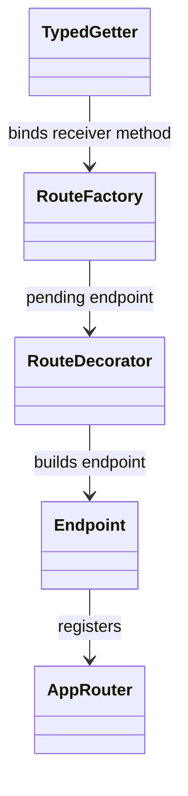
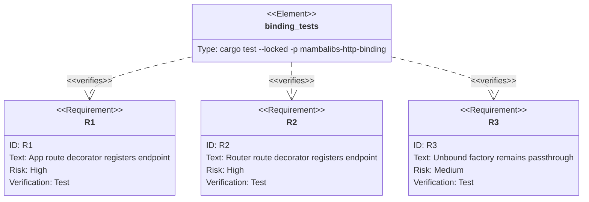

## Scenarios
<!-- type: scenarios lang: yaml -->

```yaml
scenarios:
  - id: app-get-registers-endpoint
    given:
      - a typed native App receiver exposes the get attribute.
    when:
      - the getter returns a route factory.
      - the factory is called with a path.
      - the returned decorator is applied to a handler.
    then:
      - the handler value is returned unchanged.
      - the app contains a GET endpoint for the path.

  - id: app-post-registers-status-code
    given:
      - a typed native App receiver exposes the post attribute.
    when:
      - the returned factory is called with path and status code.
      - the returned decorator is applied.
    then:
      - the app contains a POST endpoint with the supplied status code.

  - id: router-delete-registers-endpoint
    given:
      - a typed native Router receiver exposes the delete attribute.
    when:
      - the returned decorator is applied.
    then:
      - the router contains a DELETE endpoint.

  - id: unbound-route-factory-remains-passthrough
    given:
      - code calls _httpkit_route_factory directly without an App or Router receiver.
    when:
      - the returned decorator is applied.
    then:
      - the handler is returned unchanged.
      - no endpoint registration is attempted.

  - id: native-modules-force-link-pins-introspection
    given:
      - mamba is built with native-modules.
    when:
      - the mambalibs.http module is registered.
    then:
      - endpoint registration helpers are force-link visible.
      - endpoint count introspection is force-link visible.

  - id: extension-preserves-cpython-decorator-semantics
    given:
      - Mamba extends typed native App and Router behavior.
    when:
      - route decorator metadata is recorded.
    then:
      - CPython decorator syntax remains unchanged.
      - stdlib HTTP behavior is not changed.
```

## Dependency Graph
<!-- type: dependency lang: mermaid -->



## Schema
<!-- type: schema lang: yaml -->

```yaml
definitions:
  BoundRouteTarget:
    type: object
    required: [receiver_type, method]
    properties:
      receiver_type:
        type: string
        enum: [App, Router]
      method:
        type: string
        enum: [GET, POST, PUT, PATCH, DELETE]

  PendingRoute:
    type: object
    required: [method, path, status_code]
    properties:
      method: { type: string }
      path: { type: string }
      status_code: { type: integer }
```

## Manifest
<!-- type: manifest lang: yaml -->

```yaml
packages:
  - name: mambalibs-http-binding
    path: projects/mamba/mambalibs/httpkit/binding
    kind: rust-library
    dependencies:
      - { name: mambalibs-http, spec: path, path: ".." }
      - { name: cclab-mamba-registry, spec: path, path: "../../../../../crates/cclab-mamba-registry" }
```

## Verification
<!-- type: test-plan lang: mermaid -->



## Changes
<!-- type: changes lang: yaml -->

```yaml
files:
  - path: .aw/tech-design/projects/mamba/specs/3971.md
    action: create
    section: changes
    note: "Source of truth for #3971."
  - path: projects/mamba/mambalibs/httpkit/binding/src/app.rs
    action: update
    section: changes
    note: "Bind App/Router route getters to endpoint registration."
  - path: projects/mamba/mambalibs/httpkit/binding/tests/mamba_registry_test.rs
    action: update
    section: tests
    note: "Cover app/router route decorator endpoint registration."
  - path: projects/mamba/src/driver/mod.rs
    action: update
    section: tests
    note: "Pin endpoint registration helpers in the native-modules force-link test."
```

## Tests
<!-- type: tests lang: yaml -->

```yaml
tests:
  - name: app_get_decorator_registers_endpoint_and_preserves_handler
    assertions:
      - "decorator result is original handler"
      - "app endpoint_count is 1"
      - "endpoint method is GET"
      - "endpoint path is /health"

  - name: app_post_decorator_registers_status_code
    assertions:
      - "endpoint method is POST"
      - "endpoint status_code is 201"

  - name: router_delete_decorator_registers_endpoint
    assertions:
      - "router endpoint_count is 1"
      - "endpoint method is DELETE"

  - name: native_modules_feature_links_mambalibs_http
    assertions:
      - "symbols include Endpoint"
      - "symbols include _httpkit_app_add_endpoint"
      - "symbols include _httpkit_app_endpoint_count"
```
