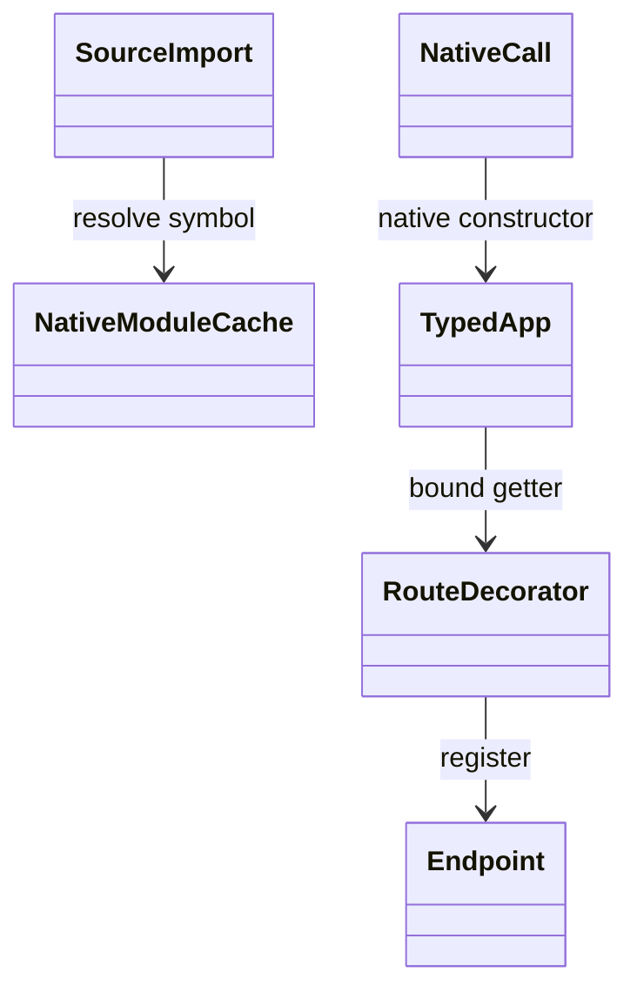

## Scenarios
<!-- type: scenarios lang: yaml -->

```yaml
scenarios:
  - id: source-constructs-native-app
    given:
      - mamba source imports App from mambalibs.http.
    when:
      - the source executes app = App().
    then:
      - the result is a typed native App.
      - it is not a list placeholder.

  - id: source-route-decorator-registers-endpoint
    given:
      - mamba source constructs a typed native App.
    when:
      - the source applies @app.get("/health") to a handler.
    then:
      - the route decorator returns the handler unchanged.
      - the App records one endpoint.

  - id: dotted-source-import-registers-endpoint
    given:
      - mamba source imports the dotted native module mambalibs.http.
    when:
      - the source executes mambalibs.http.App() and @app.get("/health").
    then:
      - the parent mambalibs package exposes the http child module.
      - the App records one endpoint.

  - id: source-can-read-endpoint-introspection
    given:
      - the App has one endpoint registered.
    when:
      - source reads app.endpoint_count.
    then:
      - the runtime prints 1.

  - id: ordinary-decorator-semantics-remain
    given:
      - user code defines ordinary decorators.
    when:
      - the native module bridge is fixed.
    then:
      - existing decorator tests continue to pass.
```

## Dependency Graph
<!-- type: dependency lang: mermaid -->



## Schema
<!-- type: schema lang: yaml -->

```yaml
definitions:
  SourceSmoke:
    type: object
    required: [import_shape, expected_stdout]
    properties:
      import_shape:
        type: string
        enum:
          - "from mambalibs.http import App"
          - "import mambalibs.http"
      expected_stdout:
        type: string
        const: "1"
```

## Manifest
<!-- type: manifest lang: yaml -->

```yaml
packages:
  - name: mamba
    path: projects/mamba
    kind: rust-binary
    features: [native-modules]
    dependencies:
      - { name: mambalibs-http-binding, spec: path, path: "mambalibs/httpkit/binding", optional: true }
```

## Verification

```mermaid
---
id: mambalibs_runtime_route_source_verification
requirements:
  source_smoke:
    id: R1
    text: "run_source executes App route decorator source and prints endpoint count"
    kind: integration
    risk: high
    verify: test
  binding_regression:
    id: R2
    text: "binding-level route decorator tests still pass"
    kind: regression
    risk: medium
    verify: test
  dotted_import:
    id: R3
    text: "dotted native import path exposes mambalibs.http through parent package"
    kind: integration
    risk: medium
    verify: test
elements:
  mamba_source_test:
    kind: test
    type: "cargo test --locked -p mamba --features native-modules native_modules_route_decorator_source_registers_endpoint"
  mamba_dotted_source_test:
    kind: test
    type: "cargo test --locked -p mamba --features native-modules native_modules_dotted_http_import_source_registers_endpoint"
  binding_tests:
    kind: test
    type: "cargo test --locked -p mambalibs-http-binding"
relations:
  - { from: mamba_source_test, verifies: source_smoke }
  - { from: binding_tests, verifies: binding_regression }
  - { from: mamba_dotted_source_test, verifies: dotted_import }
---
requirementDiagram
  requirement R1 {
    id: R1
    text: "source route decorator smoke"
    risk: high
    verifymethod: test
  }
  requirement R2 {
    id: R2
    text: "binding route decorator regression"
    risk: medium
    verifymethod: test
  }
  requirement R3 {
    id: R3
    text: "dotted native import route"
    risk: medium
    verifymethod: test
  }
  element mamba_source_test {
    type: "cargo test --locked -p mamba --features native-modules native_modules_route_decorator_source_registers_endpoint"
  }
  element mamba_dotted_source_test {
    type: "cargo test --locked -p mamba --features native-modules native_modules_dotted_http_import_source_registers_endpoint"
  }
  element binding_tests {
    type: "cargo test --locked -p mambalibs-http-binding"
  }
  mamba_source_test - verifies -> R1
  binding_tests - verifies -> R2
  mamba_dotted_source_test - verifies -> R3
```

<!-- type: test-plan lang: mermaid -->



## Changes
<!-- type: changes lang: yaml -->

```yaml
files:
  - path: .aw/tech-design/projects/mamba/specs/3993.md
    action: create
    section: changes
    note: "Source of truth for #3993."
  - path: projects/mamba/src/driver/mod.rs
    action: update
    section: tests
    note: "Add source-level route decorator smoke under native-modules."
  - path: projects/mamba/src/runtime/module.rs
    action: update
    section: changes
    note: "Register native modules through the normal module path so dotted mambalibs packages expose parent attrs."
  - path: projects/mamba/src/runtime/class.rs
    action: update
    section: changes
    note: "Mirror typed native getter dispatch in method calls so source obj.method(...) never dereferences native payloads as MbObject."
```

## Tests
<!-- type: tests lang: yaml -->

```yaml
tests:
  - name: native_modules_http_constructor_uses_native_abi
    assertions:
      - "App imports as a function pointer"
      - "mb_call0 returns a typed native App"
  - name: native_modules_route_decorator_source_registers_endpoint
    assertions:
      - "run_source succeeds"
      - "captured stdout is 1"
      - "source uses from mambalibs.http import App"
      - "source uses @app.get('/health')"
  - name: native_modules_dotted_http_import_source_registers_endpoint
    assertions:
      - "run_source succeeds"
      - "captured stdout is 1"
      - "source uses import mambalibs.http"
      - "source uses @app.get('/health')"
```
