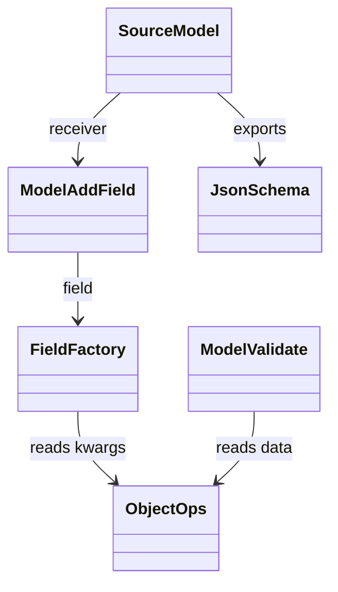

## Scenarios
<!-- type: scenarios lang: yaml -->

```yaml
scenarios:
  - id: source-creates-model
    given:
      - mamba source imports BaseModel from mambalibs.dataclasses.
    when:
      - the source executes User = BaseModel("User").
    then:
      - the result is a typed native BaseModel handle.

  - id: source-registers-field
    given:
      - source has a typed native BaseModel handle.
    when:
      - the source calls User.add_field(Field("name", {"min_length": 3})).
    then:
      - the field is registered on the model.
      - Field kwargs are read through ObjectOps-compatible dict access.

  - id: source-validates-data
    given:
      - source registered a required string field on the model.
    when:
      - the source calls User.validate({"name": "alice"}).
    then:
      - validation succeeds.

  - id: source-exports-json-schema
    given:
      - source registered a field on the model.
    when:
      - the source calls User.to_json_schema().
    then:
      - the schema string contains the registered field name.

  - id: stdlib-dataclasses-unchanged
    given:
      - CPython-compatible runtime stdlib dataclasses exists separately.
    when:
      - mambalibs.dataclasses adds model methods.
    then:
      - stdlib dataclasses syntax and behavior are not changed.
```

## Dependency Graph
<!-- type: dependency lang: mermaid -->



## Schema
<!-- type: schema lang: yaml -->

```yaml
definitions:
  ModelMethodSmoke:
    type: object
    required: [model_name, field_name, expected_success, schema_contains]
    properties:
      model_name:
        type: string
        const: User
      field_name:
        type: string
        const: name
      expected_success:
        type: boolean
        const: true
      schema_contains:
        type: string
        const: '"name"'
```

## Manifest
<!-- type: manifest lang: yaml -->

```yaml
packages:
  - name: cclab-schema-mamba
    path: crates/cclab-schema-mamba
    kind: rust-library
    dependencies:
      - { name: cclab-schema, spec: path, path: "../cclab-schema" }
      - { name: cclab-mamba-registry, spec: path, path: "../cclab-mamba-registry" }
  - name: mamba
    path: projects/mamba
    kind: rust-binary
    features: [native-modules]
```

## Verification

```mermaid
---
id: mambalibs_dataclasses_model_methods_verification
requirements:
  source_model_methods:
    id: R1
    text: "run_source executes BaseModel.add_field/validate/to_json_schema"
    kind: integration
    risk: high
    verify: test
  binding_regression:
    id: R2
    text: "cclab-schema-mamba binding tests pass"
    kind: regression
    risk: medium
    verify: test
  link_smoke:
    id: R3
    text: "mambalibs.dataclasses native-module link smoke remains green"
    kind: regression
    risk: medium
    verify: test
elements:
  mamba_source_test:
    kind: test
    type: "cargo test --locked -p mamba --features native-modules native_modules_dataclasses_model_methods_source -- --nocapture"
  binding_tests:
    kind: test
    type: "cargo test --locked -p cclab-schema-mamba"
  link_test:
    kind: test
    type: "cargo test --locked -p mamba --features native-modules native_modules_feature_links_mambalibs_dataclasses -- --nocapture"
relations:
  - { from: mamba_source_test, verifies: source_model_methods }
  - { from: binding_tests, verifies: binding_regression }
  - { from: link_test, verifies: link_smoke }
---
requirementDiagram
  requirement R1 {
    id: R1
    text: "source model methods"
    risk: high
    verifymethod: test
  }
  requirement R2 {
    id: R2
    text: "binding regression"
    risk: medium
    verifymethod: test
  }
  requirement R3 {
    id: R3
    text: "native link smoke"
    risk: medium
    verifymethod: test
  }
  element mamba_source_test {
    type: "cargo test --locked -p mamba --features native-modules native_modules_dataclasses_model_methods_source -- --nocapture"
  }
  element binding_tests {
    type: "cargo test --locked -p cclab-schema-mamba"
  }
  element link_test {
    type: "cargo test --locked -p mamba --features native-modules native_modules_feature_links_mambalibs_dataclasses -- --nocapture"
  }
  mamba_source_test - verifies -> R1
  binding_tests - verifies -> R2
  link_test - verifies -> R3
```

<!-- type: test-plan lang: mermaid -->



## Changes
<!-- type: changes lang: yaml -->

```yaml
files:
  - path: .aw/tech-design/projects/mamba/specs/3997.md
    action: create
    section: changes
    note: "Source of truth for #3997."
  - path: crates/cclab-schema-mamba/src/lib.rs
    action: update
    section: changes
    note: "Register add_field symbol and BaseModel method getters."
  - path: crates/cclab-schema-mamba/src/methods.rs
    action: update
    section: changes
    note: "Implement model add_field and bound method wrappers."
  - path: crates/cclab-schema-mamba/src/types.rs
    action: update
    section: changes
    note: "Read Field kwargs through ObjectOps dict helpers."
  - path: crates/cclab-schema-mamba/tests/test_binding.rs
    action: update
    section: tests
    note: "Cover add_field and ObjectOps dict reads."
  - path: projects/mamba/src/driver/mod.rs
    action: update
    section: tests
    note: "Add source-level BaseModel method smoke."
```

## Tests
<!-- type: tests lang: yaml -->

```yaml
tests:
  - name: native_modules_dataclasses_model_methods_source
    assertions:
      - "run_source succeeds"
      - "BaseModel.add_field accepts Field('name', {'min_length': 3})"
      - "BaseModel.validate accepts a normal source dict"
      - "BaseModel.to_json_schema includes the registered field"
  - name: cclab-schema-mamba binding tests
    assertions:
      - "add_field mutates an MbBaseModel"
      - "Field kwargs use ObjectOps dict reads"
```
