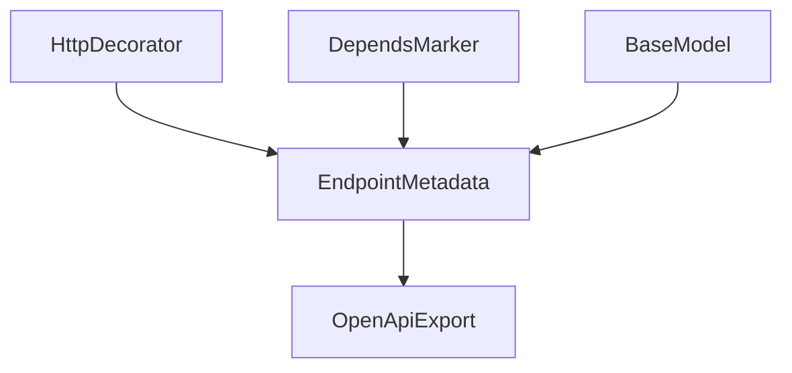
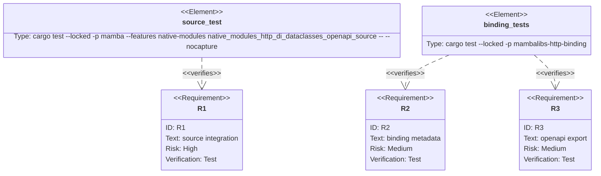

## Scenarios
<!-- type: scenarios lang: yaml -->

```yaml
scenarios:
  - id: source-registers-fastapi-style-route
    given:
      - mamba source imports FastAPI and Depends from mambalibs.http.
      - mamba source imports BaseModel and Field from mambalibs.dataclasses.
    when:
      - the source decorates a function with app.post using status_code, dependencies, request_model, and response_model keyword arguments.
    then:
      - the endpoint is registered on the typed App handle.
      - the status code is preserved.
      - the dependency key is recorded from the Depends marker.
      - the request and response model names are recorded from BaseModel handles.

  - id: app-openapi-contract
    given:
      - an App has at least one route with dependency and model metadata.
    when:
      - source calls app.openapi().
    then:
      - a JSON string is returned.
      - the JSON includes the route path, HTTP method, response status, dependency key, and model references.

  - id: compatibility-boundary
    given:
      - CPython-compatible stdlib modules remain separate from mambalibs.
    when:
      - mambalibs adds route metadata and OpenAPI export.
    then:
      - stdlib http and dataclasses behavior is unchanged.
```

## Dependency Graph
<!-- type: dependency lang: mermaid -->



## Schema
<!-- type: schema lang: yaml -->

```yaml
definitions:
  RouteOpenApiSmoke:
    type: object
    required: [path, method, status_code, dependency, request_model, response_model]
    properties:
      path:
        type: string
        const: /items
      method:
        type: string
        const: post
      status_code:
        type: integer
        const: 201
      dependency:
        type: string
        const: current_user
      request_model:
        type: string
        const: ItemCreate
      response_model:
        type: string
        const: ItemRead
```

## Manifest
<!-- type: manifest lang: yaml -->

```yaml
packages:
  - name: mambalibs-http
    path: projects/mamba/mambalibs/httpkit
    kind: rust-library
  - name: mambalibs-http-binding
    path: projects/mamba/mambalibs/httpkit/binding
    kind: rust-library
    dependencies:
      - { name: mambalibs-http, spec: path, path: ".." }
      - { name: mambalibs-di, spec: path, path: "../../dikit" }
      - { name: cclab-schema-mamba, spec: path, path: "../../../../../crates/cclab-schema-mamba" }
  - name: mamba
    path: projects/mamba
    kind: rust-binary
    features: [native-modules]
```

## Verification
<!-- type: test-plan lang: mermaid -->



## Changes
<!-- type: changes lang: yaml -->

```yaml
files:
  - path: .aw/tech-design/projects/mamba/specs/4001.md
    action: create
    section: changes
    note: "Source of truth for #4001."
  - path: projects/mamba/mambalibs/httpkit/src/app.rs
    action: update
    section: changes
    note: "Add OpenAPI-like JSON export from App endpoint metadata."
  - path: projects/mamba/mambalibs/httpkit/binding/Cargo.toml
    action: update
    section: manifest
    note: "Promote cclab-schema-mamba to a binding dependency for BaseModel name extraction."
  - path: projects/mamba/mambalibs/httpkit/binding/src/app.rs
    action: update
    section: changes
    note: "Parse decorator kwargs and register App.openapi method."
  - path: projects/mamba/mambalibs/httpkit/binding/tests/mamba_registry_test.rs
    action: update
    section: tests
    note: "Cover decorator metadata and OpenAPI export."
  - path: projects/mamba/src/driver/mod.rs
    action: update
    section: tests
    note: "Add source-level HTTP + DI + dataclasses OpenAPI smoke."
```

## Tests
<!-- type: tests lang: yaml -->

```yaml
tests:
  - name: decorator_kwargs_register_di_and_model_metadata
    assertions:
      - "status_code keyword is preserved"
      - "dependencies list extracts Depends provider keys"
      - "request_model and response_model BaseModel handles become model names"
  - name: native_modules_http_di_dataclasses_openapi_source
    assertions:
      - "run_source succeeds"
      - "app.openapi contains route path, method, status, dependency key, and model refs"
```
