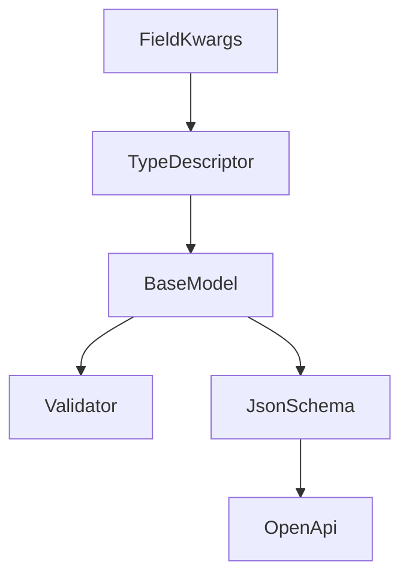
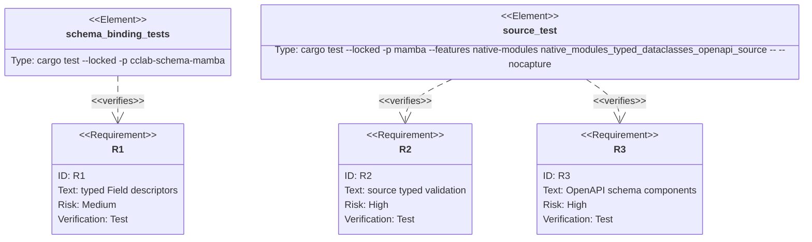

## Scenarios
<!-- type: scenarios lang: yaml -->

```yaml
scenarios:
  - id: typed-field-validation
    given:
      - mamba source imports BaseModel and Field from mambalibs.dataclasses.
      - a model registers string, int, bool, and list[str] fields.
    when:
      - source validates a valid dict and invalid scalar/list values.
    then:
      - valid data returns True.
      - invalid scalar values return a ValidationError string.
      - invalid list item values return a ValidationError string.

  - id: required-default-json-schema
    given:
      - one field has no default.
      - one field has a default value.
    when:
      - source calls BaseModel.to_json_schema().
    then:
      - the required array contains only fields without defaults.
      - default values appear on optional properties.
      - typed properties include integer, boolean, and array item schemas.

  - id: http-openapi-uses-model-schema
    given:
      - mambalibs.http receives BaseModel handles as request_model and response_model.
    when:
      - source calls app.openapi().
    then:
      - components.schemas contains the BaseModel JSON Schema, not only a placeholder.
      - request and response refs continue to point at the component schema names.

  - id: compatibility-boundary
    given:
      - CPython-compatible stdlib dataclasses exists separately.
    when:
      - mambalibs.dataclasses adds typed schema Field behavior.
    then:
      - stdlib dataclasses syntax and behavior are unchanged.
```

## Dependency Graph
<!-- type: dependency lang: mermaid -->



## Schema
<!-- type: schema lang: yaml -->

```yaml
definitions:
  TypedFieldKwargs:
    type: object
    properties:
      type:
        type: string
        enum: [str, string, int, integer, float, number, bool, boolean, list, array, list[str], list[int], list[float], list[bool]]
      default: {}
      required:
        type: boolean
      min_length:
        type: integer
      max_length:
        type: integer
      min_value:
        type: number
      max_value:
        type: number
      min_items:
        type: integer
      max_items:
        type: integer
```

## Manifest
<!-- type: manifest lang: yaml -->

```yaml
packages:
  - name: cclab-schema
    path: crates/cclab-schema
    kind: rust-library
  - name: cclab-schema-mamba
    path: crates/cclab-schema-mamba
    kind: rust-library
    dependencies:
      - { name: cclab-schema, spec: path, path: "../cclab-schema" }
      - { name: cclab-mamba-registry, spec: path, path: "../cclab-mamba-registry" }
  - name: mambalibs-http
    path: projects/mamba/mambalibs/httpkit
    kind: rust-library
  - name: mambalibs-http-binding
    path: projects/mamba/mambalibs/httpkit/binding
    kind: rust-library
  - name: mamba
    path: projects/mamba
    kind: rust-binary
    features: [native-modules]
```

## Verification
<!-- type: test-plan lang: mermaid -->



## Changes
<!-- type: changes lang: yaml -->

```yaml
files:
  - path: .aw/tech-design/projects/mamba/specs/4003.md
    action: create
    section: changes
    note: "Source of truth for #4003."
  - path: crates/cclab-schema/src/json_schema.rs
    action: update
    section: changes
    note: "Expose field descriptions/defaults in JSON Schema output."
  - path: crates/cclab-schema-mamba/src/types.rs
    action: update
    section: changes
    note: "Parse typed Field kwargs and convert list/object runtime values."
  - path: crates/cclab-schema-mamba/src/methods.rs
    action: update
    section: changes
    note: "Use BaseModel schema JSON helper for compact model schema output."
  - path: projects/mamba/mambalibs/httpkit/src/app.rs
    action: update
    section: changes
    note: "Store and emit request/response model schema components."
  - path: projects/mamba/mambalibs/httpkit/binding/src/app.rs
    action: update
    section: changes
    note: "Extract BaseModel schema JSON when registering route metadata."
  - path: crates/cclab-schema-mamba/tests/test_binding.rs
    action: update
    section: tests
    note: "Cover typed Field validation and JSON Schema output."
  - path: projects/mamba/src/driver/mod.rs
    action: update
    section: tests
    note: "Add source-level typed dataclasses plus OpenAPI integration smoke."
```

## Tests
<!-- type: tests lang: yaml -->

```yaml
tests:
  - name: field_from_kwargs_with_typed_constraints
    assertions:
      - "int fields use integer schemas and numeric constraints"
      - "list[str] fields use array schemas and item validation"
      - "defaults make fields optional"
  - name: native_modules_typed_dataclasses_openapi_source
    assertions:
      - "source validation accepts valid data"
      - "source validation rejects wrong scalar/list data"
      - "to_json_schema includes required/default/items"
      - "app.openapi includes the same model schema in components"
```
