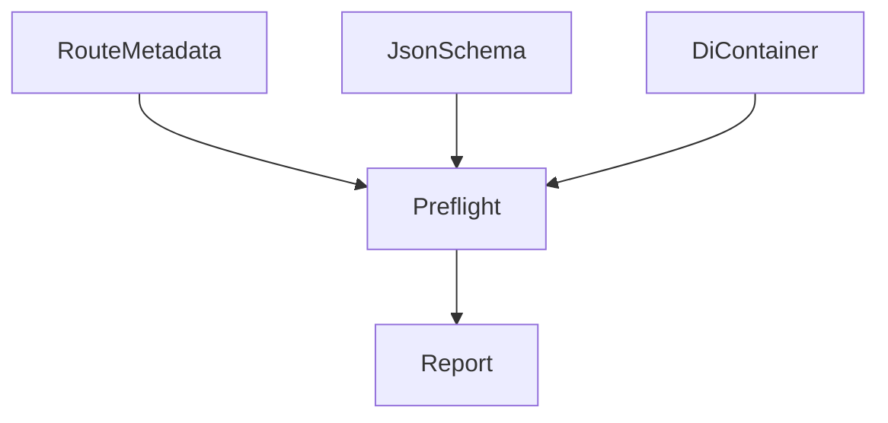

## Scenarios
<!-- type: scenarios lang: yaml -->

```yaml
scenarios:
  - id: valid-preflight
    given:
      - a mambalibs.http App has a POST route with Depends, request_model, response_model, and status_code.
      - a mambalibs.di Container has the dependency key registered.
      - the request body satisfies the mambalibs.dataclasses BaseModel schema.
    when:
      - source calls app.preflight("POST", "/items", body, container).
    then:
      - the result is a JSON string with matched=true.
      - status_code is the route status code.
      - the resolved dependency value is present in the result.

  - id: invalid-body-preflight
    given:
      - a route has a typed request_model schema.
    when:
      - source preflights a body with invalid scalar or list item types.
    then:
      - the result has status_code 422.
      - errors describe the invalid body fields.

  - id: missing-dependency-preflight
    given:
      - a route records a dependency key from Depends.
      - the DI provider does not resolve that key.
    when:
      - source calls app.preflight with the container.
    then:
      - the result has status_code 500.
      - dependency_errors names the missing key.

  - id: missing-route-preflight
    given:
      - no registered route matches method and path.
    when:
      - source calls app.preflight.
    then:
      - the result has matched=false and status_code 404.

  - id: compatibility-boundary
    given:
      - CPython stdlib http and dataclasses remain separate runtime modules.
    when:
      - mambalibs adds preflight behavior.
    then:
      - stdlib syntax and behavior are unchanged.
```

## Dependency Graph
<!-- type: dependency lang: mermaid -->



## Schema
<!-- type: schema lang: yaml -->

```yaml
definitions:
  PreflightReport:
    type: object
    required: [matched, status_code, method, path]
    properties:
      matched:
        type: boolean
      status_code:
        type: integer
      method:
        type: string
      path:
        type: string
      request_model:
        type: string
      response_model:
        type: string
      dependencies:
        type: object
        additionalProperties:
          type: string
      errors:
        type: array
        items:
          type: string
      dependency_errors:
        type: array
        items:
          type: string
```

## Manifest
<!-- type: manifest lang: yaml -->

```yaml
packages:
  - name: mambalibs-http
    path: projects/mamba/mambalibs/httpkit
    kind: rust-library
  - name: mambalibs-http-binding
    path: projects/mamba/mambalibs/httpkit/binding
    kind: rust-library
    dependencies:
      - { name: mambalibs-http, spec: path, path: ".." }
      - { name: mambalibs-di, spec: path, path: "../../dikit" }
      - { name: mambalibs-di-binding, spec: path, path: "../../dikit/binding" }
      - { name: cclab-schema-mamba, spec: path, path: "../../../../../crates/cclab-schema-mamba" }
  - name: mamba
    path: projects/mamba
    kind: rust-binary
    features: [native-modules]
    notes:
      - "Typed native wrappers must not be treated as stdlib MbObject heap values by runtime refcount helpers."
```

## Verification

```mermaid
---
id: mambalibs_http_di_schema_preflight_verification
requirements:
  host_preflight:
    id: R1
    text: "App preflight validates body schemas and reports route status"
    kind: regression
    risk: high
    verify: test
  di_resolution:
    id: R2
    text: "Preflight resolves Depends keys through mambalibs.di"
    kind: integration
    risk: high
    verify: test
  source_integration:
    id: R3
    text: "Mamba source composes HTTP, DI, and dataclasses in app.preflight"
    kind: integration
    risk: high
    verify: test
  native_wrapper_safety:
    id: R4
    text: "Typed native wrappers survive runtime retain/release no-ops"
    kind: regression
    risk: high
    verify: test
elements:
  http_tests:
    kind: test
    type: "cargo test --locked -p mambalibs-http --test app_host_protocol_test app_preflight_json_validates_body_and_reports_dependencies -- --nocapture"
  binding_tests:
    kind: test
    type: "cargo test --locked -p mambalibs-http-binding app_preflight_resolves_di_and_validates_schema -- --nocapture"
  source_test:
    kind: test
    type: "cargo test --locked -p mamba --features native-modules native_modules_http_di_dataclasses_preflight_source -- --nocapture"
  native_wrapper_test:
    kind: test
    type: "cargo test --locked -p mamba runtime::rc::tests::test_typed_native_wrapper_refcount_ops_noop -- --nocapture"
relations:
  - { from: http_tests, verifies: host_preflight }
  - { from: binding_tests, verifies: di_resolution }
  - { from: source_test, verifies: source_integration }
  - { from: native_wrapper_test, verifies: native_wrapper_safety }
---
requirementDiagram
  requirement R1 {
    id: R1
    text: "host preflight"
    risk: high
    verifymethod: test
  }
  requirement R2 {
    id: R2
    text: "DI resolution"
    risk: high
    verifymethod: test
  }
  requirement R3 {
    id: R3
    text: "source integration"
    risk: high
    verifymethod: test
  }
  requirement R4 {
    id: R4
    text: "native wrapper safety"
    risk: high
    verifymethod: test
  }
  element source_test {
    type: "cargo test --locked -p mamba --features native-modules native_modules_http_di_dataclasses_preflight_source -- --nocapture"
  }
  element native_wrapper_test {
    type: "cargo test --locked -p mamba runtime::rc::tests::test_typed_native_wrapper_refcount_ops_noop -- --nocapture"
  }
  source_test - verifies -> R3
  native_wrapper_test - verifies -> R4
```

<!-- type: test-plan lang: mermaid -->



## Changes
<!-- type: changes lang: yaml -->

```yaml
files:
  - path: .aw/tech-design/projects/mamba/specs/4006.md
    action: create
    section: changes
    note: "Source of truth for #4006."
  - path: projects/mamba/mambalibs/httpkit/src/app.rs
    action: update
    section: changes
    note: "Add App.preflight_request_json and minimal JSON Schema request validation."
  - path: projects/mamba/mambalibs/httpkit/binding/Cargo.toml
    action: update
    section: manifest
    note: "Allow HTTP binding to unwrap mambalibs.di Container and RequestScope handles."
  - path: projects/mamba/mambalibs/httpkit/binding/src/app.rs
    action: update
    section: changes
    note: "Expose App.preflight bound method and resolve DI dependencies from source values."
  - path: projects/mamba/mambalibs/httpkit/tests/app_host_protocol_test.rs
    action: update
    section: tests
    note: "Cover valid, invalid, missing dependency, and missing route preflight reports."
  - path: projects/mamba/mambalibs/httpkit/binding/tests/mamba_registry_test.rs
    action: update
    section: tests
    note: "Cover binding-level DI resolution plus body validation."
  - path: projects/mamba/src/driver/mod.rs
    action: update
    section: tests
    note: "Add source-level HTTP + DI + dataclasses preflight smoke."
  - path: projects/mamba/src/runtime/rc.rs
    action: update
    section: changes
    note: "Keep typed native wrappers out of stdlib MbObject retain/release paths."
  - path: projects/mamba/src/runtime/class.rs
    action: update
    section: changes
    note: "Dispatch typed native wrapper getters and methods before stdlib MbObject fast-path dereferences."
```

## Tests
<!-- type: tests lang: yaml -->

```yaml
tests:
  - name: app_preflight_json_validates_body_and_reports_dependencies
    assertions:
      - "valid body returns route status code"
      - "invalid body returns 422"
      - "missing dependency returns 500"
      - "missing route returns 404"
  - name: native_modules_http_di_dataclasses_preflight_source
    assertions:
      - "source registers a route with Depends and BaseModel"
      - "source registers a DI provider"
      - "app.preflight returns JSON with status_code 201 and dependency value"
      - "invalid preflight returns 422"
  - name: test_typed_native_wrapper_refcount_ops_noop
    assertions:
      - "typed native wrappers survive runtime retain/release helpers without payload mutation"
```
