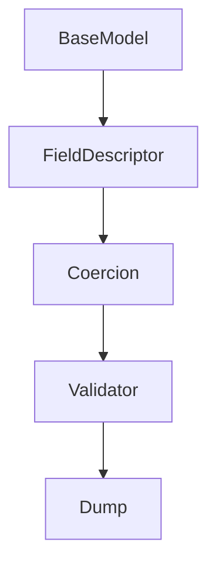
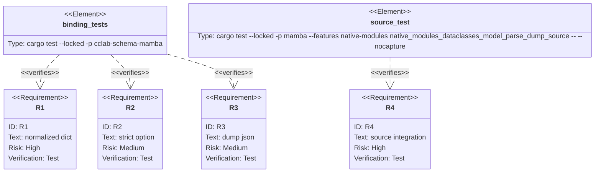

## Scenarios
<!-- type: scenarios lang: yaml -->

```yaml
scenarios:
  - id: model-validate-normalizes
    given:
      - a mambalibs.dataclasses BaseModel declares typed fields, constraints, and defaults.
      - a source payload uses declared fields and coercible scalar values.
    when:
      - source calls Model.model_validate(payload).
    then:
      - the result is a dict containing declared fields only.
      - defaults are applied for missing optional/defaulted fields.
      - lax scalar coercion is applied by default.

  - id: strict-parse-option
    given:
      - a BaseModel field expects an integer.
      - the payload provides a string value.
    when:
      - source calls Model.model_validate(payload, {"strict": True}).
    then:
      - the result is a ValidationError string rather than a normalized dict.

  - id: dump-json
    given:
      - a payload validates against the BaseModel.
    when:
      - source calls Model.model_dump_json(payload).
    then:
      - the result is compact JSON with defaults and coerced values.

  - id: schema-alias
    given:
      - existing code calls Model.to_json_schema().
    when:
      - new code calls Model.model_json_schema().
    then:
      - both APIs produce the same JSON schema string.

  - id: compatibility-boundary
    given:
      - CPython stdlib dataclasses syntax and behavior are imported through dataclasses.
    when:
      - mambalibs.dataclasses adds model_parse/model_dump helpers.
    then:
      - stdlib dataclasses behavior is unchanged because all new behavior lives under mambalibs.dataclasses.
```

## Dependency Graph
<!-- type: dependency lang: mermaid -->



## Schema
<!-- type: schema lang: yaml -->

```yaml
definitions:
  ModelParseOptions:
    type: object
    properties:
      strict:
        type: boolean
        default: false
  NormalizedModel:
    type: object
    additionalProperties: true
    notes:
      - "Keys are limited to declared BaseModel fields."
      - "Default values are inserted when field descriptors provide them."
      - "Unknown payload keys are ignored to match the existing mambalibs.dataclasses declared-field filter."
```

## Manifest
<!-- type: manifest lang: yaml -->

```yaml
packages:
  - name: cclab-schema
    path: crates/cclab-schema
    kind: rust-library
    notes:
      - "Reuse existing validate and coercion primitives."
  - name: cclab-schema-mamba
    path: crates/cclab-schema-mamba
    kind: rust-library
    dependencies:
      - { name: cclab-schema, spec: path, path: "../cclab-schema" }
  - name: mamba
    path: projects/mamba
    kind: rust-binary
    features: [native-modules]
    notes:
      - "Source-level tests must import from mambalibs.dataclasses, not stdlib dataclasses."
```

## Verification
<!-- type: test-plan lang: mermaid -->



## Changes
<!-- type: changes lang: yaml -->

```yaml
files:
  - path: .aw/tech-design/projects/mamba/specs/4009.md
    action: create
    section: changes
    note: "Source of truth for #4009."
  - path: crates/cclab-schema-mamba/src/methods.rs
    action: update
    section: changes
    note: "Add model_validate, parse_obj, model_dump, model_dump_json, and model_json_schema bound methods."
  - path: crates/cclab-schema-mamba/src/lib.rs
    action: update
    section: changes
    note: "Register new mambalibs.dataclasses extension symbols and BaseModel getters."
  - path: crates/cclab-schema-mamba/tests/test_binding.rs
    action: update
    section: tests
    note: "Cover normalized dicts, defaults, coercion, strict mode, JSON dump, and symbol registration."
  - path: projects/mamba/src/driver/mod.rs
    action: update
    section: tests
    note: "Add a source-level mambalibs.dataclasses model parse/dump smoke."
```

## Tests
<!-- type: tests lang: yaml -->

```yaml
tests:
  - name: model_validate_returns_defaulted_coerced_dict
    assertions:
      - "model_validate returns a dict for valid payloads"
      - "missing defaulted fields are present in the result"
      - "coercible scalar values are normalized by default"
  - name: model_validate_strict_rejects_lax_coercion
    assertions:
      - "strict=True keeps string-int mismatch invalid"
      - "failure shape remains a ValidationError string"
  - name: model_dump_json_emits_normalized_payload
    assertions:
      - "model_dump_json returns compact JSON"
      - "JSON contains defaults and coerced values"
  - name: native_modules_dataclasses_model_parse_dump_source
    assertions:
      - "source imports from mambalibs.dataclasses"
      - "source calls model_dump_json and model_json_schema"
      - "source observes ValidationError for invalid data"
```
