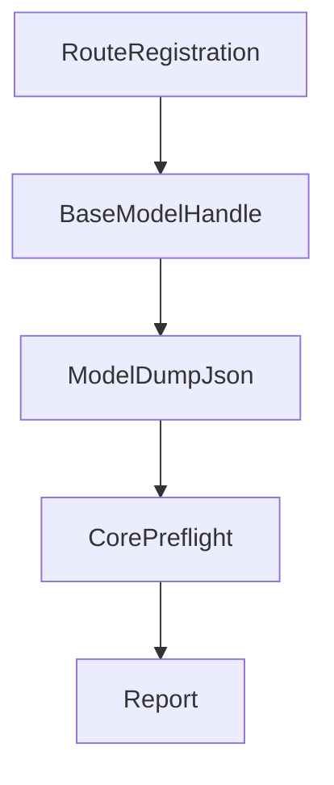

## Scenarios
<!-- type: scenarios lang: yaml -->

```yaml
scenarios:
  - id: normalized-body-success
    given:
      - an App route declares request_model with a mambalibs.dataclasses BaseModel.
      - the body has coercible scalar values and omits defaulted fields.
      - DI dependencies resolve.
    when:
      - source calls app.preflight("POST", path, body, container).
    then:
      - the report status_code is the route status.
      - report.body contains coerced scalar values.
      - report.body contains BaseModel defaults.

  - id: model-parse-error
    given:
      - a request_model expects typed fields.
      - the body violates constraints or cannot be coerced.
    when:
      - source calls app.preflight.
    then:
      - the report status_code is 422.
      - report.errors contains ValidationError-style model parse detail.

  - id: schema-fallback
    given:
      - an Endpoint is registered with only a request schema or a model name string.
    when:
      - preflight runs without a native BaseModel handle.
    then:
      - existing JSON Schema validation remains the fallback behavior.

  - id: compatibility-boundary
    given:
      - CPython stdlib http and dataclasses are imported separately.
    when:
      - mambalibs.http composes with mambalibs.dataclasses.
    then:
      - stdlib syntax and behavior are unchanged because all new behavior is under mambalibs.
```

## Dependency Graph
<!-- type: dependency lang: mermaid -->



## Schema
<!-- type: schema lang: yaml -->

```yaml
definitions:
  PreflightReport:
    type: object
    required: [matched, status_code, method, path, body]
    properties:
      matched:
        type: boolean
      status_code:
        type: integer
      method:
        type: string
      path:
        type: string
      request_model:
        type: string
      response_model:
        type: string
      body:
        description: "Original body for schema-only routes, normalized model output for BaseModel routes."
      dependencies:
        type: object
      errors:
        type: array
        items:
          type: string
      dependency_errors:
        type: array
        items:
          type: string
```

## Manifest
<!-- type: manifest lang: yaml -->

```yaml
packages:
  - name: mambalibs-http
    path: projects/mamba/mambalibs/httpkit
    kind: rust-library
  - name: mambalibs-http-binding
    path: projects/mamba/mambalibs/httpkit/binding
    kind: rust-library
    dependencies:
      - { name: mambalibs-http, spec: path, path: ".." }
      - { name: cclab-schema-mamba, spec: path, path: "../../../../../crates/cclab-schema-mamba" }
      - { name: mambalibs-di-binding, spec: path, path: "../../dikit/binding" }
  - name: mamba
    path: projects/mamba
    kind: rust-binary
    features: [native-modules]
```

## Verification

```mermaid
---
id: mambalibs_http_preflight_body_normalization_verification
requirements:
  normalized_success:
    id: R1
    text: "Preflight returns route success and normalized request body"
    kind: integration
    risk: high
    verify: test
  model_error:
    id: R2
    text: "Invalid model parsing reports 422"
    kind: regression
    risk: high
    verify: test
  fallback:
    id: R3
    text: "Schema-only preflight still works"
    kind: regression
    risk: medium
    verify: test
  source_integration:
    id: R4
    text: "Mamba source composes HTTP, DI, and dataclasses normalization"
    kind: integration
    risk: high
    verify: test
elements:
  binding_tests:
    kind: test
    type: "cargo test --locked -p mambalibs-http-binding app_preflight_resolves_di_and_normalizes_schema_body -- --nocapture"
  source_test:
    kind: test
    type: "cargo test --locked -p mamba --features native-modules native_modules_http_di_dataclasses_preflight_source -- --nocapture"
  core_tests:
    kind: test
    type: "cargo test --locked -p mambalibs-http app_preflight_json_validates_body_and_reports_dependencies -- --nocapture"
relations:
  - { from: binding_tests, verifies: normalized_success }
  - { from: binding_tests, verifies: model_error }
  - { from: core_tests, verifies: fallback }
  - { from: source_test, verifies: source_integration }
---
requirementDiagram
  requirement R1 {
    id: R1
    text: "normalized success"
    risk: high
    verifymethod: test
  }
  requirement R2 {
    id: R2
    text: "model error"
    risk: high
    verifymethod: test
  }
  requirement R3 {
    id: R3
    text: "schema fallback"
    risk: medium
    verifymethod: test
  }
  requirement R4 {
    id: R4
    text: "source integration"
    risk: high
    verifymethod: test
  }
  element binding_tests {
    type: "cargo test --locked -p mambalibs-http-binding app_preflight_resolves_di_and_normalizes_schema_body -- --nocapture"
  }
  element source_test {
    type: "cargo test --locked -p mamba --features native-modules native_modules_http_di_dataclasses_preflight_source -- --nocapture"
  }
  element core_tests {
    type: "cargo test --locked -p mambalibs-http app_preflight_json_validates_body_and_reports_dependencies -- --nocapture"
  }
  binding_tests - verifies -> R1
  binding_tests - verifies -> R2
  core_tests - verifies -> R3
  source_test - verifies -> R4
```

<!-- type: test-plan lang: mermaid -->



## Changes
<!-- type: changes lang: yaml -->

```yaml
files:
  - path: .aw/tech-design/projects/mamba/specs/4011.md
    action: create
    section: changes
    note: "Source of truth for #4011."
  - path: projects/mamba/mambalibs/httpkit/src/app.rs
    action: update
    section: changes
    note: "Include request body in preflight reports."
  - path: projects/mamba/mambalibs/httpkit/binding/src/app.rs
    action: update
    section: changes
    note: "Retain native BaseModel request handles and normalize body before core preflight."
  - path: projects/mamba/mambalibs/httpkit/binding/tests/mamba_registry_test.rs
    action: update
    section: tests
    note: "Cover body coercion/defaults and model parse errors in binding preflight."
  - path: projects/mamba/src/driver/mod.rs
    action: update
    section: tests
    note: "Assert source-level preflight report exposes normalized body."
```

## Tests
<!-- type: tests lang: yaml -->

```yaml
tests:
  - name: app_preflight_resolves_di_and_normalizes_schema_body
    assertions:
      - "string age is coerced to integer in report.body"
      - "defaulted tags are present in report.body"
      - "invalid payload returns 422 with ValidationError detail"
  - name: native_modules_http_di_dataclasses_preflight_source
    assertions:
      - "source-level preflight accepts coercible body"
      - "source-level preflight reports normalized body"
      - "invalid source-level body still returns 422"
```
