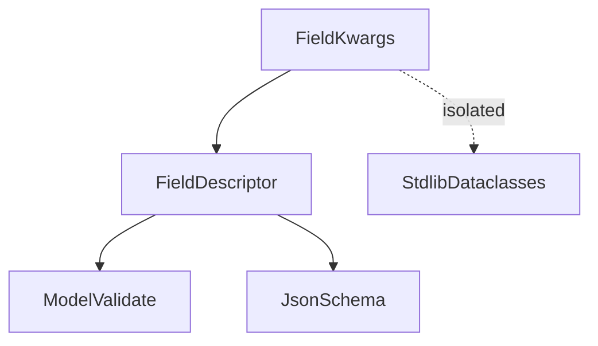
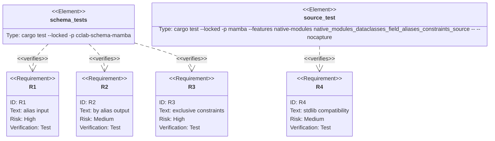

## Scenarios
<!-- type: scenarios lang: yaml -->

```yaml
scenarios:
  - id: validation-alias-input
    given:
      - a mambalibs.dataclasses BaseModel field declares alias or validation_alias.
      - input data uses the declared alias instead of the canonical field name.
    when:
      - source calls model_validate, model_dump, or model_dump_json.
    then:
      - the alias value is accepted.
      - default output uses the canonical field name.

  - id: serialization-alias-output
    given:
      - a field declares alias or serialization_alias.
      - caller passes {"by_alias": True} to a dump API.
    when:
      - model_dump or model_dump_json runs.
    then:
      - output uses the field serialization alias.

  - id: exclusive-numeric-constraints
    given:
      - a field declares gt or lt, or JSON Schema exclusiveMinimum/exclusiveMaximum aliases.
    when:
      - schema is generated or data is validated.
    then:
      - JSON Schema includes exclusiveMinimum/exclusiveMaximum.
      - values on the exclusive boundary fail validation.

  - id: regex-alias
    given:
      - a string field declares regex.
    when:
      - model validation and schema generation run.
    then:
      - regex behaves as the same additive alias as pattern.

  - id: stdlib-compatibility-boundary
    given:
      - CPython stdlib dataclasses syntax is used outside mambalibs.dataclasses.
    when:
      - these schema extensions are added.
    then:
      - stdlib dataclasses behavior is unchanged because the new surface is limited to mambalibs.dataclasses Field/model APIs.
```

## Dependency Graph
<!-- type: dependency lang: mermaid -->



## Schema
<!-- type: schema lang: yaml -->

```yaml
definitions:
  FieldKwargsExtension:
    type: object
    properties:
      alias:
        type: string
        description: "Validation and serialization alias."
      validation_alias:
        type: string
        description: "Input-only alias."
      serialization_alias:
        type: string
        description: "Output/schema alias."
      gt:
        type: number
        description: "Exclusive minimum alias."
      lt:
        type: number
        description: "Exclusive maximum alias."
      exclusive_minimum:
        type: number
      exclusiveMaximum:
        type: number
      regex:
        type: string
        description: "Alias for pattern."
  DumpOptions:
    type: object
    properties:
      strict:
        type: boolean
      by_alias:
        type: boolean
```

## Manifest
<!-- type: manifest lang: yaml -->

```yaml
packages:
  - name: cclab-schema-mamba
    path: crates/cclab-schema-mamba
    kind: rust-library
    dependencies:
      - { name: cclab-schema, spec: path, path: "../cclab-schema" }
  - name: mamba
    path: projects/mamba
    kind: rust-binary
    features: [native-modules]
```

## Verification
<!-- type: test-plan lang: mermaid -->



## Changes
<!-- type: changes lang: yaml -->

```yaml
files:
  - path: .aw/tech-design/projects/mamba/specs/4013.md
    action: create
    section: changes
    note: "Source of truth for #4013."
  - path: crates/cclab-schema-mamba/src/types.rs
    action: update
    section: changes
    note: "Parse Field aliases, regex alias, and exclusive numeric constraint aliases."
  - path: crates/cclab-schema-mamba/src/methods.rs
    action: update
    section: changes
    note: "Normalize alias input and support by_alias output for dump APIs."
  - path: crates/cclab-schema-mamba/tests/test_binding.rs
    action: update
    section: tests
    note: "Cover alias ingestion/output and exclusive constraint validation/schema."
  - path: projects/mamba/src/driver/mod.rs
    action: update
    section: tests
    note: "Cover source-level mambalibs.dataclasses extension while leaving stdlib untouched."
```

## Tests
<!-- type: tests lang: yaml -->

```yaml
tests:
  - name: field_aliases_and_exclusive_constraints_round_trip
    assertions:
      - "alias input is accepted"
      - "by_alias output uses serialization aliases"
      - "gt/lt boundaries reject equal values"
      - "model_json_schema emits aliases and exclusive constraints"
  - name: native_modules_dataclasses_field_aliases_constraints_source
    assertions:
      - "source-level model_dump_json accepts aliases"
      - "source-level schema emits aliases"
      - "stdlib dataclasses import remains independent"
```
