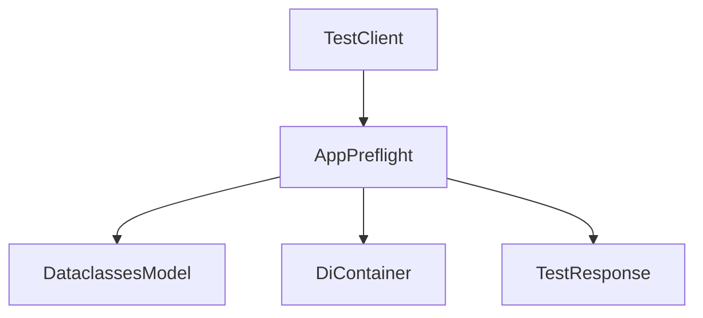
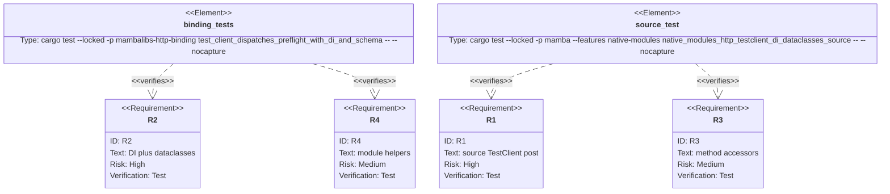

## Scenarios
<!-- type: scenarios lang: yaml -->

```yaml
scenarios:
  - id: post-normalizes-body-and-resolves-di
    given:
      - a mambalibs.http FastAPI app has a POST route with request_model and Depends metadata.
      - TestClient is created with the app and a mambalibs.di Container.
      - the route request_model is a mambalibs.dataclasses BaseModel.
    when:
      - source calls client.post(path, body).
    then:
      - the response status_code matches the route status.
      - response.json()/test_client_json returns the preflight report.
      - the report body contains dataclasses-normalized values and defaults.
      - the report dependencies contain resolved DI values.

  - id: invalid-body-returns-422
    given:
      - TestClient posts a body that fails BaseModel parsing.
    when:
      - source inspects response.status_code and response.json().
    then:
      - the status code is 422.
      - the response report includes ValidationError detail.

  - id: missing-route-returns-404
    given:
      - TestClient targets an unregistered route.
    when:
      - client.get(path) runs.
    then:
      - response.status_code is 404.
      - response.json() reports matched=false.

  - id: compatibility-boundary
    given:
      - CPython stdlib http/dataclasses or existing third-party shims are imported.
    when:
      - TestClient preflight dispatch is added.
    then:
      - behavior remains unchanged because the new dispatch surface is limited to mambalibs.http.
```

## Dependency Graph
<!-- type: dependency lang: mermaid -->



## Schema
<!-- type: schema lang: yaml -->

```yaml
definitions:
  TestClient:
    type: object
    properties:
      app:
        description: "Native mambalibs.http App handle."
      provider:
        description: "Optional mambalibs.di Container, RequestScope, or dependency dict."
  TestResponse:
    type: object
    required: [status_code, body]
    properties:
      status_code:
        type: integer
      body:
        type: string
        description: "Preflight report JSON text."
```

## Manifest
<!-- type: manifest lang: yaml -->

```yaml
packages:
  - name: mambalibs-http-binding
    path: projects/mamba/mambalibs/httpkit/binding
    kind: rust-library
    dependencies:
      - { name: mambalibs-http, spec: path, path: ".." }
      - { name: mambalibs-di-binding, spec: path, path: "../../dikit/binding" }
      - { name: cclab-schema-mamba, spec: path, path: "../../../../../crates/cclab-schema-mamba" }
  - name: mamba
    path: projects/mamba
    kind: rust-binary
    features: [native-modules]
```

## Verification
<!-- type: test-plan lang: mermaid -->



## Changes
<!-- type: changes lang: yaml -->

```yaml
files:
  - path: .aw/tech-design/projects/mamba/specs/4014.md
    action: create
    section: changes
    note: "Source of truth for #4014."
  - path: projects/mamba/mambalibs/httpkit/binding/src/client/test_client.rs
    action: update
    section: changes
    note: "Store app/provider handles and dispatch get/post through App preflight."
  - path: projects/mamba/mambalibs/httpkit/binding/src/client/mod.rs
    action: update
    section: changes
    note: "Register TestClient/TestResponse method getters."
  - path: projects/mamba/mambalibs/httpkit/binding/tests/mamba_registry_test.rs
    action: update
    section: tests
    note: "Cover binding-level TestClient dispatch through DI and dataclasses."
  - path: projects/mamba/src/driver/mod.rs
    action: update
    section: tests
    note: "Cover source-level TestClient method DX."
  - path: projects/mamba/mambalibs/httpkit/README.md
    action: update
    section: changes
    note: "Document in-process TestClient dispatch semantics."
```

## Tests
<!-- type: tests lang: yaml -->

```yaml
tests:
  - name: test_client_dispatches_preflight_with_di_and_schema
    assertions:
      - "POST response status is route status"
      - "response JSON report includes normalized body"
      - "response JSON report includes resolved dependency"
      - "invalid body returns 422"
  - name: native_modules_http_testclient_di_dataclasses_source
    assertions:
      - "client.post source syntax works"
      - "response.status_code source access works"
      - "response.json() source access works"
```
