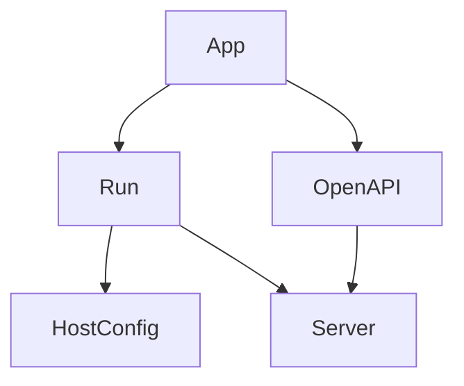
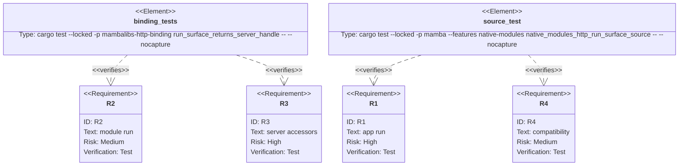

## Scenarios
<!-- type: scenarios lang: yaml -->

```yaml
scenarios:
  - id: app-run-source-dx
    given:
      - a mambalibs.http FastAPI app has registered routes.
    when:
      - source calls app.run("127.0.0.1", 0).
    then:
      - the call returns a typed Server handle.
      - Server exposes url, host, port, running, and endpoint_count.

  - id: module-run-source-dx
    given:
      - source imports run from mambalibs.http.
    when:
      - source calls run(app, host, port).
    then:
      - the same native Server handle surface is returned.

  - id: openapi-on-server
    given:
      - the app has route metadata and schemas.
    when:
      - server.openapi is read.
    then:
      - it returns the app OpenAPI JSON string captured at run time.

  - id: compatibility-boundary
    given:
      - CPython stdlib modules and third-party uvicorn shim remain importable.
    when:
      - mambalibs.http adds methods, functions, or classes for framework ergonomics.
    then:
      - those additions are treated as extension.
      - stdlib syntax/behavior and uvicorn shim behavior remain compatibility constraints and are not mutated.
```

## Dependency Graph
<!-- type: dependency lang: mermaid -->



## Schema
<!-- type: schema lang: yaml -->

```yaml
definitions:
  Server:
    type: object
    required: [host, port, url, running, endpoint_count, openapi]
    properties:
      host:
        type: string
      port:
        type: integer
      url:
        type: string
      running:
        type: boolean
      endpoint_count:
        type: integer
      openapi:
        type: string
        description: "OpenAPI JSON text captured when run was called."
```

## Manifest
<!-- type: manifest lang: yaml -->

```yaml
packages:
  - name: mambalibs-http-binding
    path: projects/mamba/mambalibs/httpkit/binding
    kind: rust-library
    dependencies:
      - { name: mambalibs-http, spec: path, path: ".." }
  - name: mamba
    path: projects/mamba
    kind: rust-binary
    features: [native-modules]
```

## Verification
<!-- type: test-plan lang: mermaid -->



## Changes
<!-- type: changes lang: yaml -->

```yaml
files:
  - path: .aw/tech-design/projects/mamba/specs/4017.md
    action: create
    section: changes
    note: "Source of truth for #4017."
  - path: projects/mamba/mambalibs/httpkit/binding/src/server.rs
    action: create
    section: changes
    note: "Register Server/run and App.run binding accessors."
  - path: projects/mamba/mambalibs/httpkit/binding/src/lib.rs
    action: update
    section: changes
    note: "Register server surface after app surface."
  - path: projects/mamba/mambalibs/httpkit/binding/tests/mamba_registry_test.rs
    action: update
    section: tests
    note: "Cover binding-level run surface and server accessors."
  - path: projects/mamba/src/driver/mod.rs
    action: update
    section: tests
    note: "Cover source-level app.run/run DX."
  - path: projects/mamba/mambalibs/httpkit/README.md
    action: update
    section: changes
    note: "Document mambalibs.http run surface and compatibility boundary."
```

## Tests
<!-- type: tests lang: yaml -->

```yaml
tests:
  - name: run_surface_returns_server_handle
    assertions:
      - "module run returns Server"
      - "Server accessors expose host/port/url/running/endpoint_count/openapi"
      - "Server.stop flips running to false"
  - name: native_modules_http_run_surface_source
    assertions:
      - "app.run source syntax works"
      - "mambalibs.http.run source syntax works"
      - "Server accessors print expected values"
```
