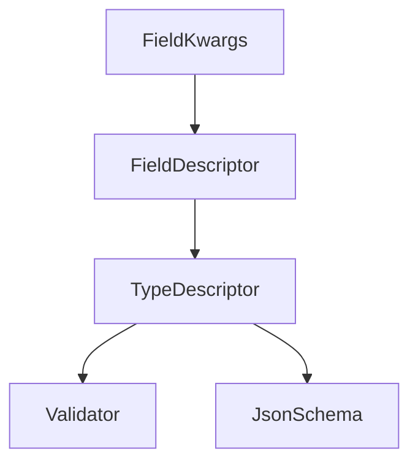
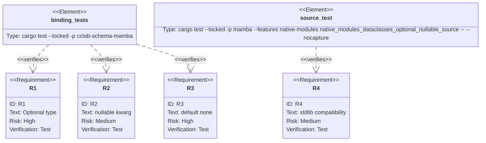

## Scenarios
<!-- type: scenarios lang: yaml -->

```yaml
scenarios:
  - id: optional-type-string
    given:
      - a mambalibs.dataclasses BaseModel declares Field("nickname", {"type": "Optional[str]"}).
    when:
      - source calls Model.model_validate({"nickname": None}).
    then:
      - validation accepts null.
      - model_json_schema emits a nullable string schema for nickname.

  - id: nullable-kwarg
    given:
      - a field declares {"type": "int", "nullable": True}.
    when:
      - source validates {"score": None}.
    then:
      - null is accepted without coercing it to a string or number.
      - the JSON schema marks the integer field as nullable.

  - id: default-none
    given:
      - a field declares {"type": "Optional[str]", "default": None}.
    when:
      - source validates a payload that omits the field.
    then:
      - the field is not required.
      - the normalized output includes null.
      - JSON schema emits default null.

  - id: compatibility-boundary
    given:
      - CPython stdlib dataclasses remains importable as dataclasses.
    when:
      - mambalibs.dataclasses adds nullable schema behavior.
    then:
      - the behavior is an additive mambalibs extension.
      - stdlib dataclasses syntax and behavior are unchanged.
```

## Dependency Graph
<!-- type: dependency lang: mermaid -->



## Schema
<!-- type: schema lang: yaml -->

```yaml
definitions:
  FieldKwargs:
    type: object
    properties:
      type:
        type: string
        examples: ["Optional[str]", "str | None", "list[Optional[int]]"]
      nullable:
        type: boolean
      optional:
        type: boolean
      default:
        type: ["string", "integer", "number", "boolean", "array", "object", "null"]
    constraints:
      - "nullable=True and optional=True wrap the field type in Optional."
      - "default=None is an explicit default and makes the field non-required."
      - "Optional[...] accepts null but remains required unless a default is declared."
```

## Manifest
<!-- type: manifest lang: yaml -->

```yaml
packages:
  - name: cclab-schema-mamba
    path: crates/cclab-schema-mamba
    kind: rust-library
    dependencies:
      - { name: cclab-schema, spec: path, path: "../cclab-schema" }
  - name: mamba
    path: projects/mamba
    kind: rust-binary
    features: [native-modules]
```

## Verification
<!-- type: test-plan lang: mermaid -->



## Changes
<!-- type: changes lang: yaml -->

```yaml
files:
  - path: .aw/tech-design/projects/mamba/specs/4019.md
    action: create
    section: changes
    note: "Source of truth for #4019."
  - path: crates/cclab-schema-mamba/src/types.rs
    action: update
    section: changes
    note: "Parse Optional/nullable/default None field kwargs into TypeDescriptor::Optional."
  - path: crates/cclab-schema-mamba/tests/test_binding.rs
    action: update
    section: tests
    note: "Cover binding-level optional, nullable, and default None semantics."
  - path: projects/mamba/src/driver/mod.rs
    action: update
    section: tests
    note: "Cover source-level mambalibs.dataclasses nullable schema behavior."
  - path: crates/cclab-schema/README.md
    action: update
    section: changes
    note: "Document mambalibs.dataclasses extension/compatibility rule for schema fields."
```

## Tests
<!-- type: tests lang: yaml -->

```yaml
tests:
  - name: field_from_kwargs_with_optional_nullable_and_default_none
    verifies: [R1, R2, R3]
  - name: mb_schema_model_validate_accepts_optional_nullable_defaults
    verifies: [R1, R2, R3]
  - name: native_modules_dataclasses_optional_nullable_source
    verifies: [R1, R2, R3, R4]
```
