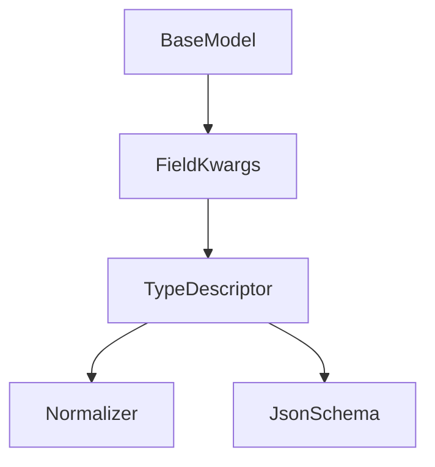
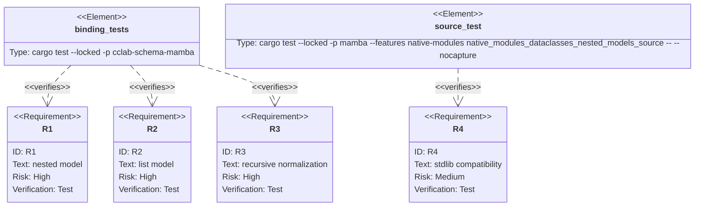

## Scenarios
<!-- type: scenarios lang: yaml -->

```yaml
scenarios:
  - id: nested-model-field
    given:
      - a User BaseModel declares a typed name field and default active field.
      - a Team BaseModel declares Field("owner", {"model": User}).
    when:
      - source calls Team.model_dump_json({"owner": {"name": "alice"}}).
    then:
      - owner is validated as a nested object.
      - nested defaults and coercion are applied.
      - JSON schema emits owner as an object with User properties.

  - id: list-of-models
    given:
      - a Team BaseModel declares Field("members", {"type": "list", "items_model": User}).
    when:
      - source calls Team.model_validate with a list of user dicts.
    then:
      - every list item is validated against the User schema.
      - normalized output preserves the list and nested defaulted fields.
      - JSON schema emits array items as the nested object schema.

  - id: nested-error
    given:
      - a nested User model has a required field.
    when:
      - source validates Team with owner missing that field.
    then:
      - model_dump_json returns a ValidationError string.

  - id: compatibility-boundary
    given:
      - CPython stdlib dataclasses remains imported through dataclasses.
    when:
      - mambalibs.dataclasses adds nested model field kwargs.
    then:
      - the behavior is an additive mambalibs extension.
      - stdlib dataclasses syntax and behavior are unchanged.
```

## Dependency Graph
<!-- type: dependency lang: mermaid -->



## Schema
<!-- type: schema lang: yaml -->

```yaml
definitions:
  FieldKwargs:
    type: object
    properties:
      model:
        description: "A mambalibs.dataclasses BaseModel handle used as the field object schema."
      items_model:
        description: "A BaseModel handle used as the item schema when type is list/array."
      type:
        type: string
        examples: ["list", "array", "Optional[list]"]
    constraints:
      - "model takes precedence over scalar type strings for the field."
      - "items_model only changes list/array item type."
      - "nested object normalization applies the nested model defaults and coercion."
```

## Manifest
<!-- type: manifest lang: yaml -->

```yaml
packages:
  - name: cclab-schema-mamba
    path: crates/cclab-schema-mamba
    kind: rust-library
    dependencies:
      - { name: cclab-schema, spec: path, path: "../cclab-schema" }
  - name: mamba
    path: projects/mamba
    kind: rust-binary
    features: [native-modules]
```

## Verification
<!-- type: test-plan lang: mermaid -->



## Changes
<!-- type: changes lang: yaml -->

```yaml
files:
  - path: .aw/tech-design/projects/mamba/specs/4021.md
    action: create
    section: changes
    note: "Source of truth for #4021."
  - path: crates/cclab-schema-mamba/src/types.rs
    action: update
    section: changes
    note: "Parse model/items_model BaseModel handles into nested object/list type descriptors."
  - path: crates/cclab-schema-mamba/src/methods.rs
    action: update
    section: changes
    note: "Normalize object and list values recursively for nested model defaults/coercion."
  - path: crates/cclab-schema-mamba/tests/test_binding.rs
    action: update
    section: tests
    note: "Cover binding-level nested model and list model fields."
  - path: projects/mamba/src/driver/mod.rs
    action: update
    section: tests
    note: "Cover source-level nested mambalibs.dataclasses models."
  - path: crates/cclab-schema/README.md
    action: update
    section: changes
    note: "Document nested mambalibs.dataclasses model fields."
```

## Tests
<!-- type: tests lang: yaml -->

```yaml
tests:
  - name: field_from_kwargs_with_nested_model_handles
    verifies: [R1, R2]
  - name: mb_schema_model_validate_normalizes_nested_models
    verifies: [R1, R2, R3]
  - name: native_modules_dataclasses_nested_models_source
    verifies: [R1, R2, R3, R4]
```
