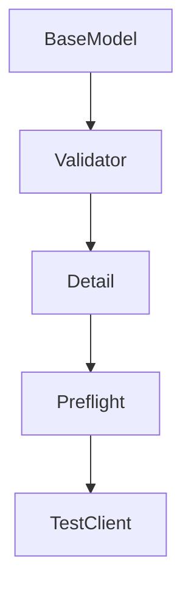

## Scenarios
<!-- type: scenarios lang: yaml -->

```yaml
scenarios:
  - id: invalid-body-detail
    given:
      - a mambalibs.http route declares request_model with typed mambalibs.dataclasses fields.
    when:
      - App.preflight receives an invalid body.
    then:
      - the report status_code is 422.
      - the report includes detail entries shaped like FastAPI/Pydantic errors.
      - the legacy errors string array remains present.

  - id: nested-detail-location
    given:
      - the request_model includes nested BaseModel fields and list item models.
    when:
      - validation fails inside a nested list item.
    then:
      - detail.loc starts with body and includes the nested path.
      - detail.msg and detail.type are populated.

  - id: test-client-detail
    given:
      - TestClient dispatches through App.preflight.
    when:
      - response.json() is called on an invalid request.
    then:
      - the returned dict contains the same detail list.

  - id: compatibility-boundary
    given:
      - existing mambalibs.dataclasses model_dump_json returns a string on validation failure.
    when:
      - HTTP preflight gains structured detail.
    then:
      - the old string behavior remains unchanged.
      - CPython stdlib behavior is unchanged.
```

## Dependency Graph
<!-- type: dependency lang: mermaid -->



## Schema
<!-- type: schema lang: yaml -->

```yaml
definitions:
  ValidationDetail:
    type: object
    required: [loc, msg, type]
    properties:
      loc:
        type: array
        items:
          type: [string, integer]
        examples: [["body", "owner", "name"], ["body", "members", 0, "age"]]
      msg:
        type: string
      type:
        type: string
  PreflightReport:
    type: object
    required: [matched, status_code]
    properties:
      status_code:
        type: integer
      errors:
        type: array
        items: { type: string }
      detail:
        type: array
        items: { $ref: "#/definitions/ValidationDetail" }
```

## Manifest
<!-- type: manifest lang: yaml -->

```yaml
packages:
  - name: cclab-schema-mamba
    path: crates/cclab-schema-mamba
    kind: rust-library
  - name: mambalibs-http-binding
    path: projects/mamba/mambalibs/httpkit/binding
    kind: rust-library
    dependencies:
      - { name: cclab-schema-mamba, spec: path, path: "../../../../crates/cclab-schema-mamba" }
  - name: mamba
    path: projects/mamba
    kind: rust-binary
    features: [native-modules]
```

## Verification

```mermaid
---
id: mambalibs_http_fastapi_style_validation_details_verification
requirements:
  detail_shape:
    id: R1
    text: "Invalid request_model parsing returns 422 detail entries with loc/msg/type"
    kind: integration
    risk: high
    verify: test
  nested_loc:
    id: R2
    text: "Nested and list validation errors preserve body-prefixed paths"
    kind: integration
    risk: high
    verify: test
  test_client:
    id: R3
    text: "TestClient response.json exposes detail"
    kind: regression
    risk: medium
    verify: test
  compatibility:
    id: R4
    text: "Existing model_dump_json and errors array behavior remains"
    kind: compatibility
    risk: medium
    verify: test
elements:
  schema_tests:
    kind: test
    type: "cargo test --locked -p cclab-schema-mamba"
  http_tests:
    kind: test
    type: "cargo test --locked -p mambalibs-http-binding"
  source_test:
    kind: test
    type: "cargo test --locked -p mamba --features native-modules native_modules_http_preflight_validation_details_source -- --nocapture"
relations:
  - { from: schema_tests, verifies: compatibility }
  - { from: http_tests, verifies: detail_shape }
  - { from: http_tests, verifies: nested_loc }
  - { from: http_tests, verifies: test_client }
  - { from: source_test, verifies: detail_shape }
  - { from: source_test, verifies: compatibility }
---
requirementDiagram
  requirement R1 {
    id: R1
    text: "detail shape"
    risk: high
    verifymethod: test
  }
  requirement R2 {
    id: R2
    text: "nested loc"
    risk: high
    verifymethod: test
  }
  requirement R3 {
    id: R3
    text: "test client"
    risk: medium
    verifymethod: test
  }
  requirement R4 {
    id: R4
    text: "compatibility"
    risk: medium
    verifymethod: test
  }
  element schema_tests {
    type: "cargo test --locked -p cclab-schema-mamba"
  }
  element http_tests {
    type: "cargo test --locked -p mambalibs-http-binding"
  }
  element source_test {
    type: "cargo test --locked -p mamba --features native-modules native_modules_http_preflight_validation_details_source -- --nocapture"
  }
  schema_tests - verifies -> R4
  http_tests - verifies -> R1
  http_tests - verifies -> R2
  http_tests - verifies -> R3
  source_test - verifies -> R1
  source_test - verifies -> R4
```

<!-- type: test-plan lang: mermaid -->



## Changes
<!-- type: changes lang: yaml -->

```yaml
files:
  - path: .aw/tech-design/projects/mamba/specs/4022.md
    action: create
    section: changes
    note: "Source of truth for #4022."
  - path: crates/cclab-schema-mamba/src/methods.rs
    action: update
    section: changes
    note: "Expose a Rust-side detail JSON helper for BaseModel validation."
  - path: crates/cclab-schema-mamba/tests/test_binding.rs
    action: update
    section: tests
    note: "Cover schema-level detail JSON output."
  - path: projects/mamba/mambalibs/httpkit/binding/src/app.rs
    action: update
    section: changes
    note: "Add detail entries to preflight 422 reports."
  - path: projects/mamba/mambalibs/httpkit/binding/tests/mamba_registry_test.rs
    action: update
    section: tests
    note: "Cover HTTP preflight and TestClient detail output."
  - path: projects/mamba/src/driver/mod.rs
    action: update
    section: tests
    note: "Cover source-level validation detail output."
```

## Tests
<!-- type: tests lang: yaml -->

```yaml
tests:
  - name: model_validation_detail_json_reports_fastapi_shape
    verifies: [R4]
  - name: app_preflight_resolves_di_and_normalizes_schema_body
    verifies: [R1]
  - name: app_preflight_reports_nested_validation_detail_locations
    verifies: [R2]
  - name: test_client_dispatches_preflight_with_di_and_schema
    verifies: [R3]
  - name: native_modules_http_preflight_validation_details_source
    verifies: [R1, R4]
```
