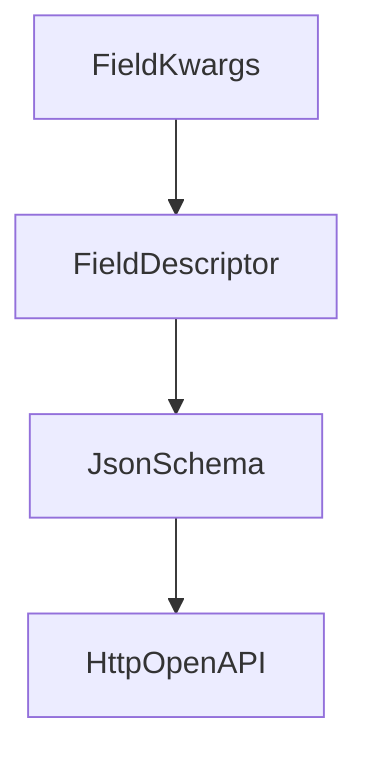

## Scenarios
<!-- type: scenarios lang: yaml -->

```yaml
scenarios:
  - id: field-schema-metadata
    given:
      - a mambalibs.dataclasses model field declares title, description, examples, deprecated, read_only, and write_only.
    when:
      - model_json_schema is exported.
    then:
      - the property schema includes the same metadata using JSON Schema/OpenAPI keys.

  - id: multiple-of-validation
    given:
      - an integer or float field declares multiple_of.
    when:
      - model_validate or model_dump_json validates data.
    then:
      - non-multiple values produce the existing ValidationError string behavior.
      - valid multiples normalize as before.

  - id: list-length-alias
    given:
      - a list field declares min_length and max_length.
    when:
      - model_json_schema is exported and data is validated.
    then:
      - minItems and maxItems are emitted.
      - list length validation uses those aliases.

  - id: compatibility-boundary
    given:
      - existing Field(name, kwargs), model_validate, model_dump, and model_dump_json callers.
    when:
      - metadata support is added.
    then:
      - existing calls and CPython stdlib dataclasses behavior are unchanged.
```

## Dependency Graph
<!-- type: dependency lang: mermaid -->



## Schema
<!-- type: schema lang: yaml -->

```yaml
definitions:
  FieldKwargs:
    type: object
    properties:
      title: { type: string }
      description: { type: string }
      examples:
        type: array
      deprecated: { type: boolean }
      read_only: { type: boolean }
      readOnly: { type: boolean }
      write_only: { type: boolean }
      writeOnly: { type: boolean }
      multiple_of:
        type: number
      multipleOf:
        type: number
      min_length:
        type: integer
        description: "String minLength and list minItems alias."
      max_length:
        type: integer
        description: "String maxLength and list maxItems alias."
```

## Manifest
<!-- type: manifest lang: yaml -->

```yaml
packages:
  - name: cclab-schema
    path: crates/cclab-schema
    kind: rust-library
  - name: cclab-schema-mamba
    path: crates/cclab-schema-mamba
    kind: rust-library
  - name: mambalibs-http-binding
    path: projects/mamba/mambalibs/httpkit/binding
    kind: rust-library
  - name: mamba
    path: projects/mamba
    kind: rust-binary
    features: [native-modules]
```

## Verification

```mermaid
---
id: mambalibs_dataclasses_field_schema_metadata_verification
requirements:
  metadata_schema:
    id: R1
    text: "Field metadata is emitted in model_json_schema"
    kind: regression
    risk: medium
    verify: test
  multiple_of:
    id: R2
    text: "multiple_of validates and emits multipleOf"
    kind: regression
    risk: medium
    verify: test
  list_alias:
    id: R3
    text: "list min_length/max_length aliases validate and emit minItems/maxItems"
    kind: compatibility
    risk: medium
    verify: test
  http_openapi:
    id: R4
    text: "HTTP OpenAPI components carry the schema metadata"
    kind: integration
    risk: medium
    verify: test
  compatibility:
    id: R5
    text: "Existing dataclasses validation/dump behavior remains"
    kind: compatibility
    risk: medium
    verify: test
elements:
  schema_tests:
    kind: test
    type: "cargo test --locked -p cclab-schema-mamba"
  http_tests:
    kind: test
    type: "cargo test --locked -p mambalibs-http-binding"
  source_test:
    kind: test
    type: "cargo test --locked -p mamba --features native-modules native_modules_dataclasses_field_schema_metadata_source -- --nocapture"
relations:
  - { from: schema_tests, verifies: metadata_schema }
  - { from: schema_tests, verifies: multiple_of }
  - { from: schema_tests, verifies: list_alias }
  - { from: schema_tests, verifies: compatibility }
  - { from: http_tests, verifies: http_openapi }
  - { from: source_test, verifies: metadata_schema }
  - { from: source_test, verifies: compatibility }
---
requirementDiagram
  requirement R1 {
    id: R1
    text: "metadata schema"
    risk: medium
    verifymethod: test
  }
  requirement R2 {
    id: R2
    text: "multiple_of"
    risk: medium
    verifymethod: test
  }
  requirement R3 {
    id: R3
    text: "list aliases"
    risk: medium
    verifymethod: test
  }
  requirement R4 {
    id: R4
    text: "http openapi"
    risk: medium
    verifymethod: test
  }
  requirement R5 {
    id: R5
    text: "compatibility"
    risk: medium
    verifymethod: test
  }
  element schema_tests {
    type: "cargo test --locked -p cclab-schema-mamba"
  }
  element http_tests {
    type: "cargo test --locked -p mambalibs-http-binding"
  }
  element source_test {
    type: "cargo test --locked -p mamba --features native-modules native_modules_dataclasses_field_schema_metadata_source -- --nocapture"
  }
  schema_tests - verifies -> R1
  schema_tests - verifies -> R2
  schema_tests - verifies -> R3
  schema_tests - verifies -> R5
  http_tests - verifies -> R4
  source_test - verifies -> R1
  source_test - verifies -> R5
```

<!-- type: test-plan lang: mermaid -->



## Changes
<!-- type: changes lang: yaml -->

```yaml
files:
  - path: .aw/tech-design/projects/mamba/specs/4024.md
    action: create
    section: changes
    note: "Source of truth for #4024."
  - path: crates/cclab-schema/src/constraints.rs
    action: update
    section: changes
    note: "Store additive Field metadata."
  - path: crates/cclab-schema/src/json_schema.rs
    action: update
    section: changes
    note: "Emit metadata and multipleOf in JSON Schema."
  - path: crates/cclab-schema/src/generics.rs
    action: update
    section: changes
    note: "Preserve metadata when substituting object fields."
  - path: crates/cclab-schema-mamba/src/types.rs
    action: update
    section: changes
    note: "Parse Pydantic-style Field metadata and constraints."
  - path: crates/cclab-schema-mamba/tests/test_binding.rs
    action: update
    section: tests
    note: "Cover schema metadata, list aliases, and multiple_of."
  - path: projects/mamba/mambalibs/httpkit/binding/tests/mamba_registry_test.rs
    action: update
    section: tests
    note: "Cover OpenAPI schema metadata passthrough."
  - path: projects/mamba/src/driver/mod.rs
    action: update
    section: tests
    note: "Cover source-level dataclasses metadata."
```

## Tests
<!-- type: tests lang: yaml -->

```yaml
tests:
  - name: mb_schema_field_metadata_constraints_emit_json_schema
    verifies: [R1, R2, R3, R5]
  - name: app_openapi_preserves_dataclass_field_schema_metadata
    verifies: [R4]
  - name: native_modules_dataclasses_field_schema_metadata_source
    verifies: [R1, R5]
```
