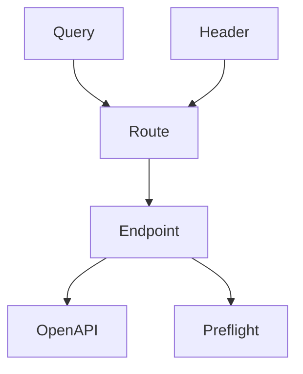

## Scenarios
<!-- type: scenarios lang: yaml -->

```yaml
scenarios:
  - id: openapi-parameters
    given:
      - a route declares parameters with Query and Header.
    when:
      - app.openapi is exported.
    then:
      - operation.parameters includes name, in, required, schema, description, and default where available.

  - id: preflight-parameters-ok
    given:
      - a route declares a required query parameter, an optional query parameter with default None, and an optional header parameter.
    when:
      - app.preflight receives request context containing the query/header maps.
    then:
      - the report status_code stays the route status.
      - the report includes normalized parameter values.
      - explicit None defaults remain optional and serialize as null.

  - id: preflight-parameters-missing
    given:
      - a route declares required Query/Header parameters.
    when:
      - app.preflight receives no matching query/header values.
    then:
      - the report status_code is 422.
      - detail entries use FastAPI-style loc values like ["query", "q"] and ["header", "X-Trace-ID"].

  - id: compatibility-boundary
    given:
      - existing route decorators, body request_model preflight, DI providers, and TestClient calls.
    when:
      - route parameters are added.
    then:
      - existing callers continue to work without passing a request context.
      - CPython stdlib behavior remains unchanged.
```

## Dependency Graph
<!-- type: dependency lang: mermaid -->



## Schema
<!-- type: schema lang: yaml -->

```yaml
definitions:
  RouteParameter:
    type: object
    required: [name, in, required]
    properties:
      name: { type: string }
      in:
        enum: [query, header]
      required: { type: boolean }
      description: { type: string }
      default: {}
      schema:
        type: object
  PreflightRequestContext:
    type: object
    properties:
      query:
        type: object
        additionalProperties: { type: string }
      headers:
        type: object
        additionalProperties: { type: string }
```

## Manifest
<!-- type: manifest lang: yaml -->

```yaml
packages:
  - name: mambalibs-http
    path: projects/mamba/mambalibs/httpkit
    kind: rust-library
  - name: mambalibs-http-binding
    path: projects/mamba/mambalibs/httpkit/binding
    kind: rust-library
  - name: mamba
    path: projects/mamba
    kind: rust-binary
    features: [native-modules]
```

## Verification

```mermaid
---
id: mambalibs_http_query_header_parameter_preflight_verification
requirements:
  openapi_parameters:
    id: R1
    text: "OpenAPI emits Query/Header operation parameters"
    kind: integration
    risk: medium
    verify: test
  preflight_ok:
    id: R2
    text: "Preflight accepts query/header context and returns parameter values"
    kind: integration
    risk: medium
    verify: test
  preflight_missing:
    id: R3
    text: "Missing required Query/Header values produce 422 detail"
    kind: regression
    risk: medium
    verify: test
  compatibility:
    id: R4
    text: "Existing body/DI/TestClient behavior remains"
    kind: compatibility
    risk: medium
    verify: test
elements:
  core_tests:
    kind: test
    type: "cargo test --locked -p mambalibs-http"
  binding_tests:
    kind: test
    type: "cargo test --locked -p mambalibs-http-binding"
  source_test:
    kind: test
    type: "cargo test --locked -p mamba --features native-modules native_modules_http_query_header_parameters_source -- --nocapture"
relations:
  - { from: core_tests, verifies: openapi_parameters }
  - { from: core_tests, verifies: preflight_ok }
  - { from: core_tests, verifies: preflight_missing }
  - { from: binding_tests, verifies: openapi_parameters }
  - { from: binding_tests, verifies: preflight_ok }
  - { from: binding_tests, verifies: preflight_missing }
  - { from: binding_tests, verifies: compatibility }
  - { from: source_test, verifies: openapi_parameters }
  - { from: source_test, verifies: preflight_missing }
---
requirementDiagram
  requirement R1 {
    id: R1
    text: "openapi parameters"
    risk: medium
    verifymethod: test
  }
  requirement R2 {
    id: R2
    text: "preflight ok"
    risk: medium
    verifymethod: test
  }
  requirement R3 {
    id: R3
    text: "preflight missing"
    risk: medium
    verifymethod: test
  }
  requirement R4 {
    id: R4
    text: "compatibility"
    risk: medium
    verifymethod: test
  }
  element core_tests {
    type: "cargo test --locked -p mambalibs-http"
  }
  element binding_tests {
    type: "cargo test --locked -p mambalibs-http-binding"
  }
  element source_test {
    type: "cargo test --locked -p mamba --features native-modules native_modules_http_query_header_parameters_source -- --nocapture"
  }
  core_tests - verifies -> R1
  core_tests - verifies -> R2
  core_tests - verifies -> R3
  binding_tests - verifies -> R1
  binding_tests - verifies -> R2
  binding_tests - verifies -> R3
  binding_tests - verifies -> R4
  source_test - verifies -> R1
  source_test - verifies -> R3
```

<!-- type: test-plan lang: mermaid -->



## Changes
<!-- type: changes lang: yaml -->

```yaml
files:
  - path: .aw/tech-design/projects/mamba/specs/4026.md
    action: create
    section: changes
    note: "Source of truth for #4026."
  - path: projects/mamba/mambalibs/httpkit/src/app.rs
    action: update
    section: changes
    note: "Add endpoint parameter metadata, OpenAPI output, and preflight checks."
  - path: projects/mamba/mambalibs/httpkit/tests/app_host_protocol_test.rs
    action: update
    section: tests
    note: "Cover core OpenAPI and preflight parameter behavior."
  - path: projects/mamba/mambalibs/httpkit/binding/src/app.rs
    action: update
    section: changes
    note: "Wire Query/Header objects into route decorator parameters and preflight context."
  - path: projects/mamba/mambalibs/httpkit/binding/tests/mamba_registry_test.rs
    action: update
    section: tests
    note: "Cover binding-level parameter OpenAPI and preflight detail output."
  - path: projects/mamba/src/driver/mod.rs
    action: update
    section: tests
    note: "Cover source-level Query/Header route parameters."
```

## Tests
<!-- type: tests lang: yaml -->

```yaml
tests:
  - name: app_openapi_and_preflight_handle_query_header_parameters
    verifies: [R1, R2, R3]
  - name: app_route_parameters_openapi_and_preflight
    verifies: [R1, R2, R3, R4]
  - name: native_modules_http_query_header_parameters_source
    verifies: [R1, R3]
```
